# Hackathon CI/CD & Scripting Cheat Sheet
## GitHub Actions + Docker + Bash Automation

> **The Complete DevOps Pipeline for Rapid, Secure, and Reliable Hackathon Deployments**

---

## 📋 Table of Contents

1. [The Automation Philosophy](#the-automation-philosophy)
2. [Architecture Overview](#architecture-overview)
3. [GitHub Actions Workflow](#github-actions-workflow)
4. [Bash Scripting Mastery](#bash-scripting-mastery)
5. [Secrets Management](#secrets-management)
6. [Docker Best Practices](#docker-best-practices)
7. [The DevOps Flex](#the-devops-flex)
8. [Troubleshooting Guide](#troubleshooting-guide)
9. [Quick Reference](#quick-reference)

---

## 🎯 The Automation Philosophy

### The Velocity Imperative

In a hackathon, **every minute counts**. Manual deployments are:
- ❌ Error-prone (forgot a step?)
- ❌ Slow (5-10 minutes per deploy)
- ❌ Not reproducible (works on my machine!)
- ❌ Risky (push to production accidentally?)

Automated CI/CD is:
- ✅ Consistent (same steps every time)
- ✅ Fast (3-5 minutes, hands-free)
- ✅ Traceable (git history = deployment history)
- ✅ Safe (automatic rollback on failure)

### The "Golden Path" Architecture

```
┌─────────────────────────────────────────────────────────────┐
│  Developer Workflow                                          │
├─────────────────────────────────────────────────────────────┤
│                                                              │
│  1. Write Code                                              │
│     ↓                                                        │
│  2. git commit -m "Add feature X"                           │
│     ↓                                                        │
│  3. git push origin main                                    │
│     ↓                                                        │
│  4. ☕ Grab coffee (automation does the rest)              │
│     ↓                                                        │
│  5. ✅ Production URL updated                               │
│                                                              │
└─────────────────────────────────────────────────────────────┘
```

### Time Savings Analysis

| Task | Manual | Automated | Savings |
|------|--------|-----------|---------|
| Build JAR | 2 min | 1 min | 50% |
| Build Docker | 3 min | 2 min (cached) | 33% |
| Push to Registry | 1 min | 1 min | 0% |
| Deploy to Cloud Run | 2 min | 1 min | 50% |
| **Total per Deploy** | **8 min** | **5 min** | **37.5%** |
| **10 Deploys/Day** | **80 min** | **50 min** | **30 min saved** |

---

## 🏗️ Architecture Overview

### Complete CI/CD Pipeline

```mermaid
graph TB
    subgraph "Developer"
        DEV[💻 Local Development]
        COMMIT[📝 git push]
    end
    
    subgraph "GitHub"
        REPO[📁 Repository<br/>main branch]
        GHA[⚙️ GitHub Actions<br/>Workflow Runner]
    end
    
    subgraph "Authentication Layer"
        OIDC[🔑 OIDC Token<br/>Exchange]
        WIF[🛡️ Workload Identity<br/>Federation]
    end
    
    subgraph "Build Process"
        CHECKOUT[📥 Checkout Code]
        JAVA[☕ Setup Java 17]
        MAVEN[📦 Maven Build<br/>with Caching]
        DOCKER[🐳 Docker Build<br/>Multi-Stage]
        CACHE[💾 Layer Cache]
    end
    
    subgraph "Google Cloud"
        AUTH[🔐 Authenticate]
        GAR[📦 Artifact Registry<br/>Container Storage]
        CR[🚀 Cloud Run<br/>Deployment]
        SM[🔒 Secret Manager]
    end
    
    DEV --> COMMIT
    COMMIT --> REPO
    REPO -->|trigger| GHA
    
    GHA --> OIDC
    OIDC --> WIF
    WIF --> AUTH
    
    GHA --> CHECKOUT
    CHECKOUT --> JAVA
    JAVA --> MAVEN
    MAVEN <--> CACHE
    MAVEN --> DOCKER
    DOCKER <--> CACHE
    
    AUTH --> DOCKER
    DOCKER -->|push| GAR
    GAR -->|deploy| CR
    CR -->|fetch| SM
    
    style WIF fill:#FFE6E6
    style CACHE fill:#E6F2FF
    style CR fill:#D4EDDA
```



### The Security Revolution: Keyless Authentication

**Traditional Approach (Dangerous):**
```
┌─────────────────────────────────────────┐
│  Service Account JSON Key               │
├─────────────────────────────────────────┤
│  ❌ Never expires                       │
│  ❌ Easily leaked in git                │
│  ❌ Requires manual rotation            │
│  ❌ Stored as GitHub Secret             │
│  ❌ High privilege if compromised       │
└─────────────────────────────────────────┘
```

**Workload Identity Federation (Modern):**
```
┌─────────────────────────────────────────┐
│  OIDC Token Exchange                     │
├─────────────────────────────────────────┤
│  ✅ Expires in 1 hour                   │
│  ✅ No secrets in GitHub                │
│  ✅ Automatic rotation                  │
│  ✅ Repository-specific trust           │
│  ✅ Principle of least privilege        │
└─────────────────────────────────────────┘
```

### Authentication Flow Sequence


---

## ⚙️ GitHub Actions Workflow

### Complete Workflow File

Create `.github/workflows/deploy.yml`:

```yaml
# ═══════════════════════════════════════════════════════════════
# Hackathon CI/CD Pipeline
# Deploys to Google Cloud Run on every push to main
# ═══════════════════════════════════════════════════════════════

name: 🚀 Hackathon CI/CD

on:
  push:
    branches: [ "main" ]
  workflow_dispatch:  # Allow manual triggering

# ═══════════════════════════════════════════════════════════════
# CRITICAL: Prevent race conditions
# If multiple commits happen quickly, cancel older builds
# ═══════════════════════════════════════════════════════════════

concurrency:
  group: ${{ github.workflow }}-${{ github.ref }}
  cancel-in-progress: true

jobs:
  build-and-deploy:
    runs-on: ubuntu-latest
    
    # ═══════════════════════════════════════════════════════════
    # CRITICAL: Required for Workload Identity Federation
    # ═══════════════════════════════════════════════════════════
    permissions:
      contents: read
      id-token: write  # Required for OIDC token generation
    
    steps:
      # ─────────────────────────────────────────────────────────
      # Step 1: Checkout Code
      # ─────────────────────────────────────────────────────────
      - name: 📥 Checkout Code
        uses: actions/checkout@v4
      
      # ─────────────────────────────────────────────────────────
      # Step 2: Setup Java with Dependency Caching
      # ─────────────────────────────────────────────────────────
      - name: ☕ Set up JDK 17
        uses: actions/setup-java@v4
        with:
          java-version: '17'
          distribution: 'temurin'
          cache: 'maven'  # CRITICAL: Caches ~/.m2/repository
      
      # ─────────────────────────────────────────────────────────
      # Step 3: Build with Maven
      # ─────────────────────────────────────────────────────────
      - name: 📦 Build with Maven
        run: mvn clean package -DskipTests -B
        # -DskipTests: Compile tests but don't run (saves 2-3 min)
        # -B: Batch mode (less verbose output)
      
      # ─────────────────────────────────────────────────────────
      # Step 4: Authenticate to Google Cloud (Keyless!)
      # ─────────────────────────────────────────────────────────
      - name: 🔐 Authenticate to Google Cloud
        id: auth
        uses: google-github-actions/auth@v2
        with:
          workload_identity_provider: ${{ secrets.WIF_PROVIDER }}
          service_account: ${{ secrets.WIF_SERVICE_ACCOUNT }}
          token_format: 'access_token'  # For Docker login
      
      # ─────────────────────────────────────────────────────────
      # Step 5: Login to Artifact Registry
      # ─────────────────────────────────────────────────────────
      - name: 🐳 Login to Artifact Registry
        uses: docker/login-action@v3
        with:
          registry: us-east1-docker.pkg.dev
          username: oauth2accesstoken  # Reserved keyword
          password: ${{ steps.auth.outputs.access_token }}
      
      # ─────────────────────────────────────────────────────────
      # Step 6: Build and Push Docker Image (with caching)
      # ─────────────────────────────────────────────────────────
      - name: 🔨 Build and Push Container
        uses: docker/build-push-action@v5
        with:
          context: .
          push: true
          tags: |
            us-east1-docker.pkg.dev/${{ secrets.GCP_PROJECT_ID }}/hackathon-repo/api:${{ github.sha }}
            us-east1-docker.pkg.dev/${{ secrets.GCP_PROJECT_ID }}/hackathon-repo/api:latest
          
          # CRITICAL: Cache layers in GitHub Actions
          cache-from: type=gha
          cache-to: type=gha,mode=max
      
      # ─────────────────────────────────────────────────────────
      # Step 7: Deploy to Cloud Run
      # ─────────────────────────────────────────────────────────
      - name: 🚀 Deploy to Cloud Run
        uses: google-github-actions/deploy-cloudrun@v2
        with:
          service: hackathon-api
          region: us-east1
          image: us-east1-docker.pkg.dev/${{ secrets.GCP_PROJECT_ID }}/hackathon-repo/api:${{ github.sha }}
          
          # Environment variables (non-sensitive)
          env_vars: |
            SPRING_PROFILES_ACTIVE=prod
            JAVA_TOOL_OPTIONS=-XX:MaxRAMPercentage=75.0
          
          # Secrets (from Secret Manager)
          secrets: |
            DATABASE_PASSWORD=db-password:latest
            API_KEY=api-key:latest
      
      # ─────────────────────────────────────────────────────────
      # Step 8: Output Deployment URL
      # ─────────────────────────────────────────────────────────
      - name: 📢 Show Deployment URL
        run: |
          echo "🎉 Deployment successful!"
          echo "🔗 URL: https://hackathon-api-HASH-ue.a.run.app"
```

### Workflow Breakdown

#### Concurrency Control

```yaml
concurrency:
  group: ${{ github.workflow }}-${{ github.ref }}
  cancel-in-progress: true
```

**Problem Scenario:**
```
Timeline:
10:00 AM - Developer pushes commit A
10:01 AM - Build starts (5 min estimated)
10:03 AM - Developer pushes commit B
10:04 AM - Build B starts (5 min estimated)
10:06 AM - Build A finishes, deploys old code ❌
10:09 AM - Build B finishes, deploys new code ✅
          (but old code was live for 3 minutes!)
```

**With Concurrency Control:**
```
10:00 AM - Build A starts
10:03 AM - Build B triggers, Build A is cancelled
10:08 AM - Build B finishes, deploys latest code ✅
```

#### Dependency Caching Strategy

**Without Cache:**
```
Maven Build Timeline:
├─ Download dependencies: 180 seconds
├─ Compile code: 20 seconds
└─ Package JAR: 10 seconds
    Total: 210 seconds (3.5 minutes)
```

**With Cache:**
```
Maven Build Timeline (subsequent runs):
├─ Download dependencies: 5 seconds (cache hit!)
├─ Compile code: 20 seconds
└─ Package JAR: 10 seconds
    Total: 35 seconds

Savings: 175 seconds per build (83% faster)
```

**Configuration:**
```yaml
- uses: actions/setup-java@v4
  with:
    cache: 'maven'
    # Caches: ~/.m2/repository
    # Cache key: hash of pom.xml
    # Cache restored if pom.xml unchanged
```

#### Docker Layer Caching

**How It Works:**
```dockerfile
# Layer 1: Base image (rarely changes)
FROM eclipse-temurin:17-jre

# Layer 2: Dependencies (changes when pom.xml changes)
COPY target/*.jar app.jar

# Layer 3: Application code (changes frequently)
# (already in JAR from Layer 2)
```

**Cache Configuration:**
```yaml
cache-from: type=gha  # Pull cache from GitHub Actions
cache-to: type=gha,mode=max  # Push all layers to cache
```

**Benchmark:**
| Build Type | Time |
|------------|------|
| No cache (first build) | 180 sec |
| Cache hit (pom.xml unchanged) | 30 sec |
| Partial cache (code changed) | 45 sec |

---

## 🔧 Bash Scripting Mastery

### The "Strict Mode" Standard

**Every script starts with:**
```bash
#!/bin/bash
set -euo pipefail

# -e: Exit on any error
# -u: Exit on undefined variable
# -o pipefail: Exit on pipe failure
```

**Why This Matters:**

```bash
# WITHOUT strict mode:
rm -rf /tmp/data
cd /nonexistent/directory  # Fails silently
rm -rf *  # Deletes current directory! 🔥

# WITH strict mode:
set -e
rm -rf /tmp/data
cd /nonexistent/directory  # Script exits here
rm -rf *  # Never executed ✅
```

### Local Development Script (dev.sh)

```bash
#!/bin/bash
set -euo pipefail

# ═══════════════════════════════════════════════════════════════
# Local Development Script
# Builds and runs Docker container for local testing
# ═══════════════════════════════════════════════════════════════

APP_NAME="hackathon-local"
PORT=8080
IMAGE_TAG="local"

# ───────────────────────────────────────────────────────────────
# Color Output Functions
# ───────────────────────────────────────────────────────────────

RED='\033[0;31m'
GREEN='\033[0;32m'
YELLOW='\033[1;33m'
NC='\033[0m' # No Color

log_info() {
    echo -e "${GREEN}✓${NC} $1"
}

log_warn() {
    echo -e "${YELLOW}⚠${NC} $1"
}

log_error() {
    echo -e "${RED}✗${NC} $1"
}

# ───────────────────────────────────────────────────────────────
# Pre-flight Checks
# ───────────────────────────────────────────────────────────────

log_info "Running pre-flight checks..."

# Check if Docker is running
if ! docker info > /dev/null 2>&1; then
    log_error "Docker is not running. Please start Docker Desktop."
    exit 1
fi

# Check if port is available
if lsof -Pi :$PORT -sTCP:LISTEN -t >/dev/null 2>&1; then
    log_error "Port $PORT is already in use."
    echo "Kill the process with: lsof -ti:$PORT | xargs kill -9"
    exit 1
fi

log_info "Pre-flight checks passed"

# ───────────────────────────────────────────────────────────────
# Cleanup Function (Idempotent)
# ───────────────────────────────────────────────────────────────

cleanup_container() {
    local container_name=$1
    log_info "Cleaning up existing container: $container_name"
    
    # Check if container exists (running or stopped)
    if [ "$(docker ps -aq -f name=^/${container_name}$)" ]; then
        # Kill if running
        if [ "$(docker ps -q -f name=^/${container_name}$)" ]; then
            docker kill "$container_name" > /dev/null 2>&1
            log_info "Killed running container"
        fi
        # Remove container
        docker rm "$container_name" > /dev/null 2>&1
        log_info "Removed container"
    fi
}

# ───────────────────────────────────────────────────────────────
# Build Process
# ───────────────────────────────────────────────────────────────

log_info "Building Maven artifact..."

# Check if tests should be skipped
MVN_FLAGS="-DskipTests"
if [ "${1:-}" == "test" ]; then
    log_warn "Running with tests (slower)"
    MVN_FLAGS=""
fi

# Build with Maven
mvn clean package $MVN_FLAGS -B || {
    log_error "Maven build failed"
    exit 1
}

log_info "Maven build successful"

# ───────────────────────────────────────────────────────────────
# Docker Build
# ───────────────────────────────────────────────────────────────

log_info "Building Docker image: $APP_NAME:$IMAGE_TAG"

# Cleanup old container
cleanup_container "$APP_NAME"

# Build image (same Dockerfile as production)
docker build \
    --tag "$APP_NAME:$IMAGE_TAG" \
    --build-arg JAR_FILE=target/*.jar \
    . || {
    log_error "Docker build failed"
    exit 1
}

log_info "Docker image built successfully"

# ───────────────────────────────────────────────────────────────
# Environment Variables
# ───────────────────────────────────────────────────────────────

if [ ! -f .env.local ]; then
    log_warn "No .env.local file found. Creating template..."
    cat > .env.local << EOF
# Local development environment variables
GCP_PROJECT_ID=your-local-project
SPRING_PROFILES_ACTIVE=local
PORT=8080
EOF
    log_info "Created .env.local - please edit with your values"
    exit 1
fi

# ───────────────────────────────────────────────────────────────
# Run Container
# ───────────────────────────────────────────────────────────────

log_info "Starting container on port $PORT..."

docker run \
    --rm \
    --name "$APP_NAME" \
    --publish "$PORT:8080" \
    --env-file .env.local \
    "$APP_NAME:$IMAGE_TAG"

# Note: Script blocks here until container stops (Ctrl+C)
```

### Docker Cleanup Script (cleanup.sh)

```bash
#!/bin/bash
set -euo pipefail

# ═══════════════════════════════════════════════════════════════
# Docker Cleanup Script
# Removes unused images, containers, and volumes
# ═══════════════════════════════════════════════════════════════

echo "🧹 Docker Cleanup Utility"
echo "========================="
echo ""

# Show current disk usage
echo "Current Docker disk usage:"
docker system df
echo ""

# Confirm with user
read -p "This will remove all stopped containers, dangling images, and unused volumes. Continue? (y/N): " -n 1 -r
echo ""

if [[ ! $REPLY =~ ^[Yy]$ ]]; then
    echo "Aborted."
    exit 0
fi

echo ""
echo "Starting cleanup..."

# Remove stopped containers
echo "Removing stopped containers..."
docker container prune -f

# Remove dangling images
echo "Removing dangling images..."
docker image prune -f

# Remove unused volumes
echo "Removing unused volumes..."
docker volume prune -f

# Remove build cache
echo "Removing build cache..."
docker builder prune -f

echo ""
echo "✅ Cleanup complete!"
echo ""
echo "New Docker disk usage:"
docker system df
```

### Build Script with Error Handling

```bash
#!/bin/bash
set -euo pipefail

# ═══════════════════════════════════════════════════════════════
# Production Build Script
# Used by CI/CD or manual production builds
# ═══════════════════════════════════════════════════════════════

REGISTRY="us-east1-docker.pkg.dev"
PROJECT_ID="${GCP_PROJECT_ID}"
REPO="hackathon-repo"
IMAGE="api"
TAG="${1:-$(git rev-parse --short HEAD)}"

IMAGE_FULL="${REGISTRY}/${PROJECT_ID}/${REPO}/${IMAGE}:${TAG}"

echo "Building production image: $IMAGE_FULL"

# ───────────────────────────────────────────────────────────────
# Validate Prerequisites
# ───────────────────────────────────────────────────────────────

if [ -z "${GCP_PROJECT_ID:-}" ]; then
    echo "Error: GCP_PROJECT_ID environment variable not set"
    exit 1
fi

if ! command -v docker &> /dev/null; then
    echo "Error: Docker not installed"
    exit 1
fi

# ───────────────────────────────────────────────────────────────
# Maven Build
# ───────────────────────────────────────────────────────────────

echo "Running Maven build..."
mvn clean package -DskipTests -B

# Verify JAR was created
if [ ! -f target/*.jar ]; then
    echo "Error: JAR file not found in target/"
    exit 1
fi

# ───────────────────────────────────────────────────────────────
# Docker Build
# ───────────────────────────────────────────────────────────────

echo "Building Docker image..."
docker build \
    --tag "$IMAGE_FULL" \
    --tag "${REGISTRY}/${PROJECT_ID}/${REPO}/${IMAGE}:latest" \
    --build-arg BUILD_DATE="$(date -u +'%Y-%m-%dT%H:%M:%SZ')" \
    --build-arg VCS_REF="$(git rev-parse HEAD)" \
    .

echo "✅ Build successful: $IMAGE_FULL"

# ───────────────────────────────────────────────────────────────
# Optional: Push to Registry
# ───────────────────────────────────────────────────────────────

read -p "Push to registry? (y/N): " -n 1 -r
echo ""
if [[ $REPLY =~ ^[Yy]$ ]]; then
    echo "Pushing image..."
    docker push "$IMAGE_FULL"
    docker push "${REGISTRY}/${PROJECT_ID}/${REPO}/${IMAGE}:latest"
    echo "✅ Push successful"
fi
```

---

## 🔒 Secrets Management

### The Three-Tier Hierarchy

```
┌─────────────────────────────────────────────────────────────┐
│  Tier 1: Local Development                                  │
├─────────────────────────────────────────────────────────────┤
│  Storage: .env.local file (gitignored)                      │
│  Injection: docker run --env-file .env.local                │
│  Scope: Your laptop only                                    │
└─────────────────────────────────────────────────────────────┘

┌─────────────────────────────────────────────────────────────┐
│  Tier 2: CI/CD Pipeline                                     │
├─────────────────────────────────────────────────────────────┤
│  Storage: GitHub Repository Secrets                         │
│  Injection: ${{ secrets.SECRET_NAME }}                      │
│  Scope: GitHub Actions runners                             │
└─────────────────────────────────────────────────────────────┘

┌─────────────────────────────────────────────────────────────┐
│  Tier 3: Production Runtime                                 │
├─────────────────────────────────────────────────────────────┤
│  Storage: Google Secret Manager                             │
│  Injection: Cloud Run secret volumes/env vars               │
│  Scope: Cloud Run containers                                │
└─────────────────────────────────────────────────────────────┘
```

### Workload Identity Federation Setup

#### Step 1: Create Identity Pool

```bash
#!/bin/bash
set -euo pipefail

PROJECT_ID="your-project-id"
PROJECT_NUMBER=$(gcloud projects describe "$PROJECT_ID" --format="value(projectNumber)")
POOL_NAME="github-pool"
PROVIDER_NAME="github-provider"
GITHUB_REPO="your-username/your-repo"
SERVICE_ACCOUNT_NAME="github-actions"

echo "Setting up Workload Identity Federation..."

# ───────────────────────────────────────────────────────────────
# Step 1: Create Workload Identity Pool
# ───────────────────────────────────────────────────────────────

echo "Creating Workload Identity Pool: $POOL_NAME"

gcloud iam workload-identity-pools create "$POOL_NAME" \
    --project="$PROJECT_ID" \
    --location="global" \
    --display-name="GitHub Actions Pool"

# ───────────────────────────────────────────────────────────────
# Step 2: Create OIDC Provider
# ───────────────────────────────────────────────────────────────

echo "Creating OIDC Provider: $PROVIDER_NAME"

gcloud iam workload-identity-pools providers create-oidc "$PROVIDER_NAME" \
    --project="$PROJECT_ID" \
    --location="global" \
    --workload-identity-pool="$POOL_NAME" \
    --display-name="GitHub Provider" \
    --attribute-mapping="google.subject=assertion.sub,attribute.actor=assertion.actor,attribute.repository=assertion.repository" \
    --issuer-uri="https://token.actions.githubusercontent.com"

# ───────────────────────────────────────────────────────────────
# Step 3: Create Service Account
# ───────────────────────────────────────────────────────────────

echo "Creating Service Account: $SERVICE_ACCOUNT_NAME"

gcloud iam service-accounts create "$SERVICE_ACCOUNT_NAME" \
    --project="$PROJECT_ID" \
    --display-name="GitHub Actions Service Account"

SERVICE_ACCOUNT_EMAIL="${SERVICE_ACCOUNT_NAME}@${PROJECT_ID}.iam.gserviceaccount.com"

# ───────────────────────────────────────────────────────────────
# Step 4: Grant IAM Roles to Service Account
# ───────────────────────────────────────────────────────────────

echo "Granting IAM roles..."

# Cloud Run Admin (deploy services)
gcloud projects add-iam-policy-binding "$PROJECT_ID" \
    --member="serviceAccount:$SERVICE_ACCOUNT_EMAIL" \
    --role="roles/run.admin"

# Service Account User (act as runtime SA)
gcloud projects add-iam-policy-binding "$PROJECT_ID" \
    --member="serviceAccount:$SERVICE_ACCOUNT_EMAIL" \
    --role="roles/iam.serviceAccountUser"

# Artifact Registry Writer (push images)
gcloud projects add-iam-policy-binding "$PROJECT_ID" \
    --member="serviceAccount:$SERVICE_ACCOUNT_EMAIL" \
    --role="roles/artifactregistry.writer"

# ───────────────────────────────────────────────────────────────
# Step 5: Bind GitHub Repo to Service Account
# ───────────────────────────────────────────────────────────────

echo "Binding GitHub repository: $GITHUB_REPO"

gcloud iam service-accounts add-iam-policy-binding "$SERVICE_ACCOUNT_EMAIL" \
    --project="$PROJECT_ID" \
    --role="roles/iam.workloadIdentityUser" \
    --member="principalSet://iam.googleapis.com/projects/${PROJECT_NUMBER}/locations/global/workloadIdentityPools/${POOL_NAME}/attribute.repository/${GITHUB_REPO}"

# ───────────────────────────────────────────────────────────────
# Step 6: Output GitHub Secrets Configuration
# ───────────────────────────────────────────────────────────────

WIF_PROVIDER="projects/${PROJECT_NUMBER}/locations/global/workloadIdentityPools/${POOL_NAME}/providers/${PROVIDER_NAME}"

echo ""
echo "✅ Setup complete!"
echo ""
echo "Add these secrets to your GitHub repository:"
echo "Repository → Settings → Secrets and variables → Actions"
echo ""
echo "────────────────────────────────────────────────────────"
echo "WIF_PROVIDER:"
echo "$WIF_PROVIDER"
echo ""
echo "WIF_SERVICE_ACCOUNT:"
echo "$SERVICE_ACCOUNT_EMAIL"
echo ""
echo "GCP_PROJECT_ID:"
echo "$PROJECT_ID"
echo "────────────────────────────────────────────────────────"
```

### Managing Runtime Secrets

#### Create Secrets in Secret Manager

```bash
#!/bin/bash
set -euo pipefail

PROJECT_ID="your-project-id"

# ───────────────────────────────────────────────────────────────
# Create Secret
# ───────────────────────────────────────────────────────────────

create_secret() {
    local secret_name=$1
    local secret_value=$2
    
    echo "Creating secret: $secret_name"
    
    # Create secret (if doesn't exist)
    if ! gcloud secrets describe "$secret_name" --project="$PROJECT_ID" &>/dev/null; then
        echo "$secret_value" | gcloud secrets create "$secret_name" \
            --project="$PROJECT_ID" \
            --data-file=-
    else
        # Add new version
        echo "$secret_value" | gcloud secrets versions add "$secret_name" \
            --project="$PROJECT_ID" \
            --data-file=-
    fi
    
    echo "✅ Secret created: $secret_name"
}

# ───────────────────────────────────────────────────────────────
# Grant Access to Runtime Service Account
# ───────────────────────────────────────────────────────────────

grant_access() {
    local secret_name=$1
    local service_account=$2
    
    echo "Granting access to $service_account"
    
    gcloud secrets add-iam-policy-binding "$secret_name" \
        --project="$PROJECT_ID" \
        --member="serviceAccount:$service_account" \
        --role="roles/secretmanager.secretAccessor"
    
    echo "✅ Access granted"
}

# ───────────────────────────────────────────────────────────────
# Example Usage
# ───────────────────────────────────────────────────────────────

# Read password securely
echo "Enter database password:"
read -s DB_PASSWORD

create_secret "db-password" "$DB_PASSWORD"
grant_access "db-password" "hackathon-api-runtime@${PROJECT_ID}.iam.gserviceaccount.com"

echo ""
echo "Secret ready for use in Cloud Run!"
```

#### Reference in Cloud Run Deployment

```yaml
# In GitHub Actions workflow:
- name: Deploy to Cloud Run
  uses: google-github-actions/deploy-cloudrun@v2
  with:
    secrets: |
      DATABASE_PASSWORD=db-password:latest
      API_KEY=api-key:latest
```

---

## 🐳 Docker Best Practices

### Multi-Stage Build (Production-Ready)

```dockerfile
# ═══════════════════════════════════════════════════════════════
# Stage 1: Build (Heavy JDK + Maven)
# ═══════════════════════════════════════════════════════════════

FROM eclipse-temurin:17-jdk AS builder

WORKDIR /app

# Copy dependency descriptor first (for layer caching)
COPY pom.xml .

# Download dependencies (cached unless pom.xml changes)
RUN mvn dependency:go-offline -B

# Copy source code
COPY src ./src

# Build application
RUN mvn package -DskipTests -B

# ═══════════════════════════════════════════════════════════════
# Stage 2: Runtime (Lightweight JRE)
# ═══════════════════════════════════════════════════════════════

FROM eclipse-temurin:17-jre-alpine

# Add metadata (best practice)
LABEL maintainer="your-email@example.com"
LABEL version="1.0"
LABEL description="Hackathon Application"

WORKDIR /app

# Copy JAR from builder stage
COPY --from=builder /app/target/*.jar app.jar

# Create non-root user (security best practice)
RUN addgroup -S appgroup && adduser -S appuser -G appgroup
USER appuser

# JVM tuning for containers
ENV JAVA_TOOL_OPTIONS="-XX:MaxRAMPercentage=75.0 -XX:+UseContainerSupport"

# Cloud Run injects PORT environment variable
ENV PORT=8080
EXPOSE 8080

# Health check (optional but professional)
HEALTHCHECK --interval=30s --timeout=3s --start-period=60s \
  CMD wget --quiet --tries=1 --spider http://localhost:${PORT}/actuator/health || exit 1

# Start application
ENTRYPOINT ["java", "-jar", "app.jar"]
```

### Layer Optimization Breakdown

```
Image Size Analysis:
├─ Stage 1 (builder): 650 MB
│   ├─ Base JDK: 400 MB
│   ├─ Maven deps: 200 MB
│   └─ Source code: 50 MB
│
└─ Stage 2 (runtime): 180 MB  ← Final image
    ├─ Base JRE: 120 MB
    └─ Application JAR: 60 MB

Savings: 470 MB (72% reduction)
```

### Build Arguments and Environment Variables

```dockerfile
# Build-time arguments
ARG JAR_FILE=target/*.jar
ARG BUILD_DATE
ARG VCS_REF

# Metadata labels
LABEL org.opencontainers.image.created="$BUILD_DATE"
LABEL org.opencontainers.image.revision="$VCS_REF"

# Runtime environment variables
ENV SPRING_PROFILES_ACTIVE=prod
ENV SERVER_PORT=8080
```

**Usage:**
```bash
docker build \
  --build-arg BUILD_DATE="$(date -u +'%Y-%m-%dT%H:%M:%SZ')" \
  --build-arg VCS_REF="$(git rev-parse HEAD)" \
  -t myapp:latest \
  .
```

---

## 🎯 The DevOps Flex

### Professional Touches that Impress Judges

#### 1. Deployment Status Badge

Add to `README.md`:
```markdown
[](https://github.com/username/repo/actions/workflows/deploy.yml)
```

**What it shows:**
- ✅ Green: Last deployment successful
- ❌ Red: Deployment failed
- 🟡 Yellow: Deployment in progress

#### 2. DORA Metrics Dashboard

Track in your pitch:
```
Our Deployment Metrics:
├─ Deployment Frequency: 24 deploys / 24 hours = 1 per hour
├─ Lead Time: 5 minutes (commit → production)
├─ Change Failure Rate: 0% (all deployments successful)
└─ MTTR: N/A (no failures to recover from)

We operate at DevOps Elite performance tier.
```

#### 3. Zero-Downtime Deployment Demo

During presentation:
```bash
# Terminal 1: Watch service
watch -n 1 'curl -s https://your-service.run.app/health | jq'

# Terminal 2: Trigger deployment
git commit -m "Update feature" && git push

# Show: Traffic continues flowing during deployment (no 502s)
```

#### 4. Structured JSON Logging

Configure `logback-spring.xml`:
```xml
<?xml version="1.0" encoding="UTF-8"?>
<configuration>
    <appender name="CONSOLE" class="ch.qos.logback.core.ConsoleAppender">
        <encoder class="net.logstash.logback.encoder.LogstashEncoder">
            <customFields>{"service":"hackathon-api"}</customFields>
        </encoder>
    </appender>
    
    <root level="INFO">
        <appender-ref ref="CONSOLE" />
    </root>
</configuration>
```

**Result in Cloud Logging:**
```json
{
  "timestamp": "2026-01-14T10:30:45.123Z",
  "severity": "INFO",
  "service": "hackathon-api",
  "message": "Request processed",
  "userId": "user-123",
  "duration_ms": 45,
  "endpoint": "/api/teams"
}
```

**Demo this:**
```bash
# Query specific user's activity
gcloud logging read 'jsonPayload.userId="user-123"' --limit 10

# Find slow requests
gcloud logging read 'jsonPayload.duration_ms > 1000' --limit 10
```

---

## 🔧 Troubleshooting Guide

### Common CI/CD Failures

#### Issue: Authentication Failed

**Symptom:**
```
Error: google-github-actions/auth failed with: 
failed to generate Google Cloud access token for 
SERVICE_ACCOUNT: (403) Permission denied
```

**Diagnosis:**
```bash
# Check if WIF binding exists
gcloud iam service-accounts get-iam-policy SERVICE_ACCOUNT_EMAIL

# Should show:
# members:
# - principalSet://iam.googleapis.com/projects/.../attribute.repository/USER/REPO
```

**Fix:**
```bash
# Re-run binding command
gcloud iam service-accounts add-iam-policy-binding SERVICE_ACCOUNT_EMAIL \
  --role="roles/iam.workloadIdentityUser" \
  --member="principalSet://iam.googleapis.com/projects/PROJECT_NUMBER/locations/global/workloadIdentityPools/POOL/attribute.repository/USER/REPO"
```

#### Issue: Docker Build Fails

**Symptom:**
```
ERROR: failed to solve: failed to read dockerfile: 
open /var/lib/docker/tmp/.../Dockerfile: no such file or directory
```

**Cause:** Context path incorrect in `docker/build-push-action`

**Fix:**
```yaml
- uses: docker/build-push-action@v5
  with:
    context: .  # Must match Dockerfile location
    file: ./Dockerfile  # If not in root
```

#### Issue: Maven Dependency Resolution

**Symptom:**
```
[ERROR] Failed to execute goal... Could not resolve dependencies
[ERROR] The following artifacts could not be resolved:
```

**Causes:**
1. pom.xml syntax error
2. Repository unreachable
3. BOM version conflict

**Debug:**
```bash
# Local test
mvn dependency:tree

# Check for conflicts
mvn dependency:analyze

# Force update
mvn clean install -U  # -U forces update
```

#### Issue: Cloud Run Deployment Hangs

**Symptom:** Deployment stuck at "Deploying..."

**Check:**
```bash
# View deployment progress
gcloud run services describe SERVICE_NAME \
  --region=us-east1 \
  --format=yaml

# Check for error in conditions
gcloud run services describe SERVICE_NAME \
  --format='get(status.conditions)'
```

**Common Issue:** Image pull timeout

**Fix:** Verify image exists:
```bash
gcloud artifacts docker images list \
  us-east1-docker.pkg.dev/PROJECT/REPO
```

---

## 📚 Quick Reference

### GitHub Actions Syntax

```yaml
# Workflow triggers
on:
  push:
    branches: [ main ]
    paths-ignore: ['**.md']  # Ignore markdown
  pull_request:
  schedule:
    - cron: '0 0 * * *'  # Daily at midnight

# Environment variables
env:
  GLOBAL_VAR: value

# Job-level env
jobs:
  build:
    env:
      JOB_VAR: value

# Step-level env
    steps:
      - run: echo "test"
        env:
          STEP_VAR: value

# Conditionals
    steps:
      - if: github.ref == 'refs/heads/main'
        run: echo "Main branch only"

# Matrix builds
strategy:
  matrix:
    java: [11, 17, 21]
steps:
  - uses: actions/setup-java@v4
    with:
      java-version: ${{ matrix.java }}
```

### Docker Commands

```bash
# Build
docker build -t myapp:latest .
docker build --no-cache -t myapp:latest .  # Ignore cache

# Run
docker run -p 8080:8080 myapp:latest
docker run -d --name myapp myapp:latest  # Detached
docker run --rm myapp:latest  # Auto-remove

# Logs
docker logs myapp
docker logs -f myapp  # Follow

# Execute command in running container
docker exec -it myapp /bin/sh

# Inspect
docker inspect myapp
docker stats myapp  # Resource usage

# Clean up
docker stop myapp
docker rm myapp
docker rmi myapp:latest
docker system prune -a  # Remove all unused
```

### Bash Shortcuts

```bash
# Check if command exists
command -v docker >/dev/null 2>&1 || echo "Docker not found"

# Check if file exists
[ -f .env ] && echo "Found" || echo "Not found"

# Read user input
read -p "Continue? (y/n): " -n 1 -r
if [[ $REPLY =~ ^[Yy]$ ]]; then
    echo "Yes"
fi

# Parse command output
PROJECT_NUMBER=$(gcloud projects describe PROJECT_ID --format="value(projectNumber)")

# Loop through lines
while IFS= read -r line; do
    echo "Processing: $line"
done < input.txt

# Error handling
command || {
    echo "Command failed"
    exit 1
}
```

---

## 🏆 Success Checklist

**Before Hackathon:**
- [ ] Set up WIF (test with manual trigger)
- [ ] Test workflow runs successfully
- [ ] Verify secrets are configured
- [ ] Clone workflow to backup branch

**During Development:**
- [ ] Commit frequently (every feature)
- [ ] Watch Actions tab for failures
- [ ] Keep deployment times under 5 min
- [ ] Document any manual fixes in README

**Before Demo:**
- [ ] Run final deployment
- [ ] Check service is healthy
- [ ] Test all endpoints
- [ ] Prepare deployment badge screenshot

**During Pitch:**
- [ ] Show GitHub Actions workflow
- [ ] Explain WIF security model
- [ ] Demo zero-downtime deployment
- [ ] Show structured logs query

---

**Deploy fast, deploy often, deploy confidently! 🚀**
