# GCP Hackathon Rapid Deployment Guide
## Cloud Run + Firestore + Terraform Infrastructure

> **The Definitive Guide for Deploying Production-Grade Serverless Applications on Google Cloud Platform**

---

## 📋 Table of Contents

1. [Executive Summary](#executive-summary)
2. [The Hackathon Stack Philosophy](#the-hackathon-stack-philosophy)
3. [Architectural Deep Dive](#architectural-deep-dive)
4. [Google Cloud SDK Mastery](#google-cloud-sdk-mastery)
5. [Infrastructure as Code with Terraform](#infrastructure-as-code-with-terraform)
6. [Java SDK Integration](#java-sdk-integration)
7. [Operational Excellence](#operational-excellence)
8. [Quick Reference](#quick-reference)
9. [Troubleshooting Protocols](#troubleshooting-protocols)

---

## 🎯 Executive Summary

### The Core Philosophy

In hackathons, **time is the scarcest resource**. This guide presents a battle-tested path to deploying production-grade infrastructure using:

- **Cloud Run**: Fully managed serverless containers
- **Cloud Firestore**: NoSQL document database with real-time sync
- **Terraform**: Infrastructure as Code for reproducibility

### Why This Stack Wins

```
Traditional Stack          →     Serverless Stack
─────────────────                ─────────────────
⏰ Hours of setup                 ✅ Minutes to deploy
🔧 VM management                  ✅ Zero infrastructure overhead
📊 Manual scaling                 ✅ Automatic scale-to-zero
🐛 "Works on my machine"          ✅ Immutable containers
💰 Always-on costs                ✅ Pay only for requests
```

### Time to First Request

| Approach | Setup Time | Deployment Time | Total |
|----------|------------|-----------------|-------|
| **Traditional VMs** | 2-3 hours | 30-60 min | ~4 hours |
| **Kubernetes/GKE** | 3-4 hours | 20-30 min | ~4.5 hours |
| **This Stack** | 15 min | 5 min | **20 minutes** |

---

## 🏗️ The Hackathon Stack Philosophy

### The Serverless Velocity Advantage


### Key Architectural Decisions

#### 1. **Cloud Run: The Compute Engine**

**What It Is:**
- Platform-as-a-Service (PaaS) built on Knative
- Deploys any containerized application
- Automatic HTTPS endpoints

**Why It Wins Hackathons:**
```
┌─────────────────────────────────────────┐
│  Cloud Run Advantages                    │
├─────────────────────────────────────────┤
│  ✅ Scale from 0 to 1000+ instances     │
│  ✅ Handle 80 concurrent requests/pod   │
│  ✅ Scale to zero when idle (free!)     │
│  ✅ Built-in load balancing             │
│  ✅ Automatic HTTPS certificates        │
│  ✅ No cluster management               │
└─────────────────────────────────────────┘
```

**Concurrency Model:**
```
Single Container Instance
├─ Default: 80 concurrent requests
├─ Configurable: up to 1000
└─ Result: Fewer cold starts, better cost

Example:
  100 users → 2 containers (not 100)
  Spike to 500 → 7 containers (not 500)
```

#### 2. **Cloud Firestore: The Persistence Layer**

**What It Is:**
- Serverless NoSQL document database
- Real-time synchronization
- Automatic multi-region replication

**Data Model:**
```
Firestore Hierarchy
│
├─ Collections (e.g., "teams")
│   ├─ Documents (e.g., "team-001")
│   │   ├─ Fields: { name: "Hackers", score: 95 }
│   │   └─ Subcollections (e.g., "members")
│   │       └─ Documents (e.g., "member-a")
│   │           └─ Fields: { name: "Alice", role: "Dev" }
```

**Two Modeling Strategies:**

| Strategy | When to Use | Query Capability |
|----------|-------------|------------------|
| **Root Collections** | Need to query across all entities | Easy cross-entity queries |
| **Subcollections** | Strict parent-child relationships | Requires Collection Group queries |

**Example Use Cases:**
```javascript
// Strategy 1: Root Collections (Recommended for hackathons)
/teams/{teamId}          → { name, score, timestamp }
/members/{memberId}      → { name, teamId, role }

// Query: "Find all members across all teams where name='Alice'"
// ✅ Easy: db.collection('members').where('name', '==', 'Alice')

// Strategy 2: Subcollections (For strict hierarchy)
/teams/{teamId}/members/{memberId} → { name, role }

// Query: "Find all Alices across all teams"
// ⚠️ Harder: Requires collectionGroup('members') + composite index
```

#### 3. **The Security Architecture**

**Zero-Credential Access Pattern:**


**Key Insight:**
- Cloud Run instances run with a **Service Account identity**
- Google Cloud Client Libraries detect this automatically
- No need to manage JSON key files or secrets

---

## 🚀 Architectural Deep Dive

### Complete System Architecture

```mermaid
graph TB
    subgraph "Internet"
        USER[👤 Users]
        JUDGE[👨‍⚖️ Judges]
    end
    
    subgraph "Google Cloud Platform"
        subgraph "Edge"
            GLB[Global Load Balancer<br/>SSL Termination]
        end
        
        subgraph "Compute - Cloud Run Service"
            CR1[Container Instance 1<br/>Concurrency: 80]
            CR2[Container Instance 2<br/>Concurrency: 80]
            CR3[Container Instance N<br/>Auto-scaled]
        end
        
        subgraph "Data Layer"
            FS[(Firestore<br/>Native Mode)]
            SM[Secret Manager<br/>Runtime Secrets]
        end
        
        subgraph "Observability"
            LOG[Cloud Logging<br/>Structured JSON]
            MON[Cloud Monitoring<br/>Metrics & Alerts]
        end
    end
    
    USER --> GLB
    JUDGE --> GLB
    GLB -->|HTTPS| CR1 & CR2 & CR3
    CR1 & CR2 & CR3 -->|Firestore API| FS
    CR1 & CR2 & CR3 -->|Secret Manager API| SM
    CR1 & CR2 & CR3 -.->|Logs| LOG
    CR1 & CR2 & CR3 -.->|Metrics| MON
    
    style CR1 fill:#D4EDDA
    style CR2 fill:#D4EDDA
    style CR3 fill:#D4EDDA
    style FS fill:#FFF3CD
    style GLB fill:#D1ECF1
```



### Data Flow: Request Lifecycle

```
1. Request Ingress
   ├─ User makes HTTPS request
   ├─ Google Global Load Balancer receives
   └─ SSL termination, routing decisions

2. Container Selection
   ├─ Load balancer picks instance with capacity
   ├─ If all at capacity → spin up new instance
   └─ If zero instances → cold start (2-5 sec)

3. Application Processing
   ├─ Cloud Run injects PORT environment variable
   ├─ App listens on 0.0.0.0:$PORT (not localhost!)
   ├─ Request hits Spring Boot controller
   └─ Business logic executes

4. Data Access
   ├─ App requests Firestore client (singleton)
   ├─ Client uses ADC to get OAuth2 token
   ├─ Query sent to Firestore API
   └─ Results returned (strongly consistent)

5. Response
   ├─ JSON serialization
   ├─ HTTP response to load balancer
   └─ Load balancer returns to user

6. Scaling Decision
   ├─ If load decreases → scale down instances
   ├─ If no requests for 15 min → scale to zero
   └─ Billing stops when at zero instances
```

---

## ⚙️ Google Cloud SDK Mastery

### Installation & Setup

**Prerequisites:**
```bash
# Check if gcloud is installed
gcloud --version

# If not installed, download from:
# https://cloud.google.com/sdk/docs/install
```

**Initial Configuration:**
```bash
# 1. Authenticate with your Google account
gcloud auth login
# Opens browser, select your account

# 2. Set default project (avoid --project flags)
gcloud config set project YOUR_PROJECT_ID

# 3. Set default region (us-central1 = Iowa, cheapest)
gcloud config set run/region us-central1

# 4. Verify configuration
gcloud config list
```

### API Enablement

**The "Hackathon Stack" APIs:**
```bash
# Enable all required APIs in one command
gcloud services enable \
  run.googleapis.com \
  firestore.googleapis.com \
  cloudbuild.googleapis.com \
  artifactregistry.googleapis.com \
  logging.googleapis.com \
  cloudresourcemanager.googleapis.com

# Verify enabled APIs
gcloud services list --enabled
```

### Cloud Run CLI Operations

#### Deploy from Source (Recommended)

```bash
# The "Magic Command" - builds and deploys in one step
gcloud run deploy SERVICE_NAME \
  --source . \
  --allow-unauthenticated \
  --region us-central1

# What happens:
# 1. Uploads source to Cloud Build
# 2. Detects language (Java via pom.xml)
# 3. Runs Maven build
# 4. Creates container using Buildpacks
# 5. Pushes to Artifact Registry
# 6. Deploys to Cloud Run
# 7. Returns public URL
```

**Buildpacks Detection:**
```
Source Directory
│
├─ pom.xml found      → Java Maven
├─ package.json found → Node.js
├─ requirements.txt   → Python
├─ go.mod found       → Go
└─ Dockerfile found   → Use Dockerfile
```

#### Deploy Pre-Built Image

```bash
# If you already built the image in CI/CD
gcloud run deploy SERVICE_NAME \
  --image us-east1-docker.pkg.dev/PROJECT/REPO/IMAGE:TAG \
  --allow-unauthenticated \
  --region us-central1
```

#### Configuration Updates (No Rebuild)

```bash
# Update environment variables
gcloud run services update SERVICE_NAME \
  --set-env-vars KEY1=VALUE1,KEY2=VALUE2

# Update memory limit
gcloud run services update SERVICE_NAME \
  --memory 1Gi

# Update concurrency
gcloud run services update SERVICE_NAME \
  --concurrency 100

# Set minimum instances (eliminate cold starts)
gcloud run services update SERVICE_NAME \
  --min-instances 1

# Set maximum instances (cost control)
gcloud run services update SERVICE_NAME \
  --max-instances 10
```

#### Monitoring & Debugging

```bash
# List all services
gcloud run services list

# Describe specific service
gcloud run services describe SERVICE_NAME

# Get service URL
gcloud run services describe SERVICE_NAME --format='value(status.url)'

# Tail logs in real-time (like tail -f)
gcloud beta run services logs tail SERVICE_NAME

# Filter logs by severity
gcloud beta run services logs tail SERVICE_NAME --log-filter="severity>=ERROR"
```

### Firestore CLI Operations

#### Database Management

```bash
# Check Firestore database status
gcloud firestore databases describe --database='(default)'

# List all databases (if using multiple)
gcloud firestore databases list
```

#### Index Management

**Composite Indexes (Required for Complex Queries):**

```bash
# Create composite index
gcloud firestore indexes composite create \
  --collection-group=users \
  --field-config field-path=age,order=ascending \
  --field-config field-path=name,order=ascending

# List all indexes
gcloud firestore indexes composite list

# Example: When do you need this?
# Query: db.collection('users').where('age', '>', 18).orderBy('name')
# Firestore Error: "Index required" → Use command above
```

#### Data Import/Export

```bash
# Export entire database (backup)
gcloud firestore export gs://YOUR_BUCKET/backup-$(date +%Y%m%d)

# Import from backup
gcloud firestore import gs://YOUR_BUCKET/backup-20250115

# Export specific collections
gcloud firestore export gs://YOUR_BUCKET/backup \
  --collection-ids=teams,submissions
```

### Advanced Logging Techniques

#### Structured Log Queries

```bash
# Find all errors in the last hour
gcloud logging read \
  "resource.type=cloud_run_revision AND severity>=ERROR" \
  --limit 50 \
  --format="table(timestamp,jsonPayload.message)"

# Filter by specific service
gcloud logging read \
  "resource.type=cloud_run_revision \
   AND resource.labels.service_name=hackathon-api \
   AND severity>=ERROR" \
  --limit 10

# Search for specific text in logs
gcloud logging read \
  "resource.type=cloud_run_revision AND textPayload:'NullPointerException'" \
  --limit 5 \
  --format=json

# Find slow requests (>2 seconds)
gcloud logging read \
  "resource.type=cloud_run_revision \
   AND httpRequest.latency>2s" \
  --limit 10
```

#### Log Streaming for Real-Time Debugging

```bash
# Stream all logs (similar to tail -f)
gcloud beta run services logs tail SERVICE_NAME --format=json

# Stream only errors
gcloud beta run services logs tail SERVICE_NAME \
  --log-filter="severity>=ERROR"

# Stream with timestamps
gcloud beta run services logs tail SERVICE_NAME \
  --format="value(timestamp,severity,textPayload)"
```

---

## 🏗️ Infrastructure as Code with Terraform

### Why Terraform for Hackathons?

**The Configuration Drift Problem:**
```
┌──────────────────────────────────────────────┐
│  Manual Console Clicks                        │
├──────────────────────────────────────────────┤
│  ❌ Not reproducible                         │
│  ❌ No version control                       │
│  ❌ Easy to forget steps                     │
│  ❌ Different between dev/prod               │
└──────────────────────────────────────────────┘

┌──────────────────────────────────────────────┐
│  Terraform Infrastructure as Code             │
├──────────────────────────────────────────────┤
│  ✅ Single source of truth                   │
│  ✅ Git-tracked changes                      │
│  ✅ Reproducible deployments                 │
│  ✅ Identical environments                   │
└──────────────────────────────────────────────┘
```

### Complete Terraform Configuration

#### File Structure

```
terraform/
├── main.tf              # Provider & resources
├── variables.tf         # Input variables
├── outputs.tf           # Output values
├── terraform.tfvars     # Variable values (gitignored!)
└── .gitignore           # Ignore state files
```

#### main.tf - Core Configuration

```hcl
# ─────────────────────────────────────────────────────────────
# Provider Configuration
# ─────────────────────────────────────────────────────────────

terraform {
  required_version = ">= 1.0"
  
  required_providers {
    google = {
      source  = "hashicorp/google"
      version = "~> 5.0"
    }
  }
}

provider "google" {
  project = var.project_id
  region  = var.region
}

# ─────────────────────────────────────────────────────────────
# API Enablement
# ─────────────────────────────────────────────────────────────

resource "google_project_service" "hackathon_apis" {
  for_each = toset([
    "run.googleapis.com",
    "firestore.googleapis.com",
    "artifactregistry.googleapis.com",
    "cloudbuild.googleapis.com",
    "iam.googleapis.com",
    "logging.googleapis.com",
    "secretmanager.googleapis.com"
  ])
  
  service = each.key
  
  # Prevent accidental disabling during destroy
  disable_on_destroy = false
}

# ─────────────────────────────────────────────────────────────
# Cloud Firestore Database
# ─────────────────────────────────────────────────────────────

resource "google_firestore_database" "database" {
  project     = var.project_id
  name        = "(default)"
  location_id = "nam5"  # North America multi-region
  type        = "FIRESTORE_NATIVE"
  
  # Concurrency control
  concurrency_mode = "OPTIMISTIC"
  
  # Disable App Engine integration
  app_engine_integration_mode = "DISABLED"
  
  # Hackathon mode: Allow quick teardown
  deletion_policy          = "DELETE"
  delete_protection_state  = "DELETE_PROTECTION_DISABLED"
  
  depends_on = [google_project_service.hackathon_apis]
}

# ─────────────────────────────────────────────────────────────
# Cloud Run Service
# ─────────────────────────────────────────────────────────────

resource "google_cloud_run_v2_service" "hackathon_service" {
  name     = var.service_name
  location = var.region
  
  # Allow public internet access
  ingress = "INGRESS_TRAFFIC_ALL"
  
  template {
    # Container configuration
    containers {
      # Placeholder image (will be replaced by CI/CD)
      image = "us-docker.pkg.dev/cloudrun/container/hello"
      
      # Resource limits
      resources {
        limits = {
          cpu    = var.cpu_limit
          memory = var.memory_limit
        }
      }
      
      # Environment variables
      env {
        name  = "SPRING_PROFILES_ACTIVE"
        value = "prod"
      }
      
      env {
        name  = "GCP_PROJECT_ID"
        value = var.project_id
      }
      
      # Port configuration (Cloud Run injects $PORT)
      ports {
        container_port = 8080
      }
    }
    
    # Scaling configuration
    scaling {
      min_instance_count = var.min_instances
      max_instance_count = var.max_instances
    }
    
    # Timeout configuration
    timeout = "300s"  # 5 minutes max request duration
    
    # Service account (for IAM permissions)
    service_account = google_service_account.cloudrun_sa.email
  }
  
  # CRITICAL: Don't overwrite deployed images
  lifecycle {
    ignore_changes = [
      template[0].containers[0].image,
      client,
      client_version
    ]
  }
  
  depends_on = [google_project_service.hackathon_apis]
}

# ─────────────────────────────────────────────────────────────
# Service Account for Cloud Run Runtime
# ─────────────────────────────────────────────────────────────

resource "google_service_account" "cloudrun_sa" {
  account_id   = "${var.service_name}-runtime"
  display_name = "Cloud Run Runtime Service Account"
  description  = "Used by Cloud Run to access GCP services"
}

# Grant Firestore access
resource "google_project_iam_member" "cloudrun_firestore" {
  project = var.project_id
  role    = "roles/datastore.user"
  member  = "serviceAccount:${google_service_account.cloudrun_sa.email}"
}

# Grant Secret Manager access
resource "google_project_iam_member" "cloudrun_secrets" {
  project = var.project_id
  role    = "roles/secretmanager.secretAccessor"
  member  = "serviceAccount:${google_service_account.cloudrun_sa.email}"
}

# Grant Logging access
resource "google_project_iam_member" "cloudrun_logging" {
  project = var.project_id
  role    = "roles/logging.logWriter"
  member  = "serviceAccount:${google_service_account.cloudrun_sa.email}"
}

# ─────────────────────────────────────────────────────────────
# Public Access IAM Binding
# ─────────────────────────────────────────────────────────────

resource "google_cloud_run_service_iam_binding" "public_access" {
  location = google_cloud_run_v2_service.hackathon_service.location
  service  = google_cloud_run_v2_service.hackathon_service.name
  role     = "roles/run.invoker"
  
  members = [
    "allUsers"
  ]
}

# ─────────────────────────────────────────────────────────────
# Artifact Registry Repository (for container images)
# ─────────────────────────────────────────────────────────────

resource "google_artifact_registry_repository" "container_repo" {
  repository_id = "hackathon-repo"
  location      = var.region
  format        = "DOCKER"
  description   = "Container registry for hackathon applications"
  
  depends_on = [google_project_service.hackathon_apis]
}
```

#### variables.tf - Input Variables

```hcl
variable "project_id" {
  description = "The Google Cloud Project ID"
  type        = string
}

variable "region" {
  description = "The deployment region"
  type        = string
  default     = "us-central1"
}

variable "service_name" {
  description = "The name of the Cloud Run service"
  type        = string
  default     = "hackathon-api"
}

variable "cpu_limit" {
  description = "CPU limit for each container instance"
  type        = string
  default     = "1"  # 1 vCPU
}

variable "memory_limit" {
  description = "Memory limit for each container instance"
  type        = string
  default     = "512Mi"  # Can be: 128Mi, 256Mi, 512Mi, 1Gi, 2Gi, 4Gi
}

variable "min_instances" {
  description = "Minimum number of instances (0 = scale to zero)"
  type        = number
  default     = 0
}

variable "max_instances" {
  description = "Maximum number of instances (cost control)"
  type        = number
  default     = 10
}
```

#### outputs.tf - Output Values

```hcl
output "service_url" {
  description = "The public URL of the Cloud Run service"
  value       = google_cloud_run_v2_service.hackathon_service.uri
}

output "service_name" {
  description = "The name of the deployed service"
  value       = google_cloud_run_v2_service.hackathon_service.name
}

output "database_name" {
  description = "The Firestore database name"
  value       = google_firestore_database.database.name
}

output "container_registry" {
  description = "The Artifact Registry repository URL"
  value       = "${var.region}-docker.pkg.dev/${var.project_id}/${google_artifact_registry_repository.container_repo.repository_id}"
}

output "service_account_email" {
  description = "The service account email for Cloud Run"
  value       = google_service_account.cloudrun_sa.email
}
```

#### terraform.tfvars - Variable Values

```hcl
# Do not commit this file to git!
# Add to .gitignore

project_id   = "your-project-id-here"
region       = "us-central1"
service_name = "hackathon-api"

# Performance tuning
memory_limit = "1Gi"
cpu_limit    = "2"

# Cost control
max_instances = 10

# For demos: eliminate cold starts
# min_instances = 1
```

### Terraform Workflow

```bash
# 1. Initialize (downloads provider plugins)
terraform init

# 2. Format code (optional but professional)
terraform fmt

# 3. Validate syntax
terraform validate

# 4. Plan (dry run, see what will be created)
terraform plan -out=tfplan

# 5. Apply (create resources)
terraform apply tfplan

# Or apply directly (skip plan file)
terraform apply -auto-approve

# 6. View outputs
terraform output
terraform output service_url

# 7. Update configuration
# Edit .tf files, then:
terraform plan
terraform apply

# 8. Destroy everything (cleanup)
terraform destroy -auto-approve
```

### Terraform State Management

**Important Files:**
```
terraform.tfstate       # Current state (DO NOT EDIT MANUALLY)
terraform.tfstate.backup # Previous state
.terraform/             # Provider plugins
.terraform.lock.hcl     # Dependency lock file
```

**State Best Practices:**
```bash
# For solo hackathons: Local state is fine
# For team hackathons: Use remote state

# Example: Google Cloud Storage backend
terraform {
  backend "gcs" {
    bucket = "your-terraform-state-bucket"
    prefix = "terraform/state"
  }
}
```

---

## ☕ Java SDK Integration

### Dependency Management

**The Problem: Dependency Hell**
```
Your App needs:  protobuf-3.21.0
Firestore needs: protobuf-3.24.0
                     ↓
           Runtime Crash! 🔥
           NoSuchMethodError
```

**The Solution: Google Cloud BOM (Bill of Materials)**

#### pom.xml Configuration

```xml
<?xml version="1.0" encoding="UTF-8"?>
<project xmlns="http://maven.apache.org/POM/4.0.0"
         xmlns:xsi="http://www.w3.org/2001/XMLSchema-instance"
         xsi:schemaLocation="http://maven.apache.org/POM/4.0.0 
         http://maven.apache.org/xsd/maven-4.0.0.xsd">
    <modelVersion>4.0.0</modelVersion>
    
    <parent>
        <groupId>org.springframework.boot</groupId>
        <artifactId>spring-boot-starter-parent</artifactId>
        <version>3.2.1</version>
    </parent>
    
    <groupId>com.hackathon</groupId>
    <artifactId>gcp-app</artifactId>
    <version>1.0.0</version>
    
    <properties>
        <java.version>17</java.version>
        <maven.compiler.source>17</maven.compiler.source>
        <maven.compiler.target>17</maven.compiler.target>
    </properties>
    
    <!-- ═══════════════════════════════════════════════════════ -->
    <!-- CRITICAL: Import Google Cloud BOM                        -->
    <!-- ═══════════════════════════════════════════════════════ -->
    <dependencyManagement>
        <dependencies>
            <dependency>
                <groupId>com.google.cloud</groupId>
                <artifactId>libraries-bom</artifactId>
                <version>26.74.0</version>
                <type>pom</type>
                <scope>import</scope>
            </dependency>
        </dependencies>
    </dependencyManagement>
    
    <dependencies>
        <!-- Spring Boot Web -->
        <dependency>
            <groupId>org.springframework.boot</groupId>
            <artifactId>spring-boot-starter-web</artifactId>
        </dependency>
        
        <!-- ═══════════════════════════════════════════════════════ -->
        <!-- Google Cloud Firestore (version managed by BOM)         -->
        <!-- ═══════════════════════════════════════════════════════ -->
        <dependency>
            <groupId>com.google.cloud</groupId>
            <artifactId>google-cloud-firestore</artifactId>
            <!-- NO VERSION TAG - managed by BOM! -->
        </dependency>
        
        <!-- Logging integration -->
        <dependency>
            <groupId>com.google.cloud</groupId>
            <artifactId>google-cloud-logging-logback</artifactId>
        </dependency>
        
        <!-- Testing -->
        <dependency>
            <groupId>org.springframework.boot</groupId>
            <artifactId>spring-boot-starter-test</artifactId>
            <scope>test</scope>
        </dependency>
    </dependencies>
    
    <build>
        <plugins>
            <plugin>
                <groupId>org.springframework.boot</groupId>
                <artifactId>spring-boot-maven-plugin</artifactId>
            </plugin>
        </plugins>
    </build>
</project>
```

### Application Configuration

#### application.properties

```properties
# ═══════════════════════════════════════════════════════════════
# Spring Boot Configuration
# ═══════════════════════════════════════════════════════════════

spring.application.name=hackathon-api

# CRITICAL: Use Cloud Run's injected PORT variable
server.port=${PORT:8080}

# ═══════════════════════════════════════════════════════════════
# GCP Project Configuration
# ═══════════════════════════════════════════════════════════════

gcp.project-id=${GCP_PROJECT_ID:your-local-project-id}

# ═══════════════════════════════════════════════════════════════
# Logging Configuration
# ═══════════════════════════════════════════════════════════════

logging.level.root=INFO
logging.level.com.hackathon=DEBUG
logging.level.com.google.cloud=INFO

# Structured logging for Cloud Logging
logging.pattern.console=%d{yyyy-MM-dd HH:mm:ss} - %msg%n

# ═══════════════════════════════════════════════════════════════
# Production Profile Overrides
# ═══════════════════════════════════════════════════════════════

# Activated via: SPRING_PROFILES_ACTIVE=prod environment variable
```

### Firestore Configuration (Singleton Pattern)

```java
package com.hackathon.config;

import com.google.cloud.firestore.Firestore;
import com.google.cloud.firestore.FirestoreOptions;
import org.slf4j.Logger;
import org.slf4j.LoggerFactory;
import org.springframework.context.annotation.Bean;
import org.springframework.context.annotation.Configuration;
import org.springframework.context.annotation.Scope;

@Configuration
public class FirestoreConfig {
    
    private static final Logger log = LoggerFactory.getLogger(FirestoreConfig.class);
    
    /**
     * Creates a singleton Firestore client.
     * 
     * CRITICAL: This is initialized ONCE per application lifecycle.
     * Creating a new Firestore client for each request causes:
     * - Repeated SSL handshakes
     * - Connection exhaustion
     * - 2-3 second latency per request
     * 
     * Application Default Credentials (ADC) automatically detect:
     * 1. GOOGLE_APPLICATION_CREDENTIALS env var (local JSON key)
     * 2. gcloud auth application-default login token
     * 3. Cloud Run metadata server (production)
     */
    @Bean
    @Scope("singleton")
    public Firestore firestore() {
        log.info("Initializing Firestore Client (Singleton)");
        
        // Zero-config authentication
        Firestore db = FirestoreOptions.getDefaultInstance().getService();
        
        log.info("Firestore connected to project: {}", 
                 FirestoreOptions.getDefaultInstance().getProjectId());
        
        return db;
    }
}
```

### Data Operations Examples

#### Service Layer

```java
package com.hackathon.service;

import com.google.api.core.ApiFuture;
import com.google.cloud.Timestamp;
import com.google.cloud.firestore.*;
import org.springframework.stereotype.Service;
import org.slf4j.Logger;
import org.slf4j.LoggerFactory;

import java.util.*;
import java.util.concurrent.ExecutionException;

@Service
public class DataService {
    
    private static final Logger log = LoggerFactory.getLogger(DataService.class);
    private final Firestore db;
    
    public DataService(Firestore db) {
        this.db = db;
    }
    
    // ═══════════════════════════════════════════════════════════════
    // CREATE: Add Document with Auto-Generated ID
    // ═══════════════════════════════════════════════════════════════
    
    public String createSubmission(String teamName, String repoUrl) 
            throws ExecutionException, InterruptedException {
        
        Map<String, Object> data = new HashMap<>();
        data.put("team", teamName);
        data.put("repoUrl", repoUrl);
        data.put("score", 0);
        
        // Server timestamp (handles clock skew across distributed systems)
        data.put("timestamp", FieldValue.serverTimestamp());
        
        // .add() generates random document ID (prevents hotspotting)
        ApiFuture<DocumentReference> future = db.collection("submissions").add(data);
        
        DocumentReference docRef = future.get();
        String docId = docRef.getId();
        
        log.info("Created submission with ID: {}", docId);
        return docId;
    }
    
    // ═══════════════════════════════════════════════════════════════
    // CREATE: Set Document with Specific ID
    // ═══════════════════════════════════════════════════════════════
    
    public void createTeam(String teamId, String teamName, List<String> members) 
            throws ExecutionException, InterruptedException {
        
        Map<String, Object> data = Map.of(
            "name", teamName,
            "members", members,
            "createdAt", FieldValue.serverTimestamp()
        );
        
        // .set() uses specified document ID
        ApiFuture<WriteResult> future = db.collection("teams")
                                           .document(teamId)
                                           .set(data);
        
        WriteResult result = future.get();
        log.info("Team {} created at {}", teamId, result.getUpdateTime());
    }
    
    // ═══════════════════════════════════════════════════════════════
    // READ: Get Single Document
    // ═══════════════════════════════════════════════════════════════
    
    public Map<String, Object> getTeam(String teamId) 
            throws ExecutionException, InterruptedException {
        
        DocumentReference docRef = db.collection("teams").document(teamId);
        ApiFuture<DocumentSnapshot> future = docRef.get();
        DocumentSnapshot document = future.get();
        
        if (document.exists()) {
            log.info("Found team: {}", teamId);
            return document.getData();
        } else {
            log.warn("Team not found: {}", teamId);
            return null;
        }
    }
    
    // ═══════════════════════════════════════════════════════════════
    // READ: Query Multiple Documents
    // ═══════════════════════════════════════════════════════════════
    
    public List<Map<String, Object>> getTopTeams(int limit) 
            throws ExecutionException, InterruptedException {
        
        // Query: Get top N teams by score
        Query query = db.collection("teams")
                        .orderBy("score", Query.Direction.DESCENDING)
                        .limit(limit);
        
        ApiFuture<QuerySnapshot> future = query.get();
        QuerySnapshot querySnapshot = future.get();
        
        List<Map<String, Object>> results = new ArrayList<>();
        for (QueryDocumentSnapshot document : querySnapshot.getDocuments()) {
            Map<String, Object> data = document.getData();
            data.put("id", document.getId());  // Include document ID
            results.add(data);
        }
        
        log.info("Retrieved {} top teams", results.size());
        return results;
    }
    
    // ═══════════════════════════════════════════════════════════════
    // UPDATE: Modify Specific Fields
    // ═══════════════════════════════════════════════════════════════
    
    public void updateScore(String teamId, int newScore) 
            throws ExecutionException, InterruptedException {
        
        DocumentReference docRef = db.collection("teams").document(teamId);
        
        // Update only specified fields (doesn't replace entire document)
        ApiFuture<WriteResult> future = docRef.update(
            "score", newScore,
            "lastUpdated", FieldValue.serverTimestamp()
        );
        
        WriteResult result = future.get();
        log.info("Team {} score updated at {}", teamId, result.getUpdateTime());
    }
    
    // ═══════════════════════════════════════════════════════════════
    // UPDATE: Increment Atomic Counter
    // ═══════════════════════════════════════════════════════════════
    
    public void incrementScore(String teamId, int points) 
            throws ExecutionException, InterruptedException {
        
        DocumentReference docRef = db.collection("teams").document(teamId);
        
        // Atomic increment (safe for concurrent updates)
        ApiFuture<WriteResult> future = docRef.update(
            "score", FieldValue.increment(points)
        );
        
        future.get();
        log.info("Team {} score incremented by {}", teamId, points);
    }
    
    // ═══════════════════════════════════════════════════════════════
    // DELETE: Remove Document
    // ═══════════════════════════════════════════════════════════════
    
    public void deleteTeam(String teamId) 
            throws ExecutionException, InterruptedException {
        
        ApiFuture<WriteResult> future = db.collection("teams")
                                           .document(teamId)
                                           .delete();
        
        future.get();
        log.info("Team {} deleted", teamId);
    }
    
    // ═══════════════════════════════════════════════════════════════
    // ADVANCED: Batch Write (Multiple Operations)
    // ═══════════════════════════════════════════════════════════════
    
    public void batchCreateTeams(List<String> teamNames) 
            throws ExecutionException, InterruptedException {
        
        WriteBatch batch = db.batch();
        
        for (String name : teamNames) {
            DocumentReference docRef = db.collection("teams").document();
            batch.set(docRef, Map.of(
                "name", name,
                "score", 0,
                "createdAt", FieldValue.serverTimestamp()
            ));
        }
        
        // Commit all writes atomically
        ApiFuture<List<WriteResult>> future = batch.commit();
        List<WriteResult> results = future.get();
        
        log.info("Batch created {} teams", results.size());
    }
    
    // ═══════════════════════════════════════════════════════════════
    // REAL-TIME: Add Snapshot Listener
    // ═══════════════════════════════════════════════════════════════
    
    public void listenToScoreChanges(String teamId) {
        DocumentReference docRef = db.collection("teams").document(teamId);
        
        // Real-time listener (pushes updates to client)
        docRef.addSnapshotListener((snapshot, error) -> {
            if (error != null) {
                log.error("Listen failed: {}", error.getMessage());
                return;
            }
            
            if (snapshot != null && snapshot.exists()) {
                Integer score = snapshot.getLong("score").intValue();
                log.info("Team {} score changed to {}", teamId, score);
                
                // Trigger custom logic (e.g., WebSocket push to frontend)
            }
        });
    }
}
```

#### REST Controller

```java
package com.hackathon.controller;

import com.hackathon.service.DataService;
import org.springframework.http.ResponseEntity;
import org.springframework.web.bind.annotation.*;

import java.util.List;
import java.util.Map;

@RestController
@RequestMapping("/api")
public class TeamController {
    
    private final DataService dataService;
    
    public TeamController(DataService dataService) {
        this.dataService = dataService;
    }
    
    @GetMapping("/health")
    public ResponseEntity<Map<String, String>> health() {
        return ResponseEntity.ok(Map.of(
            "status", "healthy",
            "service", "hackathon-api"
        ));
    }
    
    @PostMapping("/teams")
    public ResponseEntity<Map<String, String>> createTeam(
            @RequestBody Map<String, Object> request) {
        try {
            String teamName = (String) request.get("name");
            List<String> members = (List<String>) request.get("members");
            
            String teamId = "team-" + System.currentTimeMillis();
            dataService.createTeam(teamId, teamName, members);
            
            return ResponseEntity.ok(Map.of("teamId", teamId));
        } catch (Exception e) {
            return ResponseEntity.internalServerError()
                    .body(Map.of("error", e.getMessage()));
        }
    }
    
    @GetMapping("/teams/{teamId}")
    public ResponseEntity<Map<String, Object>> getTeam(@PathVariable String teamId) {
        try {
            Map<String, Object> team = dataService.getTeam(teamId);
            if (team != null) {
                return ResponseEntity.ok(team);
            } else {
                return ResponseEntity.notFound().build();
            }
        } catch (Exception e) {
            return ResponseEntity.internalServerError()
                    .body(Map.of("error", e.getMessage()));
        }
    }
    
    @GetMapping("/leaderboard")
    public ResponseEntity<List<Map<String, Object>>> leaderboard(
            @RequestParam(defaultValue = "10") int limit) {
        try {
            List<Map<String, Object>> topTeams = dataService.getTopTeams(limit);
            return ResponseEntity.ok(topTeams);
        } catch (Exception e) {
            return ResponseEntity.internalServerError().build();
        }
    }
    
    @PutMapping("/teams/{teamId}/score")
    public ResponseEntity<Map<String, String>> updateScore(
            @PathVariable String teamId,
            @RequestBody Map<String, Integer> request) {
        try {
            Integer points = request.get("points");
            dataService.incrementScore(teamId, points);
            return ResponseEntity.ok(Map.of("status", "updated"));
        } catch (Exception e) {
            return ResponseEntity.internalServerError()
                    .body(Map.of("error", e.getMessage()));
        }
    }
}
```

---

## 🚨 Operational Excellence

### Emergency Troubleshooting Protocols

#### Protocol Alpha: CrashLoopBackOff

**Symptom:** Service deploys but shows "failed to start" in Cloud Run dashboard.

**Diagnostic Steps:**

```bash
# 1. Check logs immediately
gcloud beta run services logs tail SERVICE_NAME --log-filter="severity>=ERROR"

# 2. Common root causes:
```

**Root Cause 1: Port Mismatch**
```
Error: "Failed to start and then listen on the port defined by the PORT environment variable"

Problem: Application hardcoded to port 3000, but Cloud Run injects PORT=8080

Fix: application.properties
server.port=${PORT:8080}
```

**Root Cause 2: Binding to Localhost**
```
Problem: server.address=127.0.0.1 (only accessible within container)

Fix: application.properties
server.address=0.0.0.0  # Listen on all interfaces
```

**Root Cause 3: Out of Memory (OOM)**
```
Error: "137" exit code (SIGKILL by OOM killer)

Problem: JVM heap + metaspace exceeds container memory limit

Fix 1: Increase memory in Terraform
memory_limit = "1Gi"

Fix 2: Tune JVM
ENV JAVA_TOOL_OPTIONS="-XX:MaxRAMPercentage=75.0"
```

#### Protocol Beta: Permission Denied (403)

**Symptom:** Application starts, but Firestore queries fail.

```bash
# Error in logs:
StatusRuntimeException: PERMISSION_DENIED: 
The caller does not have permission
```

**Diagnostic Steps:**

```bash
# 1. Identify which Service Account is running
gcloud run services describe SERVICE_NAME \
  --format='value(spec.template.spec.serviceAccountName)'

# 2. Check IAM roles
gcloud projects get-iam-policy PROJECT_ID \
  --flatten="bindings[].members" \
  --filter="bindings.members:serviceAccount:YOUR_SA_EMAIL"

# 3. Emergency grant (if missing)
gcloud projects add-iam-policy-binding PROJECT_ID \
  --member=serviceAccount:YOUR_SA_EMAIL \
  --role=roles/datastore.user
```

**Required Roles:**
- `roles/datastore.user` - Read/write Firestore
- `roles/secretmanager.secretAccessor` - Read secrets
- `roles/logging.logWriter` - Write logs

#### Protocol Gamma: Cold Start Latency

**Symptom:** First request after idle takes 10-20 seconds.

**Mitigation Strategies:**

```bash
# Strategy 1: Pre-warm instances (5 min before demo)
gcloud run services update SERVICE_NAME --min-instances=1

# Strategy 2: Enable CPU Boost (faster startup)
gcloud run services update SERVICE_NAME \
  --cpu-boost

# Strategy 3: Optimize JVM startup
# Add to Dockerfile:
ENV JAVA_TOOL_OPTIONS="-XX:+TieredCompilation -XX:TieredStopAtLevel=1"
```

**Understanding Cold Starts:**
```
Cold Start Components:
├─ Container Download: 1-2 sec
├─ Container Start: 0.5 sec
├─ JVM Initialization: 2-3 sec
├─ Spring Context Load: 3-5 sec
└─ First Request: 0.5 sec
    ───────────────────────
    Total: 7-11 seconds

Warm Request:
└─ Request Processing: 0.1-0.5 sec
```

### Performance Optimization Checklist

- [ ] **Memory Tuning**
  ```bash
  # Default 512Mi often insufficient for Java
  # Increase to 1Gi or 2Gi in Terraform
  memory_limit = "1Gi"
  ```

- [ ] **Concurrency Settings**
  ```bash
  # Default 80 is good for most cases
  # Reduce if app is memory-intensive
  gcloud run services update SERVICE_NAME --concurrency=50
  ```

- [ ] **Startup Time Optimization**
  ```xml
  <!-- pom.xml: Exclude unused Spring Boot starters -->
  <dependency>
    <groupId>org.springframework.boot</groupId>
    <artifactId>spring-boot-starter-web</artifactId>
    <exclusions>
      <exclusion>
        <groupId>org.springframework.boot</groupId>
        <artifactId>spring-boot-starter-tomcat</artifactId>
      </exclusion>
    </exclusions>
  </dependency>
  ```

- [ ] **Firestore Index Creation**
  ```bash
  # Create indexes for complex queries BEFORE demo
  gcloud firestore indexes composite create \
    --collection-group=teams \
    --field-config field-path=score,order=descending \
    --field-config field-path=name,order=ascending
  ```

---

## 📚 Quick Reference

### Command Cheat Sheet

```bash
# ═══════════════════════════════════════════════════════════════
# Authentication & Setup
# ═══════════════════════════════════════════════════════════════

gcloud auth login
gcloud config set project PROJECT_ID
gcloud config set run/region us-central1

# ═══════════════════════════════════════════════════════════════
# Deploy from Source (Fastest for hackathons)
# ═══════════════════════════════════════════════════════════════

gcloud run deploy SERVICE_NAME \
  --source . \
  --allow-unauthenticated \
  --region us-central1

# ═══════════════════════════════════════════════════════════════
# Configuration Updates (No redeploy)
# ═══════════════════════════════════════════════════════════════

# Set environment variables
gcloud run services update SERVICE_NAME \
  --set-env-vars KEY1=VALUE1,KEY2=VALUE2

# Increase memory
gcloud run services update SERVICE_NAME --memory 1Gi

# Eliminate cold starts
gcloud run services update SERVICE_NAME --min-instances=1

# Cost control
gcloud run services update SERVICE_NAME --max-instances=10

# ═══════════════════════════════════════════════════════════════
# Monitoring & Debugging
# ═══════════════════════════════════════════════════════════════

# List services
gcloud run services list

# Get service URL
gcloud run services describe SERVICE_NAME \
  --format='value(status.url)'

# Tail logs (real-time)
gcloud beta run services logs tail SERVICE_NAME

# Filter errors only
gcloud beta run services logs tail SERVICE_NAME \
  --log-filter="severity>=ERROR"

# Search logs
gcloud logging read \
  "resource.type=cloud_run_revision AND textPayload:'error'" \
  --limit 10

# ═══════════════════════════════════════════════════════════════
# Rollback (Emergency)
# ═══════════════════════════════════════════════════════════════

# List revisions
gcloud run revisions list --service=SERVICE_NAME

# Route 100% traffic to previous revision
gcloud run services update-traffic SERVICE_NAME \
  --to-revisions=PREVIOUS_REVISION=100

# ═══════════════════════════════════════════════════════════════
# Firestore Operations
# ═══════════════════════════════════════════════════════════════

# Check database status
gcloud firestore databases describe --database='(default)'

# Create index
gcloud firestore indexes composite create \
  --collection-group=COLLECTION \
  --field-config field-path=FIELD1,order=ascending

# Backup database
gcloud firestore export gs://BUCKET/backup-$(date +%Y%m%d)

# ═══════════════════════════════════════════════════════════════
# IAM (Emergency permission grants)
# ═══════════════════════════════════════════════════════════════

# Grant Firestore access
gcloud projects add-iam-policy-binding PROJECT_ID \
  --member=serviceAccount:SA_EMAIL \
  --role=roles/datastore.user

# Grant Secret Manager access
gcloud projects add-iam-policy-binding PROJECT_ID \
  --member=serviceAccount:SA_EMAIL \
  --role=roles/secretmanager.secretAccessor
```

### Terraform Quick Reference

```bash
# Initialize
terraform init

# Plan
terraform plan

# Apply
terraform apply -auto-approve

# Show outputs
terraform output

# Destroy
terraform destroy -auto-approve

# Target specific resource
terraform apply -target=google_cloud_run_v2_service.hackathon_service

# Format code
terraform fmt

# Validate
terraform validate
```

### Maven Quick Reference

```bash
# Full build
mvn clean package

# Skip tests (faster)
mvn clean package -DskipTests

# Run locally
mvn spring-boot:run

# Download dependencies offline
mvn dependency:go-offline
```

---

## 🎯 Winning the Pitch

### Technical Talking Points

**Point 1: Elasticity by Design**
> "We architected for viral growth. Our backend uses Cloud Run's concurrency model—each container handles 80 parallel requests. We demonstrated this by load testing with 1000 concurrent users, and the system auto-scaled from 1 to 13 instances in under 10 seconds. When idle, it scales to zero, costing us $0.00 per hour."

**Point 2: Real-Time Event-Driven UX**
> "We rejected traditional polling in favor of Firestore's real-time listeners. When a user updates their profile, all connected clients receive that change in under 100 milliseconds without any backend polling logic. This is server-push, event-driven reactivity at the data layer."

**Point 3: Infrastructure as Code Maturity**
> "Our entire stack is defined in Terraform—128 lines of code that create Cloud Run, Firestore, IAM bindings, and networking. This means we can tear down and recreate our entire production environment in 3 minutes. It's version-controlled, peer-reviewed, and disaster-recovery ready."

### Demo Safety Checklist

**15 Minutes Before Demo:**
- [ ] Set `min-instances=1` to eliminate cold starts
- [ ] Run smoke test: `curl YOUR_URL/health`
- [ ] Open Cloud Run dashboard in browser tab
- [ ] Open logs in another tab with error filter
- [ ] Test all demo flows twice

**During Demo:**
- [ ] Start with the working app (show, don't explain)
- [ ] Show logs streaming in real-time
- [ ] Show architecture diagram
- [ ] Explain one technical decision in depth
- [ ] Answer "how does this scale?" confidently

**After Demo:**
- [ ] Set `min-instances=0` to stop billing
- [ ] Thank judges
- [ ] Provide GitHub repo link

---

## 📖 Additional Resources

### Official Documentation
- [Cloud Run Documentation](https://cloud.google.com/run/docs)
- [Firestore Documentation](https://cloud.google.com/firestore/docs)
- [Terraform GCP Provider](https://registry.terraform.io/providers/hashicorp/google/latest/docs)

### Sample Code
- [Google Cloud Samples (GitHub)](https://github.com/GoogleCloudPlatform)
- [Spring Boot on Cloud Run](https://github.com/GoogleCloudPlatform/java-docs-samples/tree/main/run)

### Learning Resources
- [Cloud Run Quickstarts](https://cloud.google.com/run/docs/quickstarts)
- [Firestore Quickstart (Java)](https://firebase.google.com/docs/firestore/quickstart)
- [Terraform GCP Tutorial](https://developer.hashicorp.com/terraform/tutorials/gcp-get-started)

---

**Good luck at your hackathon! Build fast, deploy faster. 🚀**
