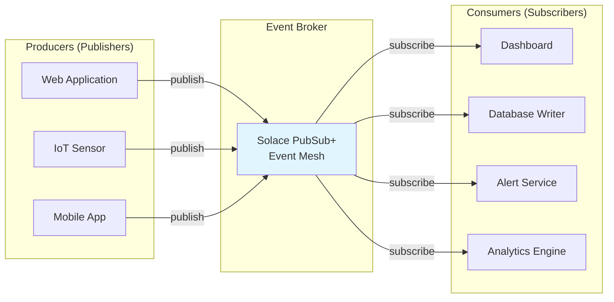
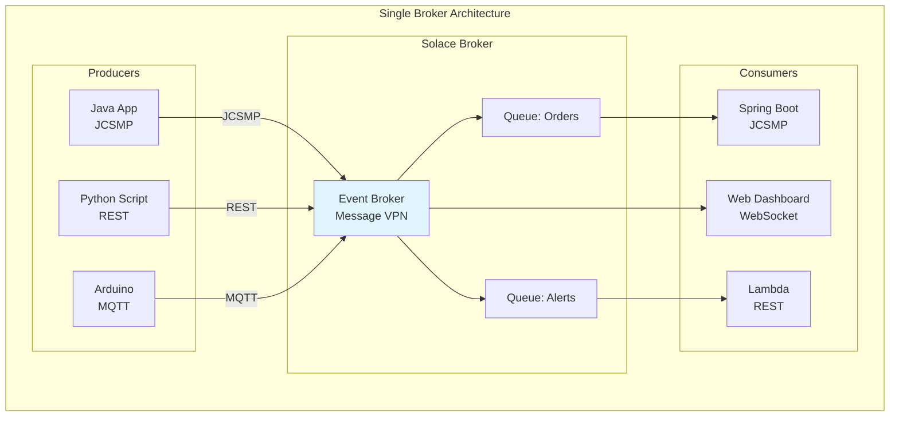
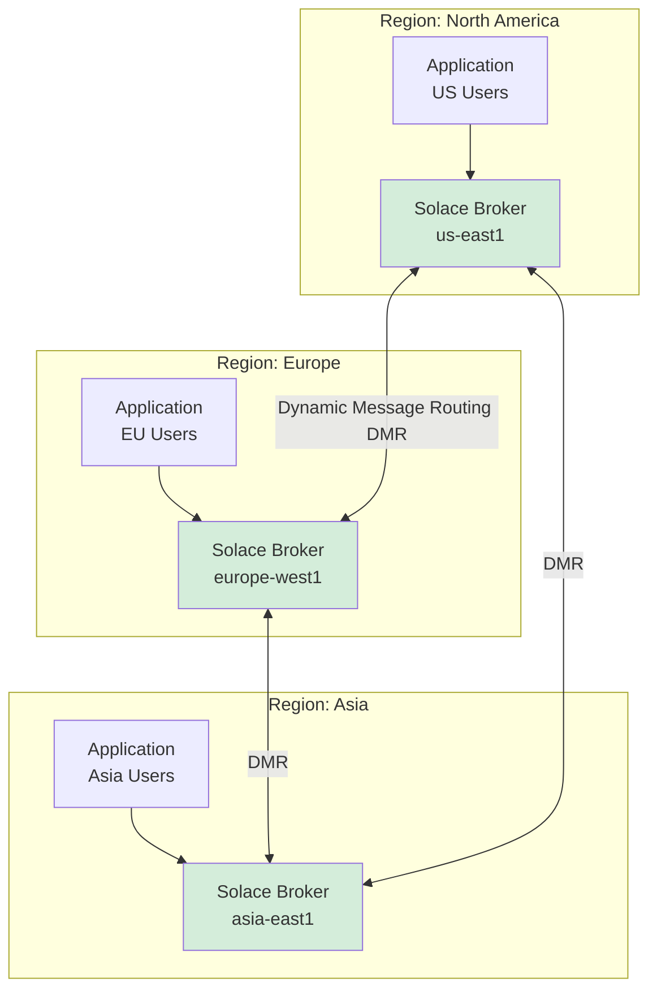

# Solace PubSub+ Hackathon Guide
## Event-Driven Architecture with Java Spring Boot

> **The Complete Guide to Building Scalable, Real-Time Event Meshes at Hackathon Speed**

---

## 📋 Table of Contents

1. [Executive Summary](#executive-summary)
2. [Event-Driven Architecture Fundamentals](#event-driven-architecture-fundamentals)
3. [The Event Mesh Paradigm](#the-event-mesh-paradigm)
4. [Smart Topic Design](#smart-topic-design)
5. [Java Integration Patterns](#java-integration-patterns)
6. [Advanced Integration](#advanced-integration)
7. [Troubleshooting & Diagnostics](#troubleshooting--diagnostics)
8. [The Winning Pitch](#the-winning-pitch)
9. [Quick Reference](#quick-reference)

---

## 🎯 Executive Summary

### Why Event-Driven Architecture (EDA)?

**Traditional Request/Response Problem:**
```
┌───────────────────────────────────────────────────────┐
│  Monolithic / Tightly Coupled Architecture            │
├───────────────────────────────────────────────────────┤
│  Frontend → API → Service A → Service B → Database   │
│                                                        │
│  ❌ If Service B crashes, entire request fails       │
│  ❌ Frontend waits for full chain (slow)             │
│  ❌ Tight coupling prevents independent scaling       │
│  ❌ Adding Service C requires changing A and B        │
└───────────────────────────────────────────────────────┘
```

**Event-Driven Solution:**
```
┌───────────────────────────────────────────────────────┐
│  Decoupled / Event-Driven Architecture                │
├───────────────────────────────────────────────────────┤
│  Frontend ──┐                                         │
│  Service A ─┼──→ Event Broker ──→ Service B          │
│  Sensor ────┘         ↓                               │
│                    Database                           │
│                                                        │
│  ✅ Services operate independently                   │
│  ✅ Real-time data flow                              │
│  ✅ Loose coupling enables rapid changes             │
│  ✅ Natural scalability and resilience               │
└───────────────────────────────────────────────────────┘
```

### The Solace Advantage

| Traditional Message Queue | Solace PubSub+ Event Mesh |
|--------------------------|---------------------------|
| Single protocol (e.g., AMQP) | Multi-protocol (MQTT, AMQP, REST, WebSocket) |
| Point-to-point messaging | Topic-based routing with wildcards |
| Static destinations | Dynamic topic hierarchies |
| Single data center | Global mesh distribution |
| Manual routing configuration | Automatic intelligent routing |

### Hackathon Use Cases

**What You Can Build with Solace:**
1. **Real-Time IoT Dashboard** - Sensors → Solace → Web UI (live updates)
2. **Multi-Player Game** - Player actions → Solace → All clients (no polling)
3. **Collaborative Tool** - User edits → Solace → Real-time sync
4. **Alert System** - Threshold breach → Solace → Notification services
5. **Analytics Pipeline** - Data ingestion → Solace → Processing → Storage

---

## 🏗️ Event-Driven Architecture Fundamentals

### Core Concepts

#### Events: The Fundamental Unit

**An event is a change of state:**
- User clicked "Submit"
- Temperature sensor reading: 72°F
- Payment processed: $99.99
- New user registered: alice@example.com

**Event Anatomy:**
```json
{
  "eventType": "user.registered",
  "timestamp": "2026-01-14T10:30:00Z",
  "userId": "user-12345",
  "email": "alice@example.com",
  "metadata": {
    "source": "web-app",
    "version": "v1"
  }
}
```

#### Producers and Consumers



**Key Principle:** Producers don't know who (if anyone) is listening. Consumers don't know who published. This is **loose coupling**.

### Publish/Subscribe Pattern

```
┌────────────────────────────────────────────────────────┐
│  Traditional Request/Response                           │
├────────────────────────────────────────────────────────┤
│  Client: "Hey Server, give me data"                    │
│  Server: "Here's your data"                            │
│  ├─ 1-to-1 relationship                                │
│  ├─ Synchronous (client waits)                         │
│  └─ Client must know server address                    │
└────────────────────────────────────────────────────────┘

┌────────────────────────────────────────────────────────┐
│  Publish/Subscribe                                      │
├────────────────────────────────────────────────────────┤
│  Publisher: "Here's an event" (to broker, not client)  │
│  Broker: Delivers to all interested subscribers        │
│  ├─ 1-to-many relationship                             │
│  ├─ Asynchronous (fire and forget)                     │
│  └─ Publisher doesn't know subscribers                 │
└────────────────────────────────────────────────────────┘
```

### Direct vs. Guaranteed Messaging

#### Direct Messaging (Fire-and-Forget)

**Characteristics:**
- ✅ Highest throughput (no disk writes)
- ✅ Lowest latency (<1ms)
- ❌ No persistence (lost if consumer offline)
- ❌ No delivery guarantee

**Use Cases:**
```
Stock ticker updates → Update every 100ms, only latest matters
Live video coordinates → Frame dropped? Next one arrives soon
Typing indicators → "Alice is typing..." ephemeral signal
Sensor telemetry → Temperature now: 72°F (stale in 1 second)
```

**Code Pattern:**
```java
TextMessage msg = JCSMPFactory.onlyInstance().createMessage(TextMessage.class);
msg.setText(data);
msg.setDeliveryMode(DeliveryMode.DIRECT);  // Fire and forget
producer.send(msg, topic);
```

#### Guaranteed Messaging (Persistent)

**Characteristics:**
- ✅ Persistent to disk
- ✅ Delivery guaranteed (even if consumer offline)
- ✅ Survives broker restart
- ❌ Higher latency (disk I/O)
- ❌ Lower throughput

**Use Cases:**
```
Payment processed → Cannot lose financial transaction
User registration → Must create account record
Order placed → Must fulfill order
Critical alert → Must notify on-call engineer
```

**Code Pattern:**
```java
TextMessage msg = JCSMPFactory.onlyInstance().createMessage(TextMessage.class);
msg.setText(data);
msg.setDeliveryMode(DeliveryMode.PERSISTENT);  // Guaranteed
producer.send(msg, topic);

// Message stored in Queue until acknowledged by consumer
```

---

## 🌐 The Event Mesh Paradigm

### What is an Event Mesh?

**Definition:** A dynamic infrastructure layer of interconnected event brokers that enables the distribution of events across hybrid cloud, on-premises, and IoT environments.

### The Power of One (Single Broker)



**Benefits:**
1. **Protocol Translation** - MQTT sensor → Java consumer (no conversion needed)
2. **Burst Handling** - Broker queues messages during load spikes
3. **Loose Coupling** - Add/remove services without touching others

### The Power of Many (Mesh)



**Benefits:**
1. **Low Latency** - Users connect to nearest broker
2. **Data Sovereignty** - Keep EU data in EU broker
3. **Disaster Recovery** - If one broker fails, mesh routes around it
4. **Global Scale** - Single logical event bus, distributed infrastructure

### Core Solace Objects

#### Message VPN (Virtual Private Network)

**What It Is:** Logical partition within a broker (like a namespace or tenant)

**Structure:**
```
Physical Broker
│
├─ VPN: "production"
│   ├─ Clients, Queues, Topics
│   └─ Isolated from other VPNs
│
├─ VPN: "development"
│   ├─ Separate clients, queues
│   └─ Cannot see production data
│
└─ VPN: "hackathon-team-a"
    └─ Your team's isolated environment
```

**Configuration:**
```properties
# application.properties
solace.java.msgVpn=hackathon-vpn  # Must match exactly (case-sensitive)
```

#### Clients and Sessions

**Client:** Any application connected to the broker

**Critical Rule:** Client names must be unique within a VPN

**Common Error:**
```
Error 403: Client Name Already In Use

Cause: Running mvn spring-boot:run in two terminals
       → Both use same default client name
```

**Solution:**
```properties
# Add randomness to client name
solace.java.clientName=my-app-${random.value}
```

#### Endpoints: Queues vs. Topic Endpoints

```
┌──────────────────────────────────────────────────────┐
│  QUEUE (Recommended)                                  │
├──────────────────────────────────────────────────────┤
│  • Can have MULTIPLE topic subscriptions             │
│  • Supports MULTIPLE consumers (load balancing)      │
│  • Flexible configuration                            │
│  • Modern, feature-rich                              │
│                                                       │
│  Example:                                            │
│    Queue: "OrderQueue"                               │
│    Subscriptions:                                    │
│      - uottahack/orders/created/v1/>                │
│      - uottahack/orders/updated/v1/>                │
│                                                       │
│    Consumers:                                        │
│      - OrderProcessor-1 (handles 50% of load)       │
│      - OrderProcessor-2 (handles 50% of load)       │
└──────────────────────────────────────────────────────┘

┌──────────────────────────────────────────────────────┐
│  TOPIC ENDPOINT (Legacy)                             │
├──────────────────────────────────────────────────────┤
│  • Only ONE topic subscription                       │
│  • Only ONE consumer                                 │
│  • Limited features                                  │
│  • Mainly for JMS compatibility                      │
│                                                       │
│  ❌ Avoid in new projects                           │
└──────────────────────────────────────────────────────┘
```

**Decision Tree:**
```
Need persistence? ──┐
                    ├─ YES → Use Queue with topic subscription
                    └─ NO  → Use Direct Messaging (no endpoint)
```

---

## 🎯 Smart Topic Design

### The Philosophy of Smart Topics

**Traditional Approach:**
```
Topic: "drone-updates"
Payload: {
  "droneId": "drone-42",
  "location": "ottawa",
  "status": "low-battery"
}

Consumer must:
1. Receive ALL drone updates
2. Parse JSON
3. Filter by droneId, location, status
4. Discard irrelevant messages

Result: Wasted bandwidth, processing, memory
```

**Smart Topic Approach:**
```
Topic: "uottahack/logistics/drone/update/v1/drone-42/ottawa/low-battery"
Payload: {
  "coordinates": [45.4215, -75.6972],
  "batteryPercent": 15
}

Consumer subscribes: "uottahack/logistics/drone/update/v1/*/ottawa/low-battery"

Result:
✅ Only receives relevant messages
✅ Broker filters BEFORE network transmission
✅ No JSON parsing needed for routing decisions
```

### Topic Hierarchy Architecture

**Best Practice Pattern:**
```
domain / subdomain / noun / verb / version / id / property1 / property2

Example:
uottahack / logistics / drone / locationUpdated / v1 / drone-42 / ottawa / active
│          │           │       │                │    │         │        │
│          │           │       │                │    │         │        └─ Status
│          │           │       │                │    │         └────────── Region
│          │           │       │                │    └──────────────────── Unique ID
│          │           │       │                └───────────────────────── API Version
│          │           │       └────────────────────────────────────────── Event Type
│          │           └────────────────────────────────────────────────── Resource
│          └────────────────────────────────────────────────────────────── Team Area
└───────────────────────────────────────────────────────────────────────── Namespace
```

**Why This Structure Wins:**

```
Judge Question: "How do you filter for only emergency events in Ottawa?"

Bad Answer: "We query the database and filter by location and status."

Great Answer: "We subscribe to the wildcard topic:
  uottahack/**/ottawa/emergency
  
The event mesh handles filtering at the infrastructure layer. 
Zero application logic, zero bandwidth waste."
```

### Wildcard Mastery

#### Single-Level Wildcard: `*`

**Matches exactly one level:**

```
Subscription: uottahack/logistics/drone/*/v1

✅ Matches: uottahack/logistics/drone/locationUpdated/v1
✅ Matches: uottahack/logistics/drone/batteryLow/v1
❌ Does NOT match: uottahack/logistics/drone/locationUpdated/v1/drone-42
```

**Use Case:** Subscribe to all event types for a resource
```java
// Receive all drone events (update, alert, etc.)
session.addSubscription(
    JCSMPFactory.onlyInstance().createTopic("uottahack/logistics/drone/*/v1")
);
```

#### Multi-Level Wildcard: `>`

**Matches one or more levels (must be last character):**

```
Subscription: uottahack/logistics/>

✅ Matches: uottahack/logistics/drone/locationUpdated
✅ Matches: uottahack/logistics/truck/departed/v1/truck-5/toronto
✅ Matches: uottahack/logistics/warehouse/inventory/updated
❌ Does NOT match: uottahack/analytics/... (different subdomain)
```

**Use Case:** Subscribe to entire domain or subdomain
```java
// Receive ALL logistics events
session.addSubscription(
    JCSMPFactory.onlyInstance().createTopic("uottahack/logistics/>")
);
```

#### Special Pattern: `**` (Any Emergency)

**Matches "emergency" at any level:**

```
Subscription: uottahack/**/emergency

✅ Matches: uottahack/logistics/drone/alert/v1/drone-42/ottawa/emergency
✅ Matches: uottahack/security/alarm/triggered/v1/building-3/emergency
✅ Matches: uottahack/medical/alert/v1/patient-99/emergency
```

**Use Case:** Critical alerts from any subsystem
```java
// Emergency notification service
session.addSubscription(
    JCSMPFactory.onlyInstance().createTopic("uottahack/**/emergency")
);
```

### Topic Design Decision Matrix

| Scenario | Topic Structure | Subscription Pattern |
|----------|----------------|---------------------|
| **Dashboard: All drones** | `uottahack/drone/*/v1/>` | Display global view |
| **Regional Monitor: Ottawa only** | `uottahack/drone/*/v1/*/ottawa/*` | Filter by region |
| **Battery Alert Service** | `uottahack/drone/batteryLow/v1/>` | Specific event type |
| **Single Drone Tracker** | `uottahack/drone/*/v1/drone-42/>` | Individual resource |
| **Emergency Responder** | `uottahack/**/emergency` | Critical alerts only |

### Protocol Translation: MQTT ↔ Solace

**Arduino (MQTT) publishes:**
```c++
// MQTT uses + for single-level, # for multi-level
client.publish("uottahack/sensor/temperature/v1/sensor-5", "72.5");
```

**Java (JCSMP) subscribes:**
```java
// Solace automatically translates MQTT topics to SMF format
session.addSubscription(
    JCSMPFactory.onlyInstance().createTopic("uottahack/sensor/temperature/v1/sensor-5")
);
// Receives the MQTT message seamlessly!
```

**Translation Rules:**
```
MQTT Wildcard  →  Solace Wildcard
─────────────────────────────────
+              →  *
#              →  >
```

---

## ☕ Java Integration Patterns

### Choosing the Right API

| API | Complexity | Control | Use Case |
|-----|-----------|---------|----------|
| **Spring Cloud Stream** | Low | Low | Simple pub/sub, abstract broker |
| **JMS** | Medium | Medium | Enterprise legacy integration |
| **JCSMP (Native)** | Medium | High | High performance, full features |
| **Solace Spring Boot Starter** | Low | High | **⭐ RECOMMENDED** |

**Why Solace Spring Boot Starter Wins:**
```
✅ Spring Boot auto-configuration (easy DI)
✅ Exposes native JCSMP API (full power)
✅ Best of both worlds
```

### Complete Maven Setup

**pom.xml:**
```xml
<?xml version="1.0" encoding="UTF-8"?>
<project>
    <parent>
        <groupId>org.springframework.boot</groupId>
        <artifactId>spring-boot-starter-parent</artifactId>
        <version>3.2.1</version>
    </parent>
    
    <properties>
        <java.version>17</java.version>
    </properties>
    
    <!-- ══════════════════════════════════════════════════════ -->
    <!-- Import Solace Spring Boot BOM (version management)    -->
    <!-- ══════════════════════════════════════════════════════ -->
    <dependencyManagement>
        <dependencies>
            <dependency>
                <groupId>com.solace.spring.boot</groupId>
                <artifactId>solace-spring-boot-bom</artifactId>
                <version>3.0.0</version>
                <type>pom</type>
                <scope>import</scope>
            </dependency>
        </dependencies>
    </dependencyManagement>
    
    <dependencies>
        <!-- Spring Boot Web -->
        <dependency>
            <groupId>org.springframework.boot</groupId>
            <artifactId>spring-boot-starter-web</artifactId>
        </dependency>
        
        <!-- ══════════════════════════════════════════════════ -->
        <!-- Solace Spring Boot Starter (JCSMP)                -->
        <!-- ══════════════════════════════════════════════════ -->
        <dependency>
            <groupId>com.solace.spring.boot</groupId>
            <artifactId>solace-java-spring-boot-starter</artifactId>
            <!-- Version managed by BOM -->
        </dependency>
    </dependencies>
</project>
```

### Application Configuration

**application.properties:**
```properties
# ═══════════════════════════════════════════════════════════════
# Solace Connection Configuration
# ═══════════════════════════════════════════════════════════════

# Broker URL (protocol://host:port)
solace.java.host=${SOLACE_HOST:tcp://localhost:55555}

# Message VPN name (must match broker config)
solace.java.msgVpn=${SOLACE_VPN:default}

# Authentication
solace.java.clientUsername=${SOLACE_USERNAME:default}
solace.java.clientPassword=${SOLACE_PASSWORD:default}

# Client name (MUST be unique per connection)
solace.java.clientName=${spring.application.name}-${random.value}

# Connection resilience
solace.java.connectRetries=20
solace.java.reconnectRetries=20
solace.java.connectRetriesPerHost=5

# ═══════════════════════════════════════════════════════════════
# Performance Tuning (Optional)
# ═══════════════════════════════════════════════════════════════

# Channel properties
solace.java.channelProperties.connectTimeout=10000
solace.java.channelProperties.readTimeout=10000

# ═══════════════════════════════════════════════════════════════
# TLS/SSL Configuration (for production)
# ═══════════════════════════════════════════════════════════════

# solace.java.host=tcps://secure-broker.solace.cloud:55443
# solace.java.authenticationScheme=AUTHENTICATION_SCHEME_CLIENT_CERTIFICATE
```

### Pattern 1: Dynamic Topic Publisher

```java
package com.hackathon.solace;

import com.google.cloud.firestore.*;
import com.solacesystems.jcsmp.*;
import org.springframework.stereotype.Service;
import org.slf4j.Logger;
import org.slf4j.LoggerFactory;

import javax.annotation.PostConstruct;

@Service
public class EventPublisher {
    
    private static final Logger log = LoggerFactory.getLogger(EventPublisher.class);
    private static final String TOPIC_PREFIX = "uottahack/logistics";
    
    private final SpringJCSMPFactory solaceFactory;
    private JCSMPSession session;
    private XMLMessageProducer producer;
    
    public EventPublisher(SpringJCSMPFactory solaceFactory) {
        this.solaceFactory = solaceFactory;
    }
    
    @PostConstruct
    public void initialize() throws JCSMPException {
        log.info("Initializing Solace Publisher...");
        
        // Create session (lightweight, reuse!)
        this.session = solaceFactory.createSession();
        
        // Create producer with event handler
        this.producer = session.getMessageProducer(
            new JCSMPStreamingPublishEventHandler() {
                @Override
                public void responseReceived(String messageID) {
                    // ACK received (only for guaranteed messaging)
                    log.debug("Message {} acknowledged", messageID);
                }
                
                @Override
                public void handleError(String messageID, JCSMPException e, long timestamp) {
                    // NACK or connection error
                    log.error("Failed to publish message {}: {}", messageID, e.getMessage());
                }
            }
        );
        
        // Connect session
        session.connect();
        
        log.info("Solace Publisher ready");
    }
    
    /**
     * Publish drone location update (Direct Messaging)
     * 
     * Topic Structure:
     * uottahack/logistics/drone/locationUpdated/v1/{droneId}/{region}/{status}
     */
    public void publishDroneLocation(String droneId, String region, String status, 
                                     double lat, double lon) throws JCSMPException {
        
        // Build dynamic topic
        String topicString = String.format(
            "%s/drone/locationUpdated/v1/%s/%s/%s",
            TOPIC_PREFIX, droneId, region, status
        );
        
        Topic topic = JCSMPFactory.onlyInstance().createTopic(topicString);
        
        // Create message
        TextMessage msg = JCSMPFactory.onlyInstance().createMessage(TextMessage.class);
        
        // Payload (keep light - filtering done by topic!)
        String payload = String.format("{\"lat\":%.6f,\"lon\":%.6f,\"ts\":%d}", 
                                      lat, lon, System.currentTimeMillis());
        msg.setText(payload);
        
        // Direct messaging (fire-and-forget, high throughput)
        msg.setDeliveryMode(DeliveryMode.DIRECT);
        
        // Optional: Add metadata
        msg.setApplicationMessageId(droneId + "-" + System.currentTimeMillis());
        
        // Send
        producer.send(msg, topic);
        
        log.debug("Published drone update: {}", topicString);
        
        // CRITICAL: Reset message for reuse (performance optimization)
        msg.reset();
    }
    
    /**
     * Publish order created event (Guaranteed Messaging)
     * 
     * Topic: uottahack/logistics/order/created/v1/{orderId}
     */
    public void publishOrderCreated(String orderId, String orderData) throws JCSMPException {
        
        String topicString = String.format(
            "%s/order/created/v1/%s",
            TOPIC_PREFIX, orderId
        );
        
        Topic topic = JCSMPFactory.onlyInstance().createTopic(topicString);
        
        TextMessage msg = JCSMPFactory.onlyInstance().createMessage(TextMessage.class);
        msg.setText(orderData);
        
        // PERSISTENT = Guaranteed delivery
        msg.setDeliveryMode(DeliveryMode.PERSISTENT);
        
        // Send and wait for ACK
        producer.send(msg, topic);
        
        log.info("Published order: {}", orderId);
    }
}
```

### Pattern 2: Wildcard Subscriber (Direct Messaging)

```java
package com.hackathon.solace;

import com.solacesystems.jcsmp.*;
import org.springframework.stereotype.Service;
import org.slf4j.Logger;
import org.slf4j.LoggerFactory;

import javax.annotation.PostConstruct;

@Service
public class EventSubscriber {
    
    private static final Logger log = LoggerFactory.getLogger(EventSubscriber.class);
    
    private final SpringJCSMPFactory solaceFactory;
    private JCSMPSession session;
    
    public EventSubscriber(SpringJCSMPFactory solaceFactory) {
        this.solaceFactory = solaceFactory;
    }
    
    @PostConstruct
    public void initialize() throws JCSMPException {
        log.info("Initializing Solace Subscriber...");
        
        session = solaceFactory.createSession();
        
        // Create message consumer with callback
        XMLMessageConsumer consumer = session.getMessageConsumer(
            new XMLMessageListener() {
                @Override
                public void onReceive(BytesXMLMessage msg) {
                    handleMessage(msg);
                }
                
                @Override
                public void onException(JCSMPException e) {
                    log.error("Consumer exception: {}", e.getMessage());
                }
            }
        );
        
        consumer.start();
        session.connect();
        
        // Subscribe to topics
        subscribeToTopics();
        
        log.info("Solace Subscriber ready");
    }
    
    private void subscribeToTopics() throws JCSMPException {
        // ───────────────────────────────────────────────────────
        // Subscribe to ALL drone events
        // ───────────────────────────────────────────────────────
        Topic allDrones = JCSMPFactory.onlyInstance()
            .createTopic("uottahack/logistics/drone/>");
        session.addSubscription(allDrones);
        log.info("Subscribed to: uottahack/logistics/drone/>");
        
        // ───────────────────────────────────────────────────────
        // Subscribe to Ottawa emergencies ONLY
        // ───────────────────────────────────────────────────────
        Topic ottawaEmergency = JCSMPFactory.onlyInstance()
            .createTopic("uottahack/logistics/drone/*/v1/*/ottawa/emergency");
        session.addSubscription(ottawaEmergency);
        log.info("Subscribed to: uottahack/logistics/drone/*/v1/*/ottawa/emergency");
    }
    
    private void handleMessage(BytesXMLMessage msg) {
        try {
            // Extract topic (contains routing info!)
            String topic = msg.getDestination().getName();
            
            // Parse payload
            String payload = "";
            if (msg instanceof TextMessage) {
                payload = ((TextMessage) msg).getText();
            }
            
            log.info("Received message on topic: {}", topic);
            log.debug("Payload: {}", payload);
            
            // ───────────────────────────────────────────────────
            // Route based on TOPIC (not payload parsing!)
            // ───────────────────────────────────────────────────
            
            if (topic.contains("/emergency")) {
                handleEmergency(topic, payload);
            } else if (topic.contains("/locationUpdated")) {
                handleLocationUpdate(topic, payload);
            } else {
                log.warn("Unhandled topic: {}", topic);
            }
            
        } catch (Exception e) {
            log.error("Error handling message", e);
        }
    }
    
    private void handleEmergency(String topic, String payload) {
        // Extract drone ID from topic
        String[] parts = topic.split("/");
        String droneId = parts.length > 5 ? parts[5] : "unknown";
        
        log.error("🚨 EMERGENCY: Drone {} - {}", droneId, payload);
        
        // Trigger alert service, send notification, etc.
    }
    
    private void handleLocationUpdate(String topic, String payload) {
        log.debug("Location update: {}", payload);
        
        // Update dashboard, save to database, etc.
    }
}
```

### Pattern 3: Guaranteed Messaging with Queue

```java
package com.hackathon.solace;

import com.solacesystems.jcsmp.*;
import org.springframework.stereotype.Service;
import org.slf4j.Logger;
import org.slf4j.LoggerFactory;

import javax.annotation.PostConstruct;

@Service
public class OrderProcessor {
    
    private static final Logger log = LoggerFactory.getLogger(OrderProcessor.class);
    private static final String QUEUE_NAME = "OrderQueue";
    
    private final SpringJCSMPFactory solaceFactory;
    private JCSMPSession session;
    private FlowReceiver flowReceiver;
    
    public OrderProcessor(SpringJCSMPFactory solaceFactory) {
        this.solaceFactory = solaceFactory;
    }
    
    @PostConstruct
    public void initialize() throws JCSMPException {
        log.info("Initializing Order Processor...");
        
        session = solaceFactory.createSession();
        session.connect();
        
        // Create queue endpoint
        final Queue queue = JCSMPFactory.onlyInstance().createQueue(QUEUE_NAME);
        
        // Configure flow properties
        ConsumerFlowProperties flowProps = new ConsumerFlowProperties();
        flowProps.setEndpoint(queue);
        flowProps.setAckMode(JCSMPProperties.SUPPORTED_MESSAGE_ACK_CLIENT); // Manual ACK
        
        // Configure endpoint properties
        EndpointProperties endpointProps = new EndpointProperties();
        endpointProps.setAccessType(EndpointProperties.ACCESSTYPE_EXCLUSIVE);
        
        // Create flow receiver with message handler
        flowReceiver = session.createFlow(
            new XMLMessageListener() {
                @Override
                public void onReceive(BytesXMLMessage msg) {
                    processOrder(msg);
                }
                
                @Override
                public void onException(JCSMPException e) {
                    log.error("Flow exception: {}", e.getMessage());
                }
            },
            flowProps,
            endpointProps
        );
        
        flowReceiver.start();
        
        log.info("Order Processor listening on queue: {}", QUEUE_NAME);
    }
    
    private void processOrder(BytesXMLMessage msg) {
        try {
            String payload = ((TextMessage) msg).getText();
            String topic = msg.getDestination().getName();
            
            log.info("Processing order from topic: {}", topic);
            log.debug("Order data: {}", payload);
            
            // ───────────────────────────────────────────────────
            // Business Logic Here
            // ───────────────────────────────────────────────────
            
            // Parse JSON, save to database, call external API, etc.
            boolean success = processOrderLogic(payload);
            
            if (success) {
                // CRITICAL: Acknowledge message (removes from queue)
                msg.ackMessage();
                log.info("Order processed successfully");
            } else {
                // Do NOT acknowledge
                // Message will be redelivered based on queue settings
                log.warn("Order processing failed, will retry");
            }
            
        } catch (Exception e) {
            log.error("Error processing order", e);
            // Do NOT ack - message will be redelivered
        }
    }
    
    private boolean processOrderLogic(String orderData) {
        // Your business logic
        // Return true if successful, false to retry
        return true;
    }
}
```

---

## 🔌 Advanced Integration

### Request/Reply Pattern

**Use Case:** "Login" request needs immediate response

```java
@Service
public class RequestReplyService {
    
    private final SpringJCSMPFactory solaceFactory;
    private JCSMPSession session;
    private Requestor requestor;
    
    @PostConstruct
    public void init() throws JCSMPException {
        session = solaceFactory.createSession();
        requestor = session.createRequestor();
        session.connect();
    }
    
    /**
     * Send request and wait for reply (blocking)
     */
    public String sendRequest(String requestData) throws JCSMPException {
        Topic requestTopic = JCSMPFactory.onlyInstance()
            .createTopic("uottahack/auth/login/request");
        
        TextMessage request = JCSMPFactory.onlyInstance()
            .createMessage(TextMessage.class);
        request.setText(requestData);
        
        // Send and wait for reply (timeout: 5 seconds)
        BytesXMLMessage reply = requestor.request(request, 5000, requestTopic);
        
        if (reply != null && reply instanceof TextMessage) {
            return ((TextMessage) reply).getText();
        } else {
            throw new JCSMPException("No reply received");
        }
    }
}
```

**Replier Service:**
```java
@Service
public class AuthReplier {
    
    @PostConstruct
    public void init() throws JCSMPException {
        session = solaceFactory.createSession();
        
        XMLMessageConsumer consumer = session.getMessageConsumer(
            new XMLMessageListener() {
                @Override
                public void onReceive(BytesXMLMessage msg) {
                    // Check if request message (has ReplyTo)
                    Destination replyTo = msg.getReplyTo();
                    if (replyTo != null) {
                        sendReply(msg, replyTo);
                    }
                }
            }
        );
        
        consumer.start();
        session.connect();
        
        // Subscribe to request topic
        session.addSubscription(
            JCSMPFactory.onlyInstance().createTopic("uottahack/auth/login/request")
        );
    }
    
    private void sendReply(BytesXMLMessage request, Destination replyTo) {
        try {
            // Process request
            String requestData = ((TextMessage) request).getText();
            String responseData = processLogin(requestData);
            
            // Create reply
            TextMessage reply = JCSMPFactory.onlyInstance()
                .createMessage(TextMessage.class);
            reply.setText(responseData);
            
            // Send reply to ReplyTo destination
            producer.send(reply, replyTo);
            
        } catch (Exception e) {
            log.error("Error sending reply", e);
        }
    }
}
```

### Topic-to-Queue Mapping

**Problem:** Want persistence without changing publishers

**Solution:** Map topics to queues in broker

**Broker Configuration (via Solace Cloud Console):**
```
1. Create Queue: "EventArchive"
2. Add Topic Subscription to Queue:
   - Subscription: "uottahack/>"
   - Result: All events also stored in queue
3. Consumer reads from queue (with ACK)
```

**Benefits:**
- Publishers use direct messaging (fast)
- Queue provides persistence (safety)
- Decoupled: Publishers don't know about queue

---

## 🔧 Troubleshooting & Diagnostics

### Common Connection Errors

#### Error: 403 Client Name Already In Use

**Symptom:**
```
SDKErrorSubcode: 403 - CLIENT_NAME_ALREADY_IN_USE
```

**Cause:** Two instances using same client name

**Solution:**
```properties
# Add randomness
solace.java.clientName=my-app-${random.value}
```

#### Error: 403 Forbidden / VPN Not Allowed

**Symptom:**
```
SDKErrorSubcode: 403 - FORBIDDEN
Subcode: VPN_NAME_NOT_ALLOWED
```

**Diagnosis:**
```bash
# Check VPN name (case-sensitive!)
echo $SOLACE_VPN

# Verify in Solace Cloud console: Connect → VPN Name
```

**Fix:** Update `application.properties` with exact VPN name

#### Error: Connection Timeout

**Symptom:**
```
JCSMPTransportException: Connection timeout
```

**Causes:**
1. Wrong host URL
2. Firewall blocking port
3. Broker is down

**Debug Steps:**
```bash
# 1. Test connectivity
telnet your-broker.solace.cloud 55555

# 2. Check broker status (Solace Cloud console)
#    Service Status: Running?

# 3. Try web messaging port (bypasses firewall)
solace.java.host=tcps://your-broker.solace.cloud:55443
```

### Subscription Issues

#### Messages Not Received

**Checklist:**
```
✓ Is subscriber started BEFORE publisher sends?
  → Direct messages are not stored
  
✓ Is subscription pattern correct?
  → Use Try-Me to test
  
✓ Does topic match subscription wildcard?
  → Log published topic vs subscription
  
✓ Is delivery mode correct?
  → Direct vs Persistent (Queue)
```

**Debug Pattern:**
```java
// Add logging to verify subscription
session.addSubscription(topic);
log.info("Subscribed to: {}", topic.getName());

// Log every received message
public void onReceive(BytesXMLMessage msg) {
    log.info("RECEIVED on topic: {}", msg.getDestination().getName());
    // ... rest of logic
}
```

### Using Try-Me Tool (Critical for Debugging)

**Solace Cloud Console → Try-Me Tab:**

```
Step 1: Open Subscriber
  - Connect
  - Subscribe: ">"  (all topics)
  
Step 2: Test Publisher
  - Run your Java app
  - Check if messages appear in Try-Me
  
Result Analysis:
  ✅ Messages appear → Publisher OK, Subscriber broken
  ❌ No messages → Publisher broken
```

### Queue Troubleshooting

#### Messages Stuck in Queue

**Symptom:** Queue depth increasing, consumer not processing

**Causes:**
1. Consumer crashed (not acknowledging)
2. Consumer too slow (backlog building)
3. Poison message (bad data causing exception)

**Solutions:**
```bash
# Check queue stats (Solace console)
Queue → Messages Queued

# Browse queue (inspect messages without consuming)
# Use Try-Me or CLI

# Clear queue (last resort)
# Solace console → Queue → Actions → Purge
```

---

## 🏆 The Winning Pitch

### Technical Talking Points

#### Point 1: The Central Nervous System

> "We didn't just build an app; we built a responsive ecosystem. Solace PubSub+ acts as our central nervous system, allowing our drone sensors, user dashboard, and AI analytics to communicate through events rather than tight coupling. This means we can add a new service—like a weather integration—without touching any existing code. It's plug-and-play architecture."

**Demo:** Show service topology diagram with Solace in center

#### Point 2: Smart Topics

> "Our architecture uses Smart Topics. Instead of sending all data to all consumers and filtering in application code, we embed metadata in the topic hierarchy itself. For example, to get only emergency alerts in Ottawa, we subscribe to `uottahack/**/ottawa/emergency`. The event mesh filters at the infrastructure layer, saving bandwidth and processing power."

**Demo:** 
```bash
# Terminal 1: Subscribe to ottawa/emergency
# Terminal 2: Publish to toronto/emergency
# Result: Terminal 1 receives nothing (filtered by broker)
```

#### Point 3: Protocol Agnostic

> "We support IoT sensors using MQTT, a Python analytics script using REST, and our Java backend using the native JCSMP protocol. Solace handles protocol translation automatically. An Arduino publishing via MQTT can trigger a Cloud Run service written in Java, with zero custom conversion logic."

**Demo:** Show Arduino code (MQTT) → Java subscriber (JCSMP)

#### Point 4: Real-Time Without Polling

> "Our dashboard updates in real-time without polling. When a drone's battery hits 15%, the event is published once, and all interested subscribers—dashboard, alert service, analytics—receive it within milliseconds. There's no database query, no REST API call, no polling loop."

**Demo:** Open dashboard, trigger low battery event, show instant update

### Judge Questions & Answers

**Q: "How does this scale to 10,000 users?"**

**A:** 
> "Each Solace broker can handle 200,000 messages per second. Because we use topic-based routing with wildcards, each user subscribes only to the data they need—for example, `drone/update/v1/their-drone-id/>`. The broker intelligently routes each message only to interested subscribers, so 10,000 users doesn't mean 10,000x the bandwidth."

---

**Q: "What happens if the broker crashes?"**

**A:** 
> "For direct messaging, in-flight messages are lost, but our system continues generating new data—it's designed for ephemeral telemetry where the latest value matters most. For critical data like orders, we use guaranteed messaging with persistent queues. Messages are written to disk and survive broker restarts. Additionally, in production, we'd deploy an event mesh with multiple brokers for high availability."

---

**Q: "Why not just use WebSockets?"**

**A:** 
> "WebSockets provide the transport layer, but we'd still need to build the routing logic, topic filtering, protocol translation, message persistence, and load balancing ourselves. Solace provides all of this out-of-the-box, letting us focus on business logic rather than infrastructure."

---

## 📚 Quick Reference

### Configuration Templates

**application.properties:**
```properties
# Solace Cloud
solace.java.host=tcp://mr-xyz.messaging.solace.cloud:55555
solace.java.msgVpn=hackathon-vpn
solace.java.clientUsername=solace-cloud-client
solace.java.clientPassword=your-password
solace.java.clientName=${spring.application.name}-${random.value}

# Reconnect settings
solace.java.connectRetries=20
solace.java.reconnectRetries=20

# Local Docker
# solace.java.host=tcp://localhost:55555
# solace.java.msgVpn=default
# solace.java.clientUsername=admin
# solace.java.clientPassword=admin
```

### Topic Patterns

```
# All events in domain
uottahack/>

# All drone events
uottahack/logistics/drone/>

# Specific event type
uottahack/logistics/drone/locationUpdated/v1/>

# Specific drone, all events
uottahack/logistics/drone/*/v1/drone-42/>

# Regional filtering
uottahack/logistics/drone/*/v1/*/ottawa/*

# Emergency alerts only
uottahack/**/emergency

# Combine region + status
uottahack/logistics/drone/*/v1/*/ottawa/low-battery
```

### Code Snippets

**Publish (Direct):**
```java
TextMessage msg = JCSMPFactory.onlyInstance().createMessage(TextMessage.class);
msg.setText(payload);
msg.setDeliveryMode(DeliveryMode.DIRECT);
producer.send(msg, topic);
msg.reset();
```

**Subscribe (Direct):**
```java
session.getMessageConsumer(listener).start();
session.connect();
session.addSubscription(JCSMPFactory.onlyInstance().createTopic("uottahack/>"));
```

**Guaranteed (Queue):**
```java
Queue queue = JCSMPFactory.onlyInstance().createQueue("MyQueue");
FlowReceiver flow = session.createFlow(listener, flowProps, endpointProps);
flow.start();
```

---

## 🎓 Learning Path

**Day 1: Fundamentals**
- [ ] Install Solace Cloud free instance
- [ ] Connect with Try-Me tool
- [ ] Publish and subscribe manually
- [ ] Experiment with wildcards

**Day 2: Java Integration**
- [ ] Add Solace Spring Boot Starter to pom.xml
- [ ] Configure application.properties
- [ ] Create simple publisher
- [ ] Create simple subscriber
- [ ] Test end-to-end locally

**Day 3: Smart Topics**
- [ ] Design topic hierarchy for your project
- [ ] Implement dynamic topic publishing
- [ ] Use wildcards for filtering
- [ ] Test with multiple subscribers

**Day 4: Production Readiness**
- [ ] Implement guaranteed messaging
- [ ] Create queues and subscriptions
- [ ] Add error handling
- [ ] Load test with Try-Me

---

**Build event-driven, scale infinitely! 🚀**
