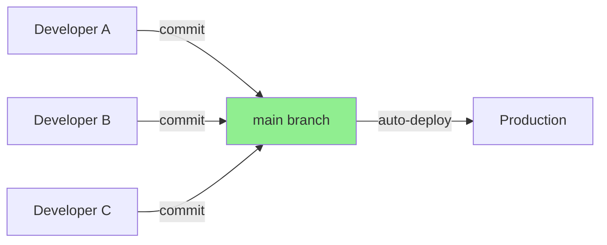
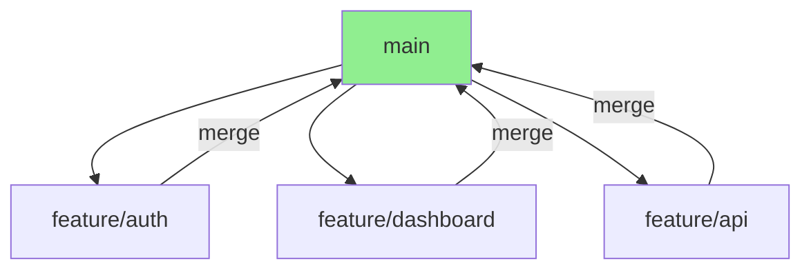

# Hackathon Team Collaboration Guide
## Git Workflows, Development Sync, and Parallel Development Strategies

> **The Complete Guide to Multi-Developer Coordination in High-Pressure Hackathon Environments**

---

## 📋 Table of Contents

1. [Pre-Hackathon Team Setup](#pre-hackathon-team-setup)
2. [Git Workflow Strategies](#git-workflow-strategies)
3. [Environment Synchronization](#environment-synchronization)
4. [Parallel Development Patterns](#parallel-development-patterns)
5. [Communication Protocols](#communication-protocols)
6. [Conflict Resolution](#conflict-resolution)
7. [Live Collaboration Tools](#live-collaboration-tools)
8. [Division of Labor](#division-of-labor)
9. [Troubleshooting Team Issues](#troubleshooting-team-issues)
10. [Quick Reference](#quick-reference)

---

## 🎯 Pre-Hackathon Team Setup

### Day Before: Team Alignment Checklist

```
□ Repository Setup
  □ Create GitHub organization/repo
  □ Add all team members as collaborators
  □ Set up branch protection rules (optional)
  □ Create initial project structure
  
□ Access & Credentials
  □ Create shared GCP project
  □ Grant IAM roles to all team members
  □ Share Solace broker credentials securely
  □ Set up Workload Identity Federation
  
□ Development Environment
  □ Create environment setup script
  □ Document required software versions
  □ Test that everyone can run locally
  □ Set up shared .env.template file
  
□ Communication Channels
  □ Discord/Slack channel for team
  □ Shared Google Doc for decisions
  □ GitHub Project board (optional)
  
□ Role Assignment (Preliminary)
  □ Identify team lead / decision maker
  □ Assign primary areas (frontend, backend, infra)
  □ Determine who handles demo/pitch
```

---

## 🔀 Git Workflow Strategies

### Strategy 1: Trunk-Based Development (Recommended for Hackathons)

**Philosophy:** Everyone commits to `main`, small frequent commits



**Advantages:**
- ✅ Simple, no complex branching
- ✅ Fast integration, catch conflicts early
- ✅ CI/CD works seamlessly
- ✅ No merge overhead

**Rules:**
```bash
# Rule 1: Pull before you push
git pull origin main
git add .
git commit -m "Add user authentication"
git push origin main

# Rule 2: Commit small, commit often
# Bad:  One commit after 4 hours
# Good: 10 commits over 4 hours

# Rule 3: Write descriptive commit messages
# Bad:  "fix"
# Good: "Fix null pointer in UserService.login()"

# Rule 4: If build breaks, fix immediately
# Red build = team is blocked
```

**When Someone Breaks Main:**
```bash
# Emergency Protocol
git revert HEAD              # Undo last commit
git push origin main         # Restore working state
# Then fix offline and recommit
```

### Strategy 2: Feature Branches (For Larger Teams)

**Philosophy:** Each feature gets a short-lived branch



**Workflow:**
```bash
# Developer A: Authentication
git checkout -b feature/auth
# ... work ...
git add .
git commit -m "Implement JWT authentication"
git push origin feature/auth

# Create Pull Request on GitHub
# Quick review by teammate (5 min max)
# Merge to main

# Developer A: Clean up
git checkout main
git pull origin main
git branch -d feature/auth
```

**Branch Naming Convention:**
```
feature/user-authentication   # New feature
fix/login-null-pointer        # Bug fix
refactor/database-service     # Code improvement
docs/api-documentation        # Documentation
```

**PR Review Protocol (Fast):**
```
Time budget: 5 minutes maximum

✓ Does it run?
✓ Does it break existing features?
✓ Any obvious bugs?

❌ Don't nitpick style
❌ Don't request architectural changes
❌ Don't delay for "perfect" code
```

### Strategy 3: Pair Programming (No Branches)

**Philosophy:** Two developers, one screen, one keyboard

```
Driver (typing)  +  Navigator (reviewing)  =  Higher quality, fewer conflicts

Rotate every 20-30 minutes
```

**Tools:**
- VS Code Live Share (real-time collaboration)
- Screen sharing (Discord/Zoom)
- Physical co-location (same room)

**When to Use:**
- Complex features (e.g., payment integration)
- Debugging critical issues
- Learning new technology together
- High-risk code (security, data integrity)

---

## ⚙️ Environment Synchronization

### The `.env.template` Pattern

**Problem:** Each developer has different credentials

**Solution:** Template file in git, actual secrets gitignored

**Repository Structure:**
```
project/
├── .env.template          # ✅ Committed to git
├── .env.local            # ❌ Gitignored
├── .gitignore            # ✅ Committed
└── README.md             # ✅ Setup instructions
```

**.env.template:**
```bash
# ═══════════════════════════════════════════════════════════════
# Environment Variables Template
# Copy this file to .env.local and fill in your values
# ═══════════════════════════════════════════════════════════════

# GCP Configuration
GCP_PROJECT_ID=your-shared-project-id-here
GCP_REGION=us-central1

# Solace Configuration
SOLACE_HOST=tcp://mr-xyz.messaging.solace.cloud:55555
SOLACE_VPN=hackathon-vpn
SOLACE_USERNAME=get-from-team-lead
SOLACE_PASSWORD=get-from-team-lead

# Database (if not using Firestore)
# DATABASE_URL=postgresql://localhost:5432/hackathon

# API Keys (shared in Discord)
# OPENAI_API_KEY=sk-...
# STRIPE_API_KEY=sk_test_...

# Local Development Ports
PORT=8080
FRONTEND_PORT=3000
```

**.gitignore:**
```
# Environment files
.env.local
.env
.env.*.local

# IDE
.idea/
.vscode/
*.swp

# OS
.DS_Store
Thumbs.db

# Dependencies
node_modules/
target/
build/

# Logs
*.log
```

### Setup Script (setup.sh)

```bash
#!/bin/bash
set -euo pipefail

echo "🚀 Hackathon Project Setup"
echo "=========================="
echo ""

# ───────────────────────────────────────────────────────────────
# Step 1: Check Prerequisites
# ───────────────────────────────────────────────────────────────

echo "Checking prerequisites..."

command -v java >/dev/null 2>&1 || {
    echo "❌ Java not found. Install Java 17."
    exit 1
}

command -v mvn >/dev/null 2>&1 || {
    echo "❌ Maven not found. Install Maven."
    exit 1
}

command -v docker >/dev/null 2>&1 || {
    echo "❌ Docker not found. Install Docker Desktop."
    exit 1
}

command -v gcloud >/dev/null 2>&1 || {
    echo "⚠️  gcloud not found. Optional but recommended."
}

echo "✅ Prerequisites OK"
echo ""

# ───────────────────────────────────────────────────────────────
# Step 2: Environment File
# ───────────────────────────────────────────────────────────────

if [ ! -f .env.local ]; then
    echo "Creating .env.local from template..."
    cp .env.template .env.local
    echo "⚠️  Please edit .env.local with your credentials"
    echo "   Get credentials from team lead"
    echo ""
    read -p "Press Enter when you've updated .env.local..."
fi

echo "✅ Environment configured"
echo ""

# ───────────────────────────────────────────────────────────────
# Step 3: Dependencies
# ───────────────────────────────────────────────────────────────

echo "Installing dependencies..."
mvn dependency:go-offline -B

echo "✅ Dependencies installed"
echo ""

# ───────────────────────────────────────────────────────────────
# Step 4: Verify Build
# ───────────────────────────────────────────────────────────────

echo "Building project..."
mvn clean package -DskipTests -B

echo "✅ Build successful"
echo ""

# ───────────────────────────────────────────────────────────────
# Step 5: Ready to Go
# ───────────────────────────────────────────────────────────────

echo "════════════════════════════════════════"
echo "✅ Setup complete!"
echo "════════════════════════════════════════"
echo ""
echo "Next steps:"
echo "  1. Run locally:  ./dev.sh"
echo "  2. Run tests:    mvn test"
echo "  3. Deploy:       git push origin main"
echo ""
```

### Dependency Lock Files

**For Maven (pom.xml):**
```xml
<!-- Everyone uses exact same versions -->
<properties>
    <java.version>17</java.version>
    <spring-boot.version>3.2.1</spring-boot.version>
    <solace.version>5.5.0</solace.version>
</properties>
```

**For npm (package-lock.json):**
```bash
# Commit package-lock.json
git add package-lock.json
git commit -m "Lock dependency versions"

# Everyone runs
npm ci  # NOT npm install (ci uses lock file exactly)
```

### Version Check Script

```bash
#!/bin/bash
# check-versions.sh

echo "Team Environment Audit"
echo "======================"
echo ""

echo "Java:    $(java -version 2>&1 | head -n 1)"
echo "Maven:   $(mvn -version | head -n 1)"
echo "Docker:  $(docker --version)"
echo "Node:    $(node --version 2>/dev/null || echo 'Not installed')"
echo "gcloud:  $(gcloud --version 2>/dev/null | head -n 1 || echo 'Not installed')"

echo ""
echo "Git Branch: $(git branch --show-current)"
echo "Last Commit: $(git log -1 --oneline)"
```

---

## 🔄 Parallel Development Patterns

### Pattern 1: Feature-Based Isolation

**Divide by Feature:**
```
Team of 3 developers:

Developer A: Authentication
  ├── Files: src/main/java/auth/
  ├── Risk: Low conflict (new files)
  └── Integration: REST API endpoint

Developer B: Dashboard UI
  ├── Files: frontend/src/components/
  ├── Risk: Low conflict (separate codebase)
  └── Integration: Calls API endpoint

Developer C: Database & Infrastructure
  ├── Files: terraform/, docker-compose.yml
  ├── Risk: Medium conflict (shared config)
  └── Integration: Provides DB connection
```

**Communication Contract:**
```yaml
# Shared in team doc

API Endpoints (Developer A):
  POST /api/auth/login
    Request: { username, password }
    Response: { token, userId }
  
Database Schema (Developer C):
  Table: users
    Columns: id, username, password_hash, created_at
  
UI Components (Developer B):
  LoginForm.jsx
    Props: onLoginSuccess(token)
```

### Pattern 2: Layer-Based Isolation

**Divide by Layer:**
```
Developer A: Frontend (React/Vue)
  └── Talks to → Mock API (JSON responses)

Developer B: Backend API (Spring Boot)
  └── Talks to → Mock Database (in-memory)

Developer C: Infrastructure (GCP, Solace)
  └── Deploys → Real environment

Integration: Last 6 hours of hackathon
```

**Mock API (Developer A):**
```javascript
// frontend/src/api/mock.js
export const mockAPI = {
  login: async (username, password) => {
    // Simulate network delay
    await new Promise(r => setTimeout(r, 500));
    return { token: "mock-token", userId: 123 };
  },
  
  getDashboard: async () => {
    return {
      drones: [
        { id: "drone-1", status: "active", battery: 85 },
        { id: "drone-2", status: "charging", battery: 15 }
      ]
    };
  }
};

// Later: Replace with real API
import { realAPI } from './real.js';
// export const api = realAPI;
```

### Pattern 3: Time-Boxing

**Divide by Time:**
```
┌────────────────────────────────────────────────────┐
│  Hours 0-8: Infrastructure (Everyone)              │
│  ├─ Set up GCP, Solace, CI/CD                     │
│  └─ Everyone contributes, pair programming         │
├────────────────────────────────────────────────────┤
│  Hours 8-20: Parallel Development                  │
│  ├─ Developer A: Feature X                        │
│  ├─ Developer B: Feature Y                        │
│  └─ Developer C: Feature Z                        │
├────────────────────────────────────────────────────┤
│  Hours 20-24: Integration & Polish                 │
│  ├─ Merge all features                            │
│  ├─ End-to-end testing                            │
│  └─ Prepare demo/pitch                            │
└────────────────────────────────────────────────────┘
```

### Pattern 4: Driver-Navigator Rotation

**Pairing Schedule:**
```
┌─────────────────────────────────────────┐
│  10:00 AM - 12:00 PM                    │
│  Driver: Alice                          │
│  Navigator: Bob                         │
│  Task: Database integration             │
├─────────────────────────────────────────┤
│  12:00 PM - 2:00 PM                     │
│  Driver: Bob                            │
│  Navigator: Charlie                     │
│  Task: API endpoints                    │
├─────────────────────────────────────────┤
│  2:00 PM - 4:00 PM                      │
│  Driver: Charlie                        │
│  Navigator: Alice                       │
│  Task: Frontend components              │
└─────────────────────────────────────────┘
```

---

## 💬 Communication Protocols

### The 3-Channel System

**Channel 1: Discord/Slack (Real-Time)**
```
#general
  "Pushing fix for login bug"
  "API endpoint /users ready for testing"
  "Need help with Solace connection timeout"

#code-updates
  GitHub webhook: Automatic commit notifications

#decisions
  "Decision: Using JWT for auth"
  "Decision: SQLite for local dev, Firestore for prod"
```

**Channel 2: Google Doc (Decisions)**
```markdown
# Team Decisions Log

## Architecture Decisions
- [x] Backend: Spring Boot (Java 17)
- [x] Database: Firestore
- [x] Messaging: Solace PubSub+
- [ ] Frontend: React vs Vue (vote by 2 PM)

## API Contracts
### POST /api/login
Request: `{ "username": "...", "password": "..." }`
Response: `{ "token": "...", "userId": 123 }`
Status: ✅ Implemented by Alice

## Issues
- [BLOCKER] Firestore auth failing in prod (Bob investigating)
- [MINOR] Dashboard refresh slow (defer to polish phase)
```

**Channel 3: GitHub Issues (Async)**
```
Use for:
- Bug reports (with screenshots)
- Feature requests
- Technical debt notes

NOT for:
- Urgent issues (use Discord)
- Quick questions (use Discord)
```

### Communication Rules

**Rule 1: Announce Major Changes**
```bash
# BAD: Silently rewrite database schema
git commit -m "Refactor database"
git push

# GOOD: Announce in Discord first
"@team I'm about to change the User table schema. 
 If you have uncommitted work on UserService, please push now.
 Changes in 5 minutes."
```

**Rule 2: Status Updates Every 2 Hours**
```
Template:
  "Status Update - Alice
   Working on: JWT authentication
   Progress: 70% done, login endpoint working
   Blockers: None
   ETA: 1 hour"
```

**Rule 3: Pair for Conflicts**
```
Merge conflict? → Screen share immediately
Don't spend 30 min alone debugging
```

---

## ⚠️ Conflict Resolution

### Preventing Conflicts

**Strategy 1: File Ownership**
```
Developer A owns:
  - src/auth/*
  - Only A edits these files

Developer B owns:
  - src/dashboard/*
  - Only B edits these files

Shared files (pom.xml, application.properties):
  - Announce before editing
  - Pull before editing
  - Push immediately after
```

**Strategy 2: Work on Different Files**
```
# Check what files teammates are editing
# (ask in Discord before starting)

Alice: "Working on UserService.java"
Bob: "OK, I'll do OrderService.java"
```

### Resolving Conflicts

**Conflict Example:**
```bash
git pull origin main

# Output:
CONFLICT (content): Merge conflict in application.properties
Automatic merge failed; fix conflicts and then commit the result.
```

**Resolution Steps:**
```bash
# Step 1: Open the conflicted file
vim application.properties

# Step 2: Find conflict markers
<<<<<<< HEAD (Your changes)
server.port=8080
=======
server.port=3000
>>>>>>> origin/main (Teammate's changes)

# Step 3: Decide what to keep
# Option A: Keep yours
server.port=8080

# Option B: Keep theirs
server.port=3000

# Option C: Combine/compromise
server.port=8080

# Step 4: Remove conflict markers
# (delete the <<<<<, =====, >>>>> lines)

# Step 5: Commit resolution
git add application.properties
git commit -m "Resolve port conflict: use 8080"
git push origin main
```

**Emergency: "I Don't Know How to Resolve This"**
```bash
# Abort the merge
git merge --abort

# Ask teammate to screen share and help
# OR
# Stash your changes, pull, then reapply
git stash
git pull origin main
git stash pop  # This might also conflict, but easier to resolve
```

---

## 🛠️ Live Collaboration Tools

### VS Code Live Share (Recommended)

**Setup:**
```
1. Install VS Code extension: "Live Share"
2. Sign in with GitHub
3. Click "Share" in status bar
4. Send link to teammate
```

**Features:**
- ✅ Real-time co-editing
- ✅ Shared terminal
- ✅ Shared debugging
- ✅ Voice chat (optional)
- ✅ Follow mode (see what teammate sees)

**Use Cases:**
```
- Debugging together
- Code review
- Pair programming
- Teaching new technology
```

### GitHub Codespaces (Cloud Development)

**Setup:**
```
1. GitHub repo → Code → Codespaces
2. Create codespace
3. Share link with team (if configured)
```

**Advantages:**
- ✅ Identical environment for everyone
- ✅ No "works on my machine"
- ✅ Pre-installed dependencies
- ❌ Costs money (free tier: 60 hours/month)

### Screen Sharing (Discord/Zoom)

**Use Cases:**
```
- Quick debugging help
- Code review
- Architecture discussions
- Demo practice
```

**Etiquette:**
```
✓ Mute when not talking
✓ Share only relevant window (not entire desktop)
✓ Use "Follow me" in Discord for smooth transitions
✓ Record session for absent teammates
```

---

## 👥 Division of Labor

### Skill-Based Assignment

```
┌────────────────────────────────────────────────────┐
│  Team Member: Alice                                 │
├────────────────────────────────────────────────────┤
│  Strengths: Frontend, UI/UX, React                 │
│  Assignment: Dashboard, user interface             │
│  Secondary: Demo presentation (knows UI best)      │
└────────────────────────────────────────────────────┘

┌────────────────────────────────────────────────────┐
│  Team Member: Bob                                   │
├────────────────────────────────────────────────────┤
│  Strengths: Backend, Java, databases               │
│  Assignment: API, business logic, Firestore        │
│  Secondary: Technical architecture doc             │
└────────────────────────────────────────────────────┘

┌────────────────────────────────────────────────────┐
│  Team Member: Charlie                               │
├────────────────────────────────────────────────────┤
│  Strengths: DevOps, cloud, scripting               │
│  Assignment: GCP, CI/CD, Solace, deployment        │
│  Secondary: Troubleshooting production issues      │
└────────────────────────────────────────────────────┘
```

### T-Shaped Roles

**Concept:** Deep in one area, broad in others

```
Alice (Frontend Specialist):
  ├─ Frontend:    ████████████ (Expert)
  ├─ Backend:     ████░░░░░░░░ (Competent)
  └─ DevOps:      ██░░░░░░░░░░ (Basic)

Advantage: Can help with backend if needed
```

### Dynamic Rebalancing

**Check-In Every 6 Hours:**
```
Hour 6:
  Alice: Frontend 80% done (ahead)
  Bob: Backend 40% done (behind)
  Charlie: DevOps 90% done (ahead)

Decision:
  → Alice helps Bob with backend
  → Charlie starts integration testing
```

---

## 🐛 Troubleshooting Team Issues

### Issue 1: "My code works locally but not in prod"

**Diagnosis:**
```bash
# Compare environments
echo "LOCAL:"
cat .env.local

echo "PROD (Cloud Run):"
gcloud run services describe SERVICE_NAME \
  --format='value(spec.template.spec.containers[0].env)'
```

**Common Causes:**
```
❌ Different environment variable values
❌ Different dependency versions
❌ Missing file (not committed to git)
❌ Hardcoded localhost URL
```

**Solution: Environment Parity**
```dockerfile
# Use same base image as production
FROM eclipse-temurin:17-jre

# Load same environment variables
# (Docker Compose mirrors Cloud Run env)
```

### Issue 2: "Git says my branch is behind AND ahead"

**Scenario:**
```bash
git status
# Output:
Your branch and 'origin/main' have diverged,
and have 3 and 2 different commits each, respectively.
```

**Cause:** You committed while teammate also committed

**Solution:**
```bash
# Option A: Rebase (cleaner history)
git pull --rebase origin main
# Resolve any conflicts
git push origin main

# Option B: Merge (safer for beginners)
git pull origin main
# Resolve any conflicts
git push origin main
```

### Issue 3: "Build works on Alice's laptop, fails on Bob's"

**Diagnosis Checklist:**
```bash
# 1. Java version
java -version
# Should be: openjdk 17

# 2. Maven version
mvn -version
# Should be: 3.8+

# 3. Environment variables
cat .env.local
# Should match .env.template structure

# 4. Dependencies
mvn dependency:tree
# Compare output with working laptop

# 5. Git status
git status
# Should be clean (no uncommitted changes)
```

**Nuclear Option: Clean Slate**
```bash
# Delete everything, start fresh
rm -rf target/ .m2/repository/
mvn clean install -U
```

### Issue 4: "Too many cooks in the kitchen"

**Symptom:** Constant merge conflicts, stepping on toes

**Solution: Traffic Control**
```
Implement "driver" system:

Rule: Only ONE person can edit shared files at a time

Shared file editing protocol:
  1. Bob: "I need to edit application.properties"
  2. Wait 30 seconds (let others finish)
  3. Alice: "Go ahead"
  4. Bob: Edits, commits, pushes
  5. Bob: "Done with application.properties"
```

---

## 📚 Quick Reference

### Git Commands Cheat Sheet

```bash
# ═══════════════════════════════════════════════════════════════
# Daily Workflow
# ═══════════════════════════════════════════════════════════════

# Morning: Get latest code
git pull origin main

# During development
git status                          # What changed?
git add .                           # Stage all changes
git commit -m "Add user login"     # Commit
git push origin main               # Share with team

# ═══════════════════════════════════════════════════════════════
# Branch Workflow
# ═══════════════════════════════════════════════════════════════

git checkout -b feature/my-feature  # Create and switch
git push -u origin feature/my-feature  # Push new branch
git checkout main                   # Switch back to main
git merge feature/my-feature        # Merge feature into main
git branch -d feature/my-feature    # Delete local branch

# ═══════════════════════════════════════════════════════════════
# Emergency Commands
# ═══════════════════════════════════════════════════════════════

git stash                           # Save work temporarily
git stash pop                       # Restore saved work
git reset --hard HEAD               # DANGER: Discard all changes
git revert HEAD                     # Undo last commit (safe)
git reflog                          # See all past actions
```

### Communication Templates

**Status Update:**
```
🔄 Status Update - [Your Name] - [Time]
━━━━━━━━━━━━━━━━━━━━━━━━━━━━━━━━
📍 Current Task: [What you're working on]
📊 Progress: [XX%] or [Almost done / Just started]
⏱️  ETA: [Time estimate]
🚧 Blockers: [None / Waiting on X / Stuck on Y]
💡 Next: [What you'll work on next]
```

**Help Request:**
```
🆘 Need Help - [Your Name]
━━━━━━━━━━━━━━━━━━━━━━━━━━━━━━━━
❌ Problem: [Brief description]
🔍 What I tried: [List attempts]
💻 Code: [Link to file / line number]
🎯 Goal: [What should happen]
⏰ Urgency: [High / Medium / Low]
```

**Merge Conflict:**
```
⚠️  MERGE CONFLICT - [Your Name]
━━━━━━━━━━━━━━━━━━━━━━━━━━━━━━━━
📁 File: [filename]
👥 Conflicting with: [teammate name]
📞 Requesting screen share to resolve
🔗 Discord call starting in 2 min
```

### Team Coordination Checklist

**Before Starting Work:**
```
□ Pull latest code (git pull origin main)
□ Check Discord for announcements
□ Announce what you're working on
□ Verify build still works locally
```

**Before Committing:**
```
□ Code compiles/builds
□ No obvious bugs
□ Commit message is descriptive
□ Pull latest changes (might have conflicts)
```

**Before Taking a Break:**
```
□ Commit and push work (so others can access)
□ Update status in Discord
□ Note any blockers for team
```

**Before Going to Sleep (if multi-day):**
```
□ Push all commits
□ Write handoff note (what's done, what's next)
□ Document any weird issues
□ Set alarm for standup time
```

---

## 🏆 Success Stories

### Example 1: The 3-2-1 Split

**Team of 3 developers, 24-hour hackathon:**

```
Hours 0-3: Together (Infrastructure)
  → Everyone: Set up GCP, Solace, GitHub Actions
  → Pair programming on tricky Terraform

Hours 3-21: Parallel (Features)
  → Alice: Frontend (React dashboard)
  → Bob: Backend API (Spring Boot)
  → Charlie: Event processing (Solace consumers)

Hours 21-24: Together (Integration)
  → Merge all features
  → End-to-end testing
  → Fix integration bugs
  → Prepare pitch

Result: ✅ Fully functional demo, won 2nd place
```

### Example 2: The Driver Rotation

**Team of 2 developers, 36-hour hackathon:**

```
Strategy: Pair programming the entire time, rotating driver

Saturday 9 AM - 12 PM:
  Driver: Alice (writes code)
  Navigator: Bob (reviews, suggests, researches)
  Task: Set up infrastructure

Saturday 12 PM - 3 PM:
  Driver: Bob
  Navigator: Alice
  Task: Implement authentication

[Continue rotating every 3 hours]

Benefits:
  ✅ Zero merge conflicts
  ✅ Continuous code review
  ✅ Knowledge sharing
  ✅ Catch bugs immediately

Result: ✅ Clean codebase, won "Best Code Quality" award
```

---

## 📖 Additional Resources

### Recommended Reading
- [GitHub Flow](https://guides.github.com/introduction/flow/) - Simple branch workflow
- [Trunk-Based Development](https://trunkbaseddevelopment.com/) - Why commit to main
- [Conventional Commits](https://www.conventionalcommits.org/) - Structured commit messages

### Tools
- [GitLens](https://gitlens.amod.io/) - VS Code extension for git visualization
- [GitKraken](https://www.gitkraken.com/) - Visual git client
- [Oh My Zsh](https://ohmyz.sh/) - Better terminal with git status
- [VS Code Live Share](https://visualstudio.microsoft.com/services/live-share/) - Real-time collaboration

### Templates
```
Repository Templates:
├── .github/
│   ├── PULL_REQUEST_TEMPLATE.md
│   └── workflows/deploy.yml
├── docs/
│   ├── ARCHITECTURE.md
│   └── API.md
├── scripts/
│   ├── setup.sh
│   └── dev.sh
├── .env.template
├── .gitignore
└── README.md
```

---

## 🎓 Final Tips

### Before the Hackathon
1. **Practice together** - Do a mini-project as a team
2. **Test the setup** - Everyone runs `setup.sh` successfully
3. **Agree on stack** - No debates during the event
4. **Assign preliminary roles** - Flexible, but starting point

### During the Hackathon
1. **Over-communicate** - Better to over-share than under-share
2. **Commit often** - Small commits, frequent pushes
3. **Help teammates** - If you're ahead, offer to help
4. **Take breaks together** - Meals are good sync points

### If Things Go Wrong
1. **Don't panic** - Every team has issues
2. **Ask for help** - Mentors, teammates, Discord
3. **Simplify scope** - Better a simple working demo than complex broken one
4. **Document workarounds** - "It works, we'll fix later"

---

**Collaborate effectively, ship together, win as a team! 🚀**
