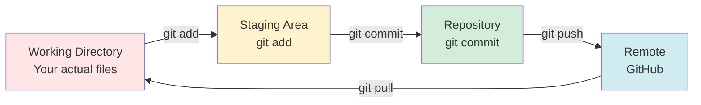
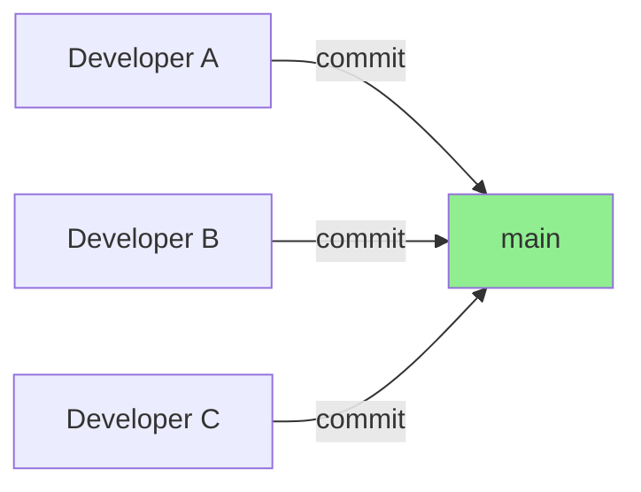
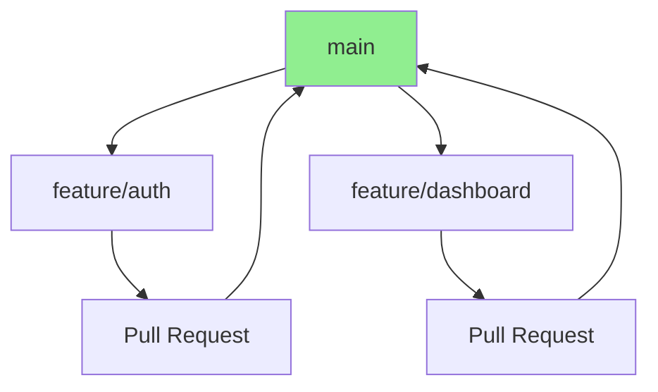

# Version Control & Git Mastery Guide
## Complete Git Workflow for Hackathon Development

> **From Git basics to advanced workflows, conflict resolution, and team coordination strategies**

---

## 📋 Table of Contents

1. [Git Fundamentals](#git-fundamentals)
2. [Initial Repository Setup](#initial-repository-setup)
3. [Daily Git Workflow](#daily-git-workflow)
4. [Branching Strategies](#branching-strategies)
5. [Commit Best Practices](#commit-best-practices)
6. [Conflict Resolution](#conflict-resolution)
7. [Advanced Git Techniques](#advanced-git-techniques)
8. [Emergency Protocols](#emergency-protocols)
9. [Git Configuration](#git-configuration)
10. [Troubleshooting Guide](#troubleshooting-guide)
11. [Quick Reference](#quick-reference)

---

## 🎯 Git Fundamentals

### What is Git?

**Git** is a distributed version control system that tracks changes in your code.

```
┌─────────────────────────────────────────────────────────┐
│  Without Git                                             │
├─────────────────────────────────────────────────────────┤
│  project/                                               │
│  ├── code.js                                            │
│  ├── code_backup.js                                     │
│  ├── code_final.js                                      │
│  ├── code_final_REALLY.js                               │
│  └── code_final_USE_THIS_ONE.js                         │
│                                                          │
│  Problems:                                              │
│  ❌ No history of changes                              │
│  ❌ No collaboration                                    │
│  ❌ Which file is current?                             │
└─────────────────────────────────────────────────────────┘

┌─────────────────────────────────────────────────────────┐
│  With Git                                                │
├─────────────────────────────────────────────────────────┤
│  project/                                               │
│  └── code.js                                            │
│                                                          │
│  Git History:                                           │
│  • 2:00 PM: "Add user authentication"                   │
│  • 1:30 PM: "Fix login bug"                             │
│  • 1:00 PM: "Initial commit"                            │
│                                                          │
│  Benefits:                                              │
│  ✅ Complete change history                            │
│  ✅ Multiple people can work together                  │
│  ✅ Can go back to any point in time                   │
└─────────────────────────────────────────────────────────┘
```

### Core Concepts

#### The Three Areas



**1. Working Directory**
- Your actual project files
- Where you make changes

**2. Staging Area (Index)**
- Files ready to be committed
- Controlled by `git add`

**3. Repository (Local)**
- Committed snapshots
- Complete project history

**4. Remote Repository**
- GitHub, GitLab, Bitbucket
- Shared with team

#### The Git Lifecycle

```
┌──────────────────────────────────────────────────────┐
│  File States                                          │
├──────────────────────────────────────────────────────┤
│                                                       │
│  Untracked → Staged → Committed → Pushed            │
│     ↓          ↓         ↓           ↓              │
│  (new)    (git add)  (git commit) (git push)        │
│                                                       │
│  Modified → Staged → Committed → Pushed              │
│     ↓          ↓         ↓           ↓              │
│  (changed) (git add)  (git commit) (git push)        │
└──────────────────────────────────────────────────────┘
```

---

## 🚀 Initial Repository Setup

### Option 1: Create New Repository

**On GitHub:**
```
1. Go to github.com/new
2. Repository name: "hackathon-project"
3. Visibility: Public (or Private)
4. ✓ Add README
5. ✓ Add .gitignore (select language)
6. Click "Create repository"
```

**On Your Computer:**
```bash
# Clone the repository
git clone https://github.com/your-username/hackathon-project.git

# Navigate into it
cd hackathon-project

# Verify
git status
# Should show: "On branch main, nothing to commit"
```

### Option 2: Initialize Existing Project

**If you already have code:**
```bash
# Navigate to your project
cd my-existing-project

# Initialize Git
git init

# Create .gitignore
cat > .gitignore << 'EOF'
# Environment
.env
.env.local
.env.*.local

# Dependencies
node_modules/
target/
build/
dist/

# IDE
.idea/
.vscode/
*.swp
.DS_Store

# Logs
*.log
npm-debug.log*

# OS
Thumbs.db
EOF

# Stage all files
git add .

# First commit
git commit -m "Initial commit"

# Create GitHub repo (via web), then:
git remote add origin https://github.com/your-username/repo-name.git
git branch -M main
git push -u origin main
```

### Essential .gitignore Patterns

```bash
# ═══════════════════════════════════════════════════════════════
# .gitignore Template for Hackathon Projects
# ═══════════════════════════════════════════════════════════════

# ───────────────────────────────────────────────────────────────
# Environment Variables (CRITICAL - Never commit secrets!)
# ───────────────────────────────────────────────────────────────
.env
.env.local
.env.development.local
.env.test.local
.env.production.local
*.env

# ───────────────────────────────────────────────────────────────
# Dependencies
# ───────────────────────────────────────────────────────────────
node_modules/
bower_components/
vendor/

# Java
target/
.m2/

# Python
venv/
__pycache__/
*.pyc
*.pyo
.pytest_cache/

# ───────────────────────────────────────────────────────────────
# Build Outputs
# ───────────────────────────────────────────────────────────────
build/
dist/
out/
*.jar
*.war
*.class

# ───────────────────────────────────────────────────────────────
# IDE & Editors
# ───────────────────────────────────────────────────────────────
.idea/
.vscode/
*.swp
*.swo
*~
.project
.classpath
.settings/

# ───────────────────────────────────────────────────────────────
# Operating System
# ───────────────────────────────────────────────────────────────
.DS_Store
.DS_Store?
._*
.Spotlight-V100
.Trashes
ehthumbs.db
Thumbs.db

# ───────────────────────────────────────────────────────────────
# Logs
# ───────────────────────────────────────────────────────────────
*.log
npm-debug.log*
yarn-debug.log*
yarn-error.log*

# ───────────────────────────────────────────────────────────────
# Testing
# ───────────────────────────────────────────────────────────────
coverage/
.nyc_output/

# ───────────────────────────────────────────────────────────────
# Temporary Files
# ───────────────────────────────────────────────────────────────
*.tmp
*.temp
.cache/

# ───────────────────────────────────────────────────────────────
# Terraform (if using Infrastructure as Code)
# ───────────────────────────────────────────────────────────────
.terraform/
*.tfstate
*.tfstate.backup
.terraform.lock.hcl

# ───────────────────────────────────────────────────────────────
# Docker
# ───────────────────────────────────────────────────────────────
docker-compose.override.yml
```

---

## 🔄 Daily Git Workflow

### The Standard Flow

```
Morning:     git pull origin main          (Get latest code)
             ↓
Work:        [Edit files]                  (Make changes)
             ↓
Check:       git status                    (What changed?)
             ↓
Stage:       git add .                     (Stage changes)
             ↓
Commit:      git commit -m "Add feature"   (Save snapshot)
             ↓
Share:       git push origin main          (Share with team)
             ↓
Repeat every 1-2 hours
```

### Detailed Workflow Commands

#### Step 1: Pull Latest Changes

```bash
# Always start by getting latest code
git pull origin main

# What this does:
# 1. Fetches changes from GitHub
# 2. Merges them into your local branch
# 3. Updates your working directory
```

**Why This Matters:**
```
Without pulling first:
  You: [Working on old code]
  Teammate: [Pushed new changes]
  You: git push
  Result: ❌ CONFLICT - Your code is out of date

With pulling first:
  You: git pull (get teammate's changes)
  You: [Work on latest code]
  You: git push
  Result: ✅ SUCCESS - Everyone in sync
```

#### Step 2: Check Status

```bash
# See what changed
git status

# Example output:
On branch main
Changes not staged for commit:
  modified:   src/App.js
  modified:   src/styles.css

Untracked files:
  src/NewComponent.js
```

**Interpreting Status:**
```
Red files:     Modified but not staged
Green files:   Staged and ready to commit
Untracked:     New files Git doesn't know about
```

#### Step 3: Stage Changes

```bash
# Stage all changes (most common)
git add .

# Stage specific file
git add src/App.js

# Stage multiple files
git add src/App.js src/styles.css

# Stage by pattern
git add src/*.js

# Interactive staging (advanced)
git add -p  # Review each change individually
```

**What to Stage:**
```
✅ Stage:
  • Code files (.js, .java, .py)
  • Configuration files (package.json, pom.xml)
  • Documentation (README.md)
  • Public assets (images for UI)

❌ DON'T Stage:
  • .env files (secrets!)
  • node_modules/ (dependencies)
  • build/ or dist/ (generated files)
  • IDE configs (.idea/, .vscode/)
  • Personal notes
```

#### Step 4: Commit Changes

```bash
# Basic commit
git commit -m "Add user authentication"

# Multi-line commit (recommended for complex changes)
git commit -m "Add user authentication

- Implement JWT token generation
- Add login endpoint
- Create middleware for protected routes
- Update tests"

# Commit with longer message in editor
git commit
# Opens editor, write detailed message, save, close
```

#### Step 5: Push to Remote

```bash
# Push to main branch
git push origin main

# First time pushing a new branch
git push -u origin feature/my-feature

# Force push (DANGEROUS - use with caution)
git push --force origin main  # Overwrites remote history
```

### Quick Daily Commands

```bash
# ═══════════════════════════════════════════════════════════════
# Copy-Paste Daily Workflow
# ═══════════════════════════════════════════════════════════════

# Morning: Get latest
git pull origin main

# During work: Check what changed
git status

# Ready to save: Stage and commit
git add .
git commit -m "Descriptive message here"

# Share with team: Push
git push origin main

# Repeat every 1-2 hours during hackathon
```

---

## 🌿 Branching Strategies

### Strategy 1: Trunk-Based (Recommended for Hackathons)

**Concept:** Everyone commits directly to `main`



**When to Use:**
- Small teams (2-4 people)
- Fast-paced environment (hackathons)
- High trust team
- Good communication

**Commands:**
```bash
# Just work on main
git checkout main
git pull origin main
# ... make changes ...
git add .
git commit -m "Add feature"
git push origin main
```

**Rules:**
1. Pull before you push
2. Commit small, commit often
3. If you break main, fix immediately
4. Test before pushing

### Strategy 2: Feature Branches

**Concept:** Each feature gets its own branch



**When to Use:**
- Larger teams (5+ people)
- Want code review
- More formal process
- Longer features (>2 hours)

**Commands:**
```bash
# Create and switch to new branch
git checkout -b feature/user-authentication

# Work on feature
git add .
git commit -m "Implement JWT tokens"

# Push to remote
git push -u origin feature/user-authentication

# Create Pull Request on GitHub
# After approval, merge via GitHub UI

# Back on main, pull merged changes
git checkout main
git pull origin main

# Delete local branch
git branch -d feature/user-authentication
```

### Branch Naming Conventions

```
feature/    New feature development
  ├─ feature/user-login
  ├─ feature/payment-integration
  └─ feature/dashboard-ui

fix/        Bug fixes
  ├─ fix/login-crash
  ├─ fix/memory-leak
  └─ fix/null-pointer

refactor/   Code improvements (no new features)
  ├─ refactor/database-service
  └─ refactor/api-structure

docs/       Documentation only
  └─ docs/api-documentation

chore/      Build, dependencies, config
  ├─ chore/update-dependencies
  └─ chore/setup-ci-cd
```

### Branch Management Commands

```bash
# ═══════════════════════════════════════════════════════════════
# Branch Commands
# ═══════════════════════════════════════════════════════════════

# List all branches
git branch          # Local branches
git branch -r       # Remote branches
git branch -a       # All branches

# Create new branch
git branch feature/my-feature

# Switch to branch
git checkout feature/my-feature

# Create and switch in one command
git checkout -b feature/my-feature

# Rename branch
git branch -m old-name new-name

# Delete local branch
git branch -d feature/my-feature   # Safe (checks if merged)
git branch -D feature/my-feature   # Force delete

# Delete remote branch
git push origin --delete feature/my-feature

# See which branch you're on
git branch --show-current

# Switch back to main
git checkout main
```

---

## ✍️ Commit Best Practices

### Writing Good Commit Messages

#### The Anatomy of a Great Commit Message

```
Short summary (50 chars or less)
<blank line>
Detailed explanation (wrap at 72 chars):
- What changed
- Why it changed
- Any side effects or considerations
<blank line>
Related issues: #123
```

**Example:**
```bash
git commit -m "Fix null pointer exception in UserService.login()

The login method was not checking for null email before processing,
causing a crash when users submitted the form with empty email field.

Changes:
- Add null check before email processing
- Return meaningful error message
- Add unit test for null email case

Fixes #42"
```

### Commit Message Templates

**For Features:**
```
Add [feature name]

Implements [description of what it does]
- Key change 1
- Key change 2

Closes #[issue number]
```

**For Bug Fixes:**
```
Fix [brief description of bug]

[Explain what was wrong]
[Explain what you changed]

Fixes #[issue number]
```

**For Refactoring:**
```
Refactor [component name]

[Explain why refactoring was needed]
- Change 1
- Change 2

No functional changes
```

### Commit Frequency

```
┌─────────────────────────────────────────────────────────┐
│  TOO INFREQUENT (Bad)                                    │
├─────────────────────────────────────────────────────────┤
│  9:00 AM: Start working                                 │
│  1:00 PM: [4 hours of work]                             │
│  1:00 PM: git commit -m "stuff"                         │
│                                                          │
│  Problems:                                              │
│  ❌ Lost work if computer crashes                      │
│  ❌ Huge commit, hard to review                        │
│  ❌ Can't revert specific change                       │
└─────────────────────────────────────────────────────────┘

┌─────────────────────────────────────────────────────────┐
│  TOO FREQUENT (Also Bad)                                │
├─────────────────────────────────────────────────────────┤
│  9:00 AM: git commit -m "add semicolon"                 │
│  9:02 AM: git commit -m "fix typo"                      │
│  9:05 AM: git commit -m "another typo"                  │
│  9:07 AM: git commit -m "still fixing"                  │
│                                                          │
│  Problems:                                              │
│  ❌ Noisy history                                       │
│  ❌ Hard to understand what actually changed           │
└─────────────────────────────────────────────────────────┘

┌─────────────────────────────────────────────────────────┐
│  JUST RIGHT (Good)                                      │
├─────────────────────────────────────────────────────────┤
│  9:00 AM: Start working on login feature               │
│  9:45 AM: git commit -m "Add login form UI"            │
│  10:30 AM: git commit -m "Implement JWT authentication" │
│  11:15 AM: git commit -m "Add login endpoint tests"    │
│  12:00 PM: git commit -m "Integrate login with backend" │
│                                                          │
│  Benefits:                                              │
│  ✅ Each commit is one logical change                  │
│  ✅ Easy to understand history                         │
│  ✅ Can revert specific features                       │
└─────────────────────────────────────────────────────────┘
```

**Rule of Thumb:**
- Commit every **30-60 minutes** of focused work
- Commit when you **complete a logical unit**
- Commit **before switching tasks**
- Commit **before taking a break**

### What to Commit Together

```
✅ Good - Atomic Commits:
  git commit -m "Add user login form"
    ├─ LoginForm.js (new file)
    ├─ styles/login.css (new file)
    └─ App.js (import LoginForm)

✅ Good - Related Changes:
  git commit -m "Fix responsive layout on mobile"
    ├─ styles/main.css
    ├─ styles/navbar.css
    └─ components/Header.js

❌ Bad - Unrelated Changes:
  git commit -m "Stuff"
    ├─ Add login form
    ├─ Fix payment bug
    ├─ Update README
    └─ Refactor database service
    
  Problem: Can't revert one without reverting all
```

---

## ⚔️ Conflict Resolution

### Understanding Merge Conflicts

**What Causes Conflicts:**
```
You and teammate edit the SAME LINES in the SAME FILE

Timeline:
9:00 AM  - Both pull main (in sync)
9:30 AM  - You edit line 10 in App.js
10:00 AM - Teammate edits line 10 in App.js
10:15 AM - Teammate pushes first (their change wins)
10:20 AM - You try to push → CONFLICT!
```

### The Conflict Resolution Process

#### Step 1: Recognize the Conflict

```bash
git push origin main

# Output:
! [rejected]        main -> main (fetch first)
error: failed to push some refs to 'github.com/user/repo'
hint: Updates were rejected because the remote contains work that you do
hint: not have locally. This is usually caused by another repository pushing
hint: to the same ref. You may want to first integrate the remote changes
hint: (e.g., 'git pull ...') before pushing again.
```

#### Step 2: Pull and See Conflicts

```bash
git pull origin main

# Output:
Auto-merging src/App.js
CONFLICT (content): Merge conflict in src/App.js
Automatic merge failed; fix conflicts and then commit the result.
```

#### Step 3: Identify Conflicted Files

```bash
git status

# Output:
Unmerged paths:
  (use "git add <file>..." to mark resolution)
        both modified:   src/App.js
```

#### Step 4: Open and Resolve Conflicts

**The file will look like this:**
```javascript
function getUserData() {
<<<<<<< HEAD (Your Changes)
  return fetch('/api/users');
=======
  return axios.get('/api/v2/users');
>>>>>>> origin/main (Teammate's Changes)
}
```

**Conflict Markers:**
- `<<<<<<< HEAD`: Start of your changes
- `=======`: Divider
- `>>>>>>> origin/main`: End of their changes

**Resolution Options:**

**Option A: Keep Your Changes**
```javascript
function getUserData() {
  return fetch('/api/users');
}
```

**Option B: Keep Their Changes**
```javascript
function getUserData() {
  return axios.get('/api/v2/users');
}
```

**Option C: Combine Both**
```javascript
function getUserData() {
  // Use axios (teammate's improvement) with our endpoint
  return axios.get('/api/users');
}
```

**Option D: Write Something New**
```javascript
function getUserData() {
  // Discussed with team: use async/await pattern
  return await axios.get('/api/v2/users');
}
```

#### Step 5: Mark as Resolved

```bash
# After editing the file and removing conflict markers
git add src/App.js

# Verify
git status
# Should show "All conflicts fixed"
```

#### Step 6: Commit the Resolution

```bash
git commit -m "Resolve merge conflict in App.js - use axios with /api/users"

# Or if Git created a merge commit message
git commit  # Uses default message
```

#### Step 7: Push

```bash
git push origin main
```

### Conflict Resolution Strategies

#### Strategy 1: Communication First

```
Before resolving:
  1. Screenshot the conflict
  2. Message teammate in Discord
  3. Quick call/screen share
  4. Decide together
  5. One person resolves, pushes
  6. Other person pulls

Benefits: No duplicate work, correct decision
```

#### Strategy 2: Abort and Retry

```bash
# If conflict is too complex, abort the merge
git merge --abort

# Now you're back to pre-merge state
# Coordinate with team, then retry
```

#### Strategy 3: Use a Merge Tool

```bash
# Configure merge tool (one-time setup)
git config --global merge.tool vscode
git config --global mergetool.vscode.cmd 'code --wait $MERGED'

# When conflict occurs
git mergetool

# Opens VS Code with 3-way diff view
# Left: Your changes
# Middle: Result
# Right: Their changes
```

### Preventing Conflicts

```
┌─────────────────────────────────────────────────────────┐
│  Prevention Strategies                                   │
├─────────────────────────────────────────────────────────┤
│  1. File Ownership                                      │
│     → Alice owns auth/, Bob owns dashboard/             │
│     → Rarely edit same files                            │
│                                                          │
│  2. Frequent Pulling                                     │
│     → Pull every 30-60 minutes                          │
│     → Stay synced with team                             │
│                                                          │
│  3. Small, Frequent Commits                              │
│     → Push every 1-2 hours                              │
│     → Reduces window for conflicts                      │
│                                                          │
│  4. Communication                                        │
│     → "I'm editing UserService.java"                    │
│     → Others avoid that file                            │
│                                                          │
│  5. Shared Files Protocol                                │
│     → Announce before editing config files              │
│     → Wait for "go ahead" from team                     │
│     → Edit, commit, push immediately                    │
└─────────────────────────────────────────────────────────┘
```

---

## 🚀 Advanced Git Techniques

### Stashing (Temporary Storage)

**Use Case:** Need to switch branches but have uncommitted work

```bash
# Save current work temporarily
git stash

# Your working directory is now clean
# Switch branches, fix urgent bug, etc.

# Come back and restore work
git stash pop

# ───────────────────────────────────────────────────────────────
# Advanced Stash Commands
# ───────────────────────────────────────────────────────────────

# Stash with descriptive message
git stash save "WIP: implementing payment feature"

# List all stashes
git stash list
# Output:
# stash@{0}: WIP: implementing payment feature
# stash@{1}: WIP: fixing login bug

# Apply specific stash (doesn't remove it)
git stash apply stash@{1}

# Apply and remove specific stash
git stash pop stash@{1}

# Delete specific stash
git stash drop stash@{1}

# Delete all stashes
git stash clear

# Create branch from stash
git stash branch feature/payment-work stash@{0}
```

### Viewing History

```bash
# ═══════════════════════════════════════════════════════════════
# Log Commands
# ═══════════════════════════════════════════════════════════════

# Basic log
git log

# One line per commit (most useful)
git log --oneline

# With graph (shows branching)
git log --oneline --graph --all

# Last 5 commits
git log -5

# Commits by specific author
git log --author="Alice"

# Commits in date range
git log --since="2 days ago"
git log --since="2024-01-14" --until="2024-01-15"

# Commits that changed specific file
git log -- src/App.js

# Show what changed in each commit
git log -p

# Show stats (files changed, lines added/removed)
git log --stat

# Pretty format
git log --pretty=format:"%h - %an, %ar : %s"
# Output: abc1234 - Alice, 2 hours ago : Fix login bug
```

### Undoing Changes

#### Scenario 1: Undo Uncommitted Changes

```bash
# Undo changes to specific file (before git add)
git checkout -- src/App.js

# Undo all uncommitted changes (DANGEROUS)
git reset --hard HEAD

# Undo staged changes (after git add, before commit)
git reset HEAD src/App.js
# File is now unstaged but changes still exist
```

#### Scenario 2: Undo Last Commit (Not Pushed)

```bash
# Keep changes, undo commit
git reset --soft HEAD~1
# Your files still have the changes
# Commit is removed from history

# Undo commit and staging
git reset HEAD~1
# Files are back to "modified" state

# Undo commit and delete changes (DANGEROUS)
git reset --hard HEAD~1
# Changes are GONE forever
```

#### Scenario 3: Undo Pushed Commit

```bash
# Safe: Create new commit that undoes previous commit
git revert HEAD
git push origin main

# Dangerous: Rewrite history (use only if alone on branch)
git reset --hard HEAD~1
git push --force origin main

# Team coordination needed:
# Everyone must delete local branch and re-clone
```

### Rewriting History (Use with Caution)

#### Interactive Rebase

```bash
# Rewrite last 3 commits
git rebase -i HEAD~3

# Opens editor:
pick abc1234 Add login feature
pick def5678 Fix typo
pick ghi9012 Fix another typo

# Change to:
pick abc1234 Add login feature
squash def5678 Fix typo
squash ghi9012 Fix another typo

# Saves and combines commits into one
# Useful for cleaning up history before pushing
```

**When to Use:**
- ✅ Before pushing to main (clean up local commits)
- ✅ On your feature branch
- ❌ After pushing (requires force push)
- ❌ On shared branches

### Cherry-Picking

**Use Case:** Apply specific commit from one branch to another

```bash
# You're on main, want commit from feature branch
git checkout main

# Find the commit hash you want
git log feature/my-feature --oneline
# abc1234 Fix critical bug

# Apply just that commit
git cherry-pick abc1234

# Now main has that fix without merging entire feature branch
```

---

## 🚨 Emergency Protocols

### Emergency 1: "I Committed to Wrong Branch!"

```bash
# You're on main, should have been on feature branch

# Step 1: Create branch from current commit
git branch feature/my-feature

# Step 2: Reset main to before your commit
git reset --hard origin/main

# Step 3: Switch to feature branch
git checkout feature/my-feature

# Your commit is now on correct branch
```

### Emergency 2: "I Pushed Secrets to GitHub!"

```bash
# CRITICAL: Secrets in git history CANNOT be fully removed
# Anyone who pulled has a copy

# Step 1: Remove from file
# Edit .env or config file, remove secrets

# Step 2: Add to .gitignore
echo ".env" >> .gitignore

# Step 3: Commit
git add .gitignore
git commit -m "Remove secrets, add to gitignore"
git push origin main

# Step 4: Rotate secrets IMMEDIATELY
# Change passwords, API keys, tokens
# The old secrets are compromised

# Step 5: (Optional) Rewrite history (complex, use tools like BFG Repo-Cleaner)
```

### Emergency 3: "Everything is Broken, Go Back!"

```bash
# Find working commit
git log --oneline

# Output:
# abc1234 (HEAD) Broken change
# def5678 Last working version
# ghi9012 Earlier work

# Reset to working version
git reset --hard def5678

# Push (will require force push)
git push --force origin main

# ⚠️ Warning: Tell team immediately
# They need to:
git fetch origin
git reset --hard origin/main
```

### Emergency 4: "Accidentally Deleted Important File!"

```bash
# If not committed yet
git checkout HEAD -- path/to/file

# If committed and pushed
git log -- path/to/file
# Find commit hash where file existed

git checkout abc1234 -- path/to/file
git add path/to/file
git commit -m "Restore deleted file"
```

### Emergency 5: "Merge Conflict Too Complex!"

```bash
# Abort the merge
git merge --abort

# You're back to pre-merge state

# Option A: Ask teammate to screen share and resolve together
# Option B: Use merge tool
git mergetool

# Option C: Accept their version completely
git checkout --theirs path/to/file
git add path/to/file
git commit

# Option D: Accept your version completely
git checkout --ours path/to/file
git add path/to/file
git commit
```

---

## ⚙️ Git Configuration

### Initial Setup

```bash
# Set your identity (required)
git config --global user.name "Your Name"
git config --global user.email "your.email@example.com"

# Set default editor
git config --global core.editor "code --wait"  # VS Code
# or
git config --global core.editor "vim"

# Set default branch name
git config --global init.defaultBranch main

# Enable colors
git config --global color.ui auto

# View all config
git config --list
```

### Useful Aliases

```bash
# Create shortcuts for common commands
git config --global alias.st status
git config --global alias.co checkout
git config --global alias.br branch
git config --global alias.ci commit
git config --global alias.unstage 'reset HEAD --'
git config --global alias.last 'log -1 HEAD'
git config --global alias.visual 'log --oneline --graph --all'

# Now you can use:
git st        # instead of git status
git co main   # instead of git checkout main
git visual    # pretty log graph
```

### SSH Key Setup (Recommended)

**Why:** No password typing for every push/pull

```bash
# Generate SSH key
ssh-keygen -t ed25519 -C "your.email@example.com"
# Press Enter for default location
# Set passphrase (optional but recommended)

# Copy public key
cat ~/.ssh/id_ed25519.pub
# Copy output

# Add to GitHub
# GitHub → Settings → SSH and GPG keys → New SSH key
# Paste key, save

# Test
ssh -T git@github.com
# Should show: "Hi username! You've successfully authenticated"

# Change remote URL to SSH
git remote set-url origin git@github.com:username/repo.git
```

---

## 🔧 Troubleshooting Guide

### Problem: "Permission Denied (Publickey)"

**Symptom:**
```
git push origin main
Permission denied (publickey).
fatal: Could not read from remote repository.
```

**Solution:**
```bash
# Check if SSH key exists
ls ~/.ssh/id_ed25519.pub

# If not, generate one
ssh-keygen -t ed25519 -C "your.email@example.com"

# Add to SSH agent
eval "$(ssh-agent -s)"
ssh-add ~/.ssh/id_ed25519

# Copy and add to GitHub
cat ~/.ssh/id_ed25519.pub
```

### Problem: "Detached HEAD State"

**Symptom:**
```
git status
HEAD detached at abc1234
```

**What Happened:** You checked out a specific commit instead of a branch

**Solution:**
```bash
# If you made changes you want to keep
git checkout -b temp-branch
git checkout main
git merge temp-branch

# If you don't care about changes
git checkout main
```

### Problem: "Repository Not Found"

**Symptom:**
```
git push origin main
ERROR: Repository not found.
```

**Solutions:**
```bash
# Check remote URL
git remote -v

# If wrong, update it
git remote set-url origin https://github.com/correct-user/repo.git

# If using HTTPS but need SSH
git remote set-url origin git@github.com:correct-user/repo.git
```

### Problem: "Large File Size"

**Symptom:**
```
git push
error: File large-file.zip is 150 MB; this exceeds GitHub's file size limit of 100 MB
```

**Solution:**
```bash
# Remove from staging
git reset HEAD large-file.zip

# Add to .gitignore
echo "large-file.zip" >> .gitignore
git add .gitignore
git commit -m "Ignore large file"

# If already committed
git rm --cached large-file.zip
git commit -m "Remove large file from tracking"

# For large files you need to track, use Git LFS
git lfs install
git lfs track "*.zip"
git add .gitattributes
git commit -m "Track zip files with LFS"
```

### Problem: "Your Branch is Behind"

**Symptom:**
```
git push
error: Your branch is behind 'origin/main' by 3 commits
```

**Solution:**
```bash
# Pull and merge
git pull origin main

# Or pull and rebase (cleaner history)
git pull --rebase origin main

# Then push
git push origin main
```

---

## 📚 Quick Reference

### Essential Commands

```bash
# ═══════════════════════════════════════════════════════════════
# Daily Workflow
# ═══════════════════════════════════════════════════════════════

git pull origin main              # Get latest
git status                        # Check changes
git add .                         # Stage all
git commit -m "Message"           # Commit
git push origin main              # Push

# ═══════════════════════════════════════════════════════════════
# Branching
# ═══════════════════════════════════════════════════════════════

git branch                        # List branches
git checkout -b feature/new       # Create and switch
git checkout main                 # Switch to main
git merge feature/new             # Merge branch
git branch -d feature/new         # Delete branch

# ═══════════════════════════════════════════════════════════════
# Viewing & Comparing
# ═══════════════════════════════════════════════════════════════

git log --oneline                 # Compact history
git log --graph --all             # Visual history
git diff                          # Show unstaged changes
git diff --staged                 # Show staged changes
git show abc1234                  # Show specific commit

# ═══════════════════════════════════════════════════════════════
# Undoing
# ═══════════════════════════════════════════════════════════════

git checkout -- file.js           # Discard changes
git reset HEAD file.js            # Unstage file
git reset --soft HEAD~1           # Undo commit, keep changes
git revert HEAD                   # Undo commit safely

# ═══════════════════════════════════════════════════════════════
# Stashing
# ═══════════════════════════════════════════════════════════════

git stash                         # Save work
git stash pop                     # Restore work
git stash list                    # List stashes
git stash clear                   # Delete all stashes

# ═══════════════════════════════════════════════════════════════
# Remote Operations
# ═══════════════════════════════════════════════════════════════

git remote -v                     # Show remotes
git fetch origin                  # Download (don't merge)
git pull origin main              # Download and merge
git push origin main              # Upload
git push -u origin feature/new    # Push new branch
```

### Git Cheat Sheet (Print-Friendly)

```
┌────────────────────────────────────────────────────────────┐
│  GIT CHEAT SHEET - HACKATHON EDITION                       │
├────────────────────────────────────────────────────────────┤
│                                                             │
│  SETUP                                                      │
│  git clone <url>               Clone repository            │
│  git init                      Initialize new repo         │
│                                                             │
│  DAILY WORKFLOW                                            │
│  git pull origin main          Get latest code             │
│  git status                    See what changed            │
│  git add .                     Stage all changes           │
│  git commit -m "msg"           Commit changes              │
│  git push origin main          Upload to GitHub            │
│                                                             │
│  BRANCHES                                                  │
│  git checkout -b new-branch    Create and switch           │
│  git checkout main             Switch to main              │
│  git merge feature-branch      Merge branch                │
│  git branch -d feature-branch  Delete branch               │
│                                                             │
│  UNDO                                                      │
│  git checkout -- file          Discard changes             │
│  git reset HEAD file           Unstage file                │
│  git reset --soft HEAD~1       Undo last commit           │
│  git revert HEAD               Undo safely (new commit)    │
│                                                             │
│  CONFLICTS                                                 │
│  git merge --abort             Cancel merge                │
│  git checkout --ours file      Keep your version           │
│  git checkout --theirs file    Keep their version          │
│                                                             │
│  HELP                                                      │
│  git status                    When in doubt, check this   │
│  git log --oneline             See recent history          │
│                                                             │
└────────────────────────────────────────────────────────────┘
```

---

## 🎯 Hackathon-Specific Best Practices

### Commit Frequency During Hackathon

```
Every Hour:
  ├─ git add .
  ├─ git commit -m "Progress checkpoint: [what you did]"
  └─ git push origin main

Before Breaks:
  ├─ git add .
  ├─ git commit -m "WIP: [current task]"
  └─ git push origin main

After Bug Fixes:
  ├─ Immediate commit
  └─ Don't let bugs accumulate

Before Major Changes:
  ├─ git commit -m "Stable checkpoint before [risky change]"
  └─ Safety net to revert to
```

### Team Coordination

```
Morning Standup:
  "I'll work on auth/ folder"
  → Others avoid auth/ folder

Before Editing Shared Files:
  "@team I'm editing pom.xml"
  → Wait 30 seconds for objections
  → Edit, commit, push immediately

After Breaking Main:
  "@team Main is broken, fixing now"
  → Fix within 15 minutes
  → Apologize, learn, move on
```

### Pre-Demo Git Checklist

```
1 Hour Before Demo:
  □ git add .
  □ git commit -m "Final features"
  □ git push origin main
  □ git log --oneline (check history)
  □ Create GitHub release tag

30 Minutes Before:
  □ git pull origin main (ensure synced)
  □ Test that latest commit works
  □ Have backup branch ready
  
If Demo Fails:
  □ git revert HEAD (undo last commit)
  □ Or: git checkout <stable-commit>
  □ Demo from working version
```

---

## 🏆 Final Tips

### The Golden Rules of Git

1. **Pull before you push** - Always sync first
2. **Commit early, commit often** - Every hour minimum
3. **Write meaningful messages** - Future you will thank you
4. **Never commit secrets** - Use .gitignore
5. **When in doubt, ask** - Better to ask than mess up

### Learning Resources

- [Pro Git Book](https://git-scm.com/book/en/v2) - Free, comprehensive
- [GitHub Learning Lab](https://github.com/apps/github-learning-lab) - Interactive tutorials
- [Git Visualizer](https://git-school.github.io/visualizing-git/) - See how Git works
- [Oh Shit, Git!?!](https://ohshitgit.com/) - Fix common mistakes

### Practice Before Hackathon

```bash
# Create practice repository
mkdir git-practice
cd git-practice
git init

# Practice workflow
touch file.txt
git add file.txt
git commit -m "Add file"

# Practice branching
git checkout -b feature-test
echo "change" >> file.txt
git add .
git commit -m "Make change"
git checkout main
git merge feature-test

# Practice conflicts
# Create conflict, resolve it
# Get comfortable with the process
```

---

**Master Git, eliminate confusion, ship code faster! 🚀**
