# uOttaHack Architecture & Design Patterns Guide

> **The Ultimate Technical Blueprint for Rapid Hackathon Development**

## Table of Contents

1. [Executive Overview](#executive-overview)
2. [Core Architecture Stack](#core-architecture-stack)
3. [Architecture Diagrams](#architecture-diagrams)
4. [Design Patterns](#design-patterns)
5. [Implementation Workflows](#implementation-workflows)
6. [Quick Start Checklists](#quick-start-checklists)
7. [Troubleshooting Decision Trees](#troubleshooting-decision-trees)

---

## Executive Overview

### The Hackathon Stack Philosophy

**Time is the scarcest resource.** This architecture eliminates operational overhead by leveraging:

- **Serverless Compute** (Cloud Run): Zero infrastructure management
- **NoSQL Persistence** (Firestore): Schema-less, real-time synchronization
- **Event-Driven Messaging** (Solace PubSub+): Decoupled, scalable communication
- **Infrastructure as Code** (Terraform): Reproducible deployments
- **Keyless CI/CD** (GitHub Actions + Workload Identity): Secure automation

### Competitive Advantages

```
┌─────────────────────────────────────────────────────────────┐
│  Traditional Approach          vs.    Event Mesh Stack       │
├─────────────────────────────────────────────────────────────┤
│  • VM Management (hours)              • Serverless (minutes) │
│  • Manual Deployments                 • Automated CI/CD      │
│  • Tight Coupling                     • Event-Driven EDA     │
│  • Schema Migrations                  • Flexible Firestore   │
│  • Static API Endpoints               • Dynamic Topics       │
└─────────────────────────────────────────────────────────────┘
```

---

## Core Architecture Stack

### Technology Matrix

| Layer | Technology | Role | Hackathon Advantage |
|-------|-----------|------|---------------------|
| **Compute** | Cloud Run | Stateless containers | Scale-to-zero, auto-scaling |
| **Database** | Firestore | Document store | Real-time sync, no schema |
| **Messaging** | Solace PubSub+ | Event mesh | Protocol translation, wildcards |
| **CI/CD** | GitHub Actions | Automation | Free compute, OIDC auth |
| **Registry** | Artifact Registry | Container storage | Regional, low-latency |
| **IaC** | Terraform | Infrastructure | Reproducible, version-controlled |
| **Language** | Java 17 + Spring Boot | Application | Enterprise patterns, BOM |

---

## Architecture Diagrams

### 1. High-Level System Architecture


### 2. CI/CD Pipeline Architecture


### 3. Event-Driven Architecture with Solace


### 4. Cloud Run Concurrency & Scaling Model


### 5. Firestore Data Modeling Patterns

```mermaid
graph TB
    subgraph "Root Collections"
        TEAMS[📁 teams/]
        MEMBERS[📁 members/]
        SUBMISSIONS[📁 submissions/]
    end

    subgraph "Team Document"
        TD["📄 team-001<br/>{name, score, timestamp}"]
    end

    subgraph "Subcollection Pattern"
        TD2[📄 team-002]
        SC["📁 team-002/members/<br/>Subcollection"]
        M1[📄 member-a]
        M2[📄 member-b]
    end

    subgraph "Query Capabilities"
        Q1["Query: Top 10 Teams<br/>by Score"]
        Q2["Collection Group Query:<br/>All Members Named 'Alice'"]
    end

    TEAMS --> TD
    TEAMS --> TD2
    TD2 --> SC
    SC --> M1 & M2
    TEAMS -.->|orderBy score| Q1
    SC -.->|collectionGroup| Q2

    style TD fill:#fff3cd
    style TD2 fill:#fff3cd
    style M1 fill:#e6f2ff
    style M2 fill:#e6f2ff
```



### 6. Security & Authentication Flow


### 7. Topic Hierarchy Strategy (Smart Topics)

```
uottahack/logistics/drone/update/v1/drone-42/ottawa/active
│         │         │     │      │  │        │      │
│         │         │     │      │  │        │      └─── Property: Status
│         │         │     │      │  │        └────────── Property: Region
│         │         │     │      │  └─────────────────── ID: Specific Instance
│         │         │     │      └────────────────────── Version: API Contract
│         │         │     └───────────────────────────── Verb: Action/Event
│         │         └─────────────────────────────────── Noun: Resource Type
│         └───────────────────────────────────────────── Sub-Domain: Project Area
└─────────────────────────────────────────────────────── Domain: Namespace
```

**Wildcard Subscription Examples:**

| Subscription Pattern | Matches | Use Case |
|---------------------|---------|----------|
| `uottahack/logistics/drone/update/>` | All drone updates | Dashboard showing all drones |
| `uottahack/logistics/drone/*/v1/*/ottawa/*` | All drones in Ottawa | Regional monitoring |
| `uottahack/**/emergency` | Any emergency across system | Critical alert service |
| `uottahack/logistics/drone/update/v1/drone-42/>` | Specific drone, all properties | Track single drone |

---

## Design Patterns

### 1. Scale-to-Zero Pattern (Cost Optimization)

```
┌──────────────────────────────────────────────────────────┐
│  Traffic Pattern During Hackathon                         │
├──────────────────────────────────────────────────────────┤
│                                                           │
│  Instances                                                │
│      3 │         ╭──╮                                     │
│        │         │  │                                     │
│      2 │      ╭──╯  ╰─╮    ╭─╮                          │
│        │      │       │    │ │                          │
│      1 │  ╭───╯       ╰────╯ ╰──╮                       │
│        │  │                      │                       │
│      0 ├──╯                      ╰──────────────────     │
│        └────────────────────────────────────> Time      │
│         3AM   9AM  12PM  3PM  6PM  9PM  12AM           │
│         Dev   Test Demo  Idle Pitch Sleep              │
└──────────────────────────────────────────────────────────┘
```

**Configuration:**
```hcl
# Terraform
scaling {
  min_instance_count = 0  # Cost savings during idle
  max_instance_count = 10 # Safety cap
}
```

**Pre-Demo Strategy:**
```bash
# 5 minutes before judging
gcloud run services update hackathon-api \
  --min-instances=1  # Eliminate cold start
```

### 2. Topic-to-Queue Mapping Pattern

```
Publisher          Topic              Queue            Consumer
   │                │                  │                  │
   ├─ publish ─────>│                  │                  │
   │        "uottahack/orders/created" │                  │
   │                │                  │                  │
   │                │                  │                  │
   │                └─ match ─────────>│                  │
   │                 subscription:     │                  │
   │                 "uottahack/orders/>"                 │
   │                                   │                  │
   │                                   ├─ persists ───────┤
   │                                   │                  │
   │                                   │<─ consume ───────┤
   │                                   │                  │
   │                                   ├─ ACK ────────────>│
   │                                   │                  │

Benefits:
✓ Decoupling: Publisher doesn't know about queue
✓ Filtering: Queue only attracts relevant topics
✓ Persistence: Messages survive consumer crashes
✓ Load Balancing: Multiple consumers on same queue
```

### 3. Request-Reply over Event Mesh


### 4. Multi-Stage Docker Build Pattern

```dockerfile
# Stage 1: Build (Heavy JDK + Maven)
FROM eclipse-temurin:17-jdk AS builder
WORKDIR /app
COPY pom.xml .
RUN mvn dependency:go-offline -B
COPY src ./src
RUN mvn package -DskipTests

# Stage 2: Runtime (Lightweight JRE)
FROM eclipse-temurin:17-jre-alpine
WORKDIR /app
COPY --from=builder /app/target/*.jar app.jar

# Optimize JVM for Containers
ENV JAVA_TOOL_OPTIONS="-XX:MaxRAMPercentage=75.0"

EXPOSE 8080
ENTRYPOINT ["java", "-jar", "app.jar"]
```

**Layer Caching Advantage:**
- If only source code changes → Reuse dependency layer (saves 3-5 minutes)
- If pom.xml changes → Rebuild from dependency download
- Final image size: ~150MB vs ~500MB with JDK

### 5. Singleton Database Client Pattern

```java
@Configuration
public class FirestoreConfig {
    
    private static final Logger log = LoggerFactory.getLogger(FirestoreConfig.class);
    
    @Bean
    @Scope("singleton")  // Critical: One instance per app
    public Firestore firestore() {
        log.info("Initializing Firestore Client (Singleton)");
        
        // Application Default Credentials (ADC)
        // Works locally (gcloud auth) and Cloud Run (metadata server)
        return FirestoreOptions.getDefaultInstance().getService();
    }
}

// Usage
@Service
public class DataService {
    private final Firestore db;  // Injected once, reused forever
    
    public DataService(Firestore db) {
        this.db = db;
    }
    
    public void saveData() {
        // db is already connected, no overhead
        db.collection("data").add(...);
    }
}
```

**Anti-Pattern (Don't Do This):**
```java
// ❌ Creating new client per request
@GetMapping("/data")
public String getData() {
    Firestore db = FirestoreOptions.getDefaultInstance().getService();  // SLOW!
    // Each instantiation: SSL handshake, gRPC channel, auth...
}
```

---

## Implementation Workflows

### Workflow 1: Zero-to-Deployed in 15 Minutes

```
Step 1: Project Setup (2 min)
├─ Create GCP Project
├─ Enable APIs: run, firestore, cloudbuild, artifactregistry
└─ Set default region: us-central1

Step 2: Terraform Apply (3 min)
├─ Clone terraform boilerplate
├─ Set variables: project_id, service_name
├─ terraform init
└─ terraform apply -auto-approve

Step 3: Java Application (5 min)
├─ Spring Initializr: Web, Cloud Firestore
├─ Add Solace Spring Boot Starter
├─ Configure application.properties
└─ Write one REST endpoint

Step 4: Local Test (2 min)
├─ ./dev.sh  (Bash script: build + run Docker)
└─ curl localhost:8080/health

Step 5: CI/CD Setup (3 min)
├─ Copy .github/workflows/deploy.yml
├─ Set GitHub Secrets: WIF_PROVIDER, WIF_SERVICE_ACCOUNT
├─ git push
└─ Watch deployment succeed

Result: Public URL in Cloud Run console
```

### Workflow 2: Adding Solace Event-Driven Feature

```
Step 1: Provision Solace Broker (1 min)
└─ Solace Cloud: Create Free Service (Docker or Cloud)

Step 2: Java Dependencies (1 min)
└─ Add to pom.xml:
   <dependency>
     <groupId>com.solace.spring.boot</groupId>
     <artifactId>solace-java-spring-boot-starter</artifactId>
   </dependency>

Step 3: Configuration (2 min)
└─ application.properties:
   solace.java.host=tcp://...
   solace.java.msgVpn=default
   solace.java.clientUsername=...

Step 4: Publisher Service (3 min)
@Service
public class EventPublisher {
    @Autowired SpringJCSMPFactory solaceFactory;
    private JCSMPSession session;
    private XMLMessageProducer producer;
    
    @PostConstruct
    public void init() throws JCSMPException {
        session = solaceFactory.createSession();
        producer = session.getMessageProducer(...);
        session.connect();
    }
    
    public void publish(String topic, String data) {
        TextMessage msg = JCSMPFactory.onlyInstance().createMessage(TextMessage.class);
        msg.setText(data);
        producer.send(msg, JCSMPFactory.onlyInstance().createTopic(topic));
    }
}

Step 5: Subscriber Service (3 min)
@Service
public class EventSubscriber {
    @PostConstruct
    public void init() throws JCSMPException {
        session = solaceFactory.createSession();
        session.getMessageConsumer(new XMLMessageListener() {
            public void onReceive(BytesXMLMessage msg) {
                System.out.println("Received: " + ((TextMessage)msg).getText());
            }
        }).start();
        session.connect();
        session.addSubscription(JCSMPFactory.onlyInstance().createTopic("uottahack/>"));
    }
}

Step 6: Test with Try-Me (1 min)
└─ Solace Console → Try-Me → Verify message flow

Total Time: 11 minutes
```

### Workflow 3: Emergency Rollback Procedure

```
┌─────────────────────────────────────────────────────────┐
│  Production Failure During Demo                          │
│  (e.g., new deployment has a critical bug)              │
└─────────────────────────────────────────────────────────┘
          │
          ▼
    [Check Cloud Run Dashboard]
          │
          ├─ Multiple Revisions Visible?
          │       │
          │       ├─ YES → Instant Traffic Split
          │       │         │
          │       │         └─ gcloud run services update-traffic hackathon-api \
          │       │              --to-revisions=PREVIOUS_REVISION=100
          │       │
          │       └─ NO → Deploy Previous Image
          │                 │
          │                 └─ gcloud run deploy hackathon-api \
          │                      --image=us-east1-docker.pkg.dev/.../api:PREVIOUS_SHA
          │
          ▼
    [Service Restored in <60 seconds]
          │
          └─> Continue Demo, Debug Later
```

---

## Quick Start Checklists

### Pre-Hackathon Setup Checklist

- [ ] **GCP Account**
  - [ ] Create new project (avoid conflicts)
  - [ ] Enable billing (free tier sufficient)
  - [ ] Install `gcloud` CLI
  - [ ] Run `gcloud auth login`
  - [ ] Set default project: `gcloud config set project PROJECT_ID`

- [ ] **GitHub Repository**
  - [ ] Create new repo (public for free Actions minutes)
  - [ ] Enable GitHub Actions
  - [ ] Configure branch protection on `main` (optional)

- [ ] **Development Environment**
  - [ ] Install Java 17 (Eclipse Temurin recommended)
  - [ ] Install Maven or Gradle
  - [ ] Install Docker Desktop
  - [ ] Install Terraform
  - [ ] IDE: IntelliJ IDEA / VSCode with Java extensions

- [ ] **Accounts & Services**
  - [ ] Solace Cloud account (free tier)
  - [ ] Provision one Solace broker
  - [ ] Save connection details securely

- [ ] **Templates & Boilerplate**
  - [ ] Clone Terraform templates
  - [ ] Copy GitHub Actions workflow YAML
  - [ ] Save Bash dev scripts
  - [ ] Bookmark documentation links

### First-Hour Deployment Checklist

- [ ] **Infrastructure**
  - [ ] Run `terraform apply` (creates Cloud Run + Firestore)
  - [ ] Verify resources in GCP Console
  - [ ] Note Cloud Run service URL

- [ ] **Workload Identity Federation**
  - [ ] Create WIF pool and provider
  - [ ] Bind service account to GitHub repo
  - [ ] Add `WIF_PROVIDER` and `WIF_SERVICE_ACCOUNT` to GitHub Secrets

- [ ] **Application Code**
  - [ ] Initialize Spring Boot project
  - [ ] Add dependencies (Firestore, Solace, Web)
  - [ ] Configure `application.properties`
  - [ ] Write health check endpoint

- [ ] **CI/CD**
  - [ ] Copy `.github/workflows/deploy.yml`
  - [ ] Commit and push to `main`
  - [ ] Verify workflow runs successfully
  - [ ] Check Cloud Run deployment

- [ ] **Smoke Test**
  - [ ] `curl https://YOUR_SERVICE_URL/health`
  - [ ] Check Cloud Logging for startup logs
  - [ ] Verify Firestore connection (write test document)
  - [ ] Verify Solace connection (publish test message)

### Pre-Demo Optimization Checklist

- [ ] **Performance**
  - [ ] Set `min-instances=1` to eliminate cold starts
  - [ ] Enable CPU Boost in Cloud Run settings
  - [ ] Pre-warm Firestore indexes (run sample queries)

- [ ] **Monitoring**
  - [ ] Open Cloud Run dashboard in browser tab
  - [ ] Open Cloud Logging with error filter
  - [ ] Open Solace Try-Me tool in tab
  - [ ] Prepare `gcloud run services logs tail` command

- [ ] **Backup Plan**
  - [ ] Document previous working revision ID
  - [ ] Test rollback command: `gcloud run services update-traffic`
  - [ ] Have local Docker container running as fallback

- [ ] **Presentation**
  - [ ] Prepare Mermaid diagrams or slides
  - [ ] Screenshot architecture from Cloud Console
  - [ ] Prepare "code tour" in IDE
  - [ ] List "Pitch Points" from this guide

---

## Troubleshooting Decision Trees

### Decision Tree 1: Service Won't Start

```
Service Status: "failed to start" (503 Error)
                    │
                    ▼
              Check Container Logs
              (gcloud run services logs tail)
                    │
        ┌───────────┴───────────┐
        │                       │
        ▼                       ▼
    Port Mismatch?         OOM Killed?
    ("bind: address        ("Out of Memory")
     in use")                   │
        │                       │
        └─> Fix:               └─> Fix:
            server.port=           Memory limit too low
            ${PORT:8080}           in Terraform
            in properties          (increase to 1Gi)
                                   │
                                   └─> OR tune JVM:
                                       -XX:MaxRAMPercentage=75.0
```

### Decision Tree 2: Database Permission Denied

```
Error: StatusRuntimeException: PERMISSION_DENIED
                    │
                    ▼
        Which IAM Principal is Running?
                    │
        ┌───────────┴────────────┐
        │                        │
        ▼                        ▼
    Cloud Run Service      GitHub Actions
    (Runtime)              (Deploy Time)
        │                        │
        └─> Check:              └─> Check:
            Runtime Service         Deploy Service
            Account has:            Account has:
            roles/datastore.user    roles/run.admin
            roles/secretmanager     roles/iam.serviceAccountUser
            .secretAccessor         roles/artifactregistry.writer
            
    Emergency Fix:
    gcloud projects add-iam-policy-binding PROJECT_ID \
      --member=serviceAccount:SERVICE_ACCOUNT \
      --role=roles/datastore.user
```

### Decision Tree 3: Solace Connection Failure

```
Can't Connect to Solace Broker
                │
                ▼
        Check Console Status
        (Solace Cloud Dashboard)
                │
        ┌───────┴────────┐
        │                │
        ▼                ▼
    Broker Down?    Broker Running
        │                │
        └─> Restart     ▼
            or          Verify Credentials
            Provision    │
            New         ├─> host: Correct URL?
                        ├─> msgVpn: Exact match (case-sensitive)?
                        ├─> username/password: Correct?
                        │
                        └─> Network Issue?
                            ├─> Firewall blocking port 55555?
                            └─> Try Web Transport (port 443):
                                solace.java.host=tcps://...:55443
```

### Decision Tree 4: GitHub Actions Workflow Fails

```
Workflow Status: ❌ Failed
                │
                ▼
        Which Step Failed?
                │
    ┌───────────┼───────────┐
    │           │           │
    ▼           ▼           ▼
Auth Step   Build Step  Deploy Step
    │           │           │
    │           │           │
    └─> Check: │           └─> Check:
        WIF      │               Cloud Run
        Config   │               Service Name
        Correct? │               Exists?
        │        │               │
        └─> See  └─> Maven      └─> Terraform
            WIF      Dep          Outputs
            Setup    Error?       Correct?
            Section  │
                     └─> Check:
                         pom.xml
                         Syntax
```

---

## Command Reference Card

### Essential gcloud Commands

```bash
# Authentication & Config
gcloud auth login
gcloud config set project PROJECT_ID
gcloud config set run/region us-central1

# API Enablement (one-liner)
gcloud services enable run.googleapis.com firestore.googleapis.com \
  cloudbuild.googleapis.com artifactregistry.googleapis.com

# Cloud Run Operations
gcloud run deploy SERVICE_NAME --source .  # Build & Deploy from source
gcloud run services update SERVICE_NAME --min-instances=1  # Pre-warm
gcloud run services update-traffic SERVICE_NAME --to-revisions=REV=100  # Rollback
gcloud beta run services logs tail SERVICE_NAME  # Live logs

# Firestore Operations
gcloud firestore databases describe --database='(default)'  # Check status
gcloud firestore export gs://BUCKET/backup  # Emergency backup

# Logging (Critical for Debugging)
gcloud logging read "resource.type=cloud_run_revision AND severity>=ERROR" \
  --limit=10 --format="json"

# IAM Emergency Grant
gcloud projects add-iam-policy-binding PROJECT_ID \
  --member=serviceAccount:SA_EMAIL \
  --role=roles/datastore.user
```

### Essential Terraform Commands

```bash
# Initialize
terraform init

# Plan (Dry Run)
terraform plan -out=tfplan

# Apply
terraform apply tfplan  # From saved plan
terraform apply -auto-approve  # Skip confirmation (hackathon mode)

# Destroy (Cleanup)
terraform destroy -auto-approve

# Target Specific Resource
terraform apply -target=google_cloud_run_v2_service.hackathon_service

# Show Outputs
terraform output service_url
```

### Essential Maven Commands

```bash
# Full Build
mvn clean package

# Skip Tests (Hackathon Speed)
mvn clean package -DskipTests

# Skip Test Compilation & Execution
mvn clean package -Dmaven.test.skip=true

# Dependency Download (Offline Prep)
mvn dependency:go-offline -B

# Run Locally
mvn spring-boot:run

# Check for Updates
mvn versions:display-dependency-updates
```

### Essential Docker Commands

```bash
# Build
docker build -t hackathon-api:local .

# Run with Env File
docker run --rm -p 8080:8080 --env-file .env.local hackathon-api:local

# Interactive Debug
docker run -it --entrypoint /bin/sh hackathon-api:local

# Cleanup
docker system prune -a  # Remove all unused images/containers

# Container Inspection
docker logs CONTAINER_NAME
docker exec -it CONTAINER_NAME /bin/sh
```

---

## Pitch Strategy: Translating Architecture to Wins

### The 3-Minute Technical Pitch Framework

```
Minute 1: The Problem & Solution
├─ State the hackathon challenge
├─ Introduce your solution concept
└─ Mention that it's "production-grade, not a prototype"

Minute 2: The Architecture Showcase
├─ Display High-Level System Diagram
├─ Highlight THREE technical differentiators:
│   1. "Event-Driven Architecture for Real-Time..."
│   2. "Serverless Scale-to-Zero for Cost Efficiency..."
│   3. "Infrastructure as Code for Reproducibility..."
└─ Use specific metrics: "80 concurrent requests per instance"

Minute 3: The Demo & Scale Story
├─ Live demo with real-time updates (Firestore listeners)
├─ Show event flow in Solace Try-Me
├─ Answer: "How does this scale to 10,000 users?"
└─ Mention: "We deployed 15 times in 24 hours with 100% success"
```

### Judge-Winning Talking Points

**Instead of saying:**
> "We used Google Cloud for our backend."

**Say this:**
> "We architected an event-driven mesh using Solace PubSub+ that decouples our services. This means if our analytics engine crashes during peak load, our drone sensors and user dashboard continue functioning independently. We demonstrated resilience by design."

---

**Instead of saying:**
> "We used Firestore for the database."

**Say this:**
> "We selected Firestore's native mode for its real-time synchronization capabilities. When a user updates their profile, all connected clients receive that change in under 100 milliseconds without polling. This is event-driven reactivity at the data layer."

---

**Instead of saying:**
> "We automated deployment."

**Say this:**
> "We implemented a zero-trust CI/CD pipeline using Workload Identity Federation. This eliminates static credentials entirely—no API keys in GitHub, no JSON files in repos. Every deployment authenticates using short-lived OIDC tokens that expire in one hour."

---

### The "DevOps Flex" Demonstration

During your demo, casually perform one of these to showcase operational maturity:

1. **Live Rollback**
   ```bash
   # "Oh, let me show you our deployment safety..."
   gcloud run services update-traffic hackathon-api \
     --to-revisions=previous-rev=100
   # "Instant rollback. Zero downtime."
   ```

2. **Structured Log Query**
   ```bash
   # "Let me show you our observability..."
   gcloud logging read 'jsonPayload.userId="demo-123"' --format=json
   # "JSON structured logs. Every field is queryable."
   ```

3. **Topic Wildcard Demo**
   ```
   # "Watch what happens when I subscribe to 'uottahack/**/emergency'"
   # [All emergency events from ANY subsystem appear in real-time]
   # "That's the power of Smart Topics."
   ```

---

## Appendix: Configuration Templates

### application.properties Template

```properties
# Spring Boot
spring.application.name=hackathon-api
server.port=${PORT:8080}

# GCP Project
gcp.project-id=${GCP_PROJECT_ID:your-project-id}

# Solace Configuration
solace.java.host=${SOLACE_HOST:tcp://localhost:55555}
solace.java.msgVpn=${SOLACE_VPN:default}
solace.java.clientUsername=${SOLACE_USERNAME:default}
solace.java.clientPassword=${SOLACE_PASSWORD:default}
solace.java.clientName=${spring.application.name}-${random.value}
solace.java.connectRetries=20
solace.java.reconnectRetries=20

# Logging
logging.level.root=INFO
logging.level.com.solacesystems=DEBUG
logging.level.com.google.cloud=DEBUG

# Production Overrides (via env vars)
# SPRING_PROFILES_ACTIVE=prod
```

### Terraform Variables Template

```hcl
# variables.tf
variable "project_id" {
  description = "GCP Project ID"
  type        = string
}

variable "region" {
  description = "Deployment Region"
  default     = "us-central1"
}

variable "service_name" {
  description = "Cloud Run Service Name"
  default     = "hackathon-api"
}

variable "container_image" {
  description = "Initial Container Image"
  default     = "us-docker.pkg.dev/cloudrun/container/hello"
}

variable "min_instances" {
  description = "Minimum Instance Count"
  default     = 0
}

variable "max_instances" {
  description = "Maximum Instance Count"
  default     = 10
}

variable "memory_limit" {
  description = "Memory Limit"
  default     = "512Mi"
}
```

### GitHub Secrets Required

| Secret Name | Description | Example Value |
|------------|-------------|---------------|
| `GCP_PROJECT_ID` | Google Cloud Project ID | `hackathon-2025-xyz` |
| `WIF_PROVIDER` | Workload Identity Provider Resource Name | `projects/123.../providers/github` |
| `WIF_SERVICE_ACCOUNT` | Service Account Email | `github-actions@project.iam.gserviceaccount.com` |
| `SOLACE_HOST` | Solace Broker Connection String | `tcp://mr-xyz.solace.cloud:55555` |
| `SOLACE_VPN` | Message VPN Name | `hackathon-vpn` |
| `SOLACE_USERNAME` | Solace Client Username | `solace-cloud-client` |
| `SOLACE_PASSWORD` | Solace Client Password | `[encrypted]` |

---

## Final Recommendations

### Time Allocation Strategy

```
Total Hackathon Time: 24 hours
├─ Infrastructure Setup: 2 hours (automated)
├─ Core Features: 12 hours
├─ Integration & Testing: 6 hours
├─ Polish & Pitch Prep: 3 hours
└─ Sleep/Breaks: 1 hour (recommended!)
```

### Critical Success Factors

1. **Start with Infrastructure** - Don't code on localhost for 20 hours then panic-deploy
2. **Commit Often** - Every push triggers deployment, reducing "big bang" risk
3. **Test on Real Environment** - Localhost ≠ Cloud Run (port bindings, env vars differ)
4. **Document as You Go** - README.md should explain your architecture
5. **Practice the Demo** - Run through twice before judging

### What Judges Look For

- ✅ **Working Demo** (50%): Does it actually run?
- ✅ **Technical Sophistication** (25%): Did you use best practices?
- ✅ **Innovation** (15%): Did you solve it uniquely?
- ✅ **Presentation** (10%): Can you explain why?

This architecture gives you all four.

---

## Additional Resources

### Official Documentation
- [Cloud Run Documentation](https://cloud.google.com/run/docs)
- [Firestore Documentation](https://cloud.google.com/firestore/docs)
- [Solace PubSub+ Documentation](https://docs.solace.com/)
- [Terraform GCP Provider](https://registry.terraform.io/providers/hashicorp/google/latest/docs)
- [GitHub Actions Documentation](https://docs.github.com/en/actions)

### Community Resources
- [Solace Samples on GitHub](https://github.com/SolaceSamples)
- [Google Cloud Samples](https://github.com/GoogleCloudPlatform)
- [Spring Cloud Stream Solace Binder](https://github.com/SolaceProducts/solace-spring-cloud)

### Troubleshooting
- [Cloud Run Troubleshooting Guide](https://cloud.google.com/run/docs/troubleshooting)
- [Solace Community Forum](https://solace.community/)
- [Stack Overflow: google-cloud-run](https://stackoverflow.com/questions/tagged/google-cloud-run)

---

**Good luck at uOttaHack! Build fast, deploy faster, and win. 🚀**
